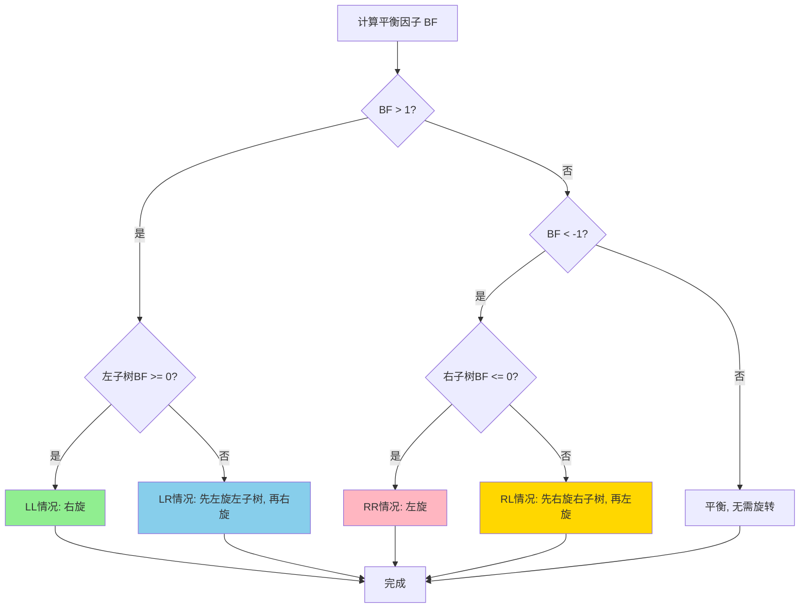
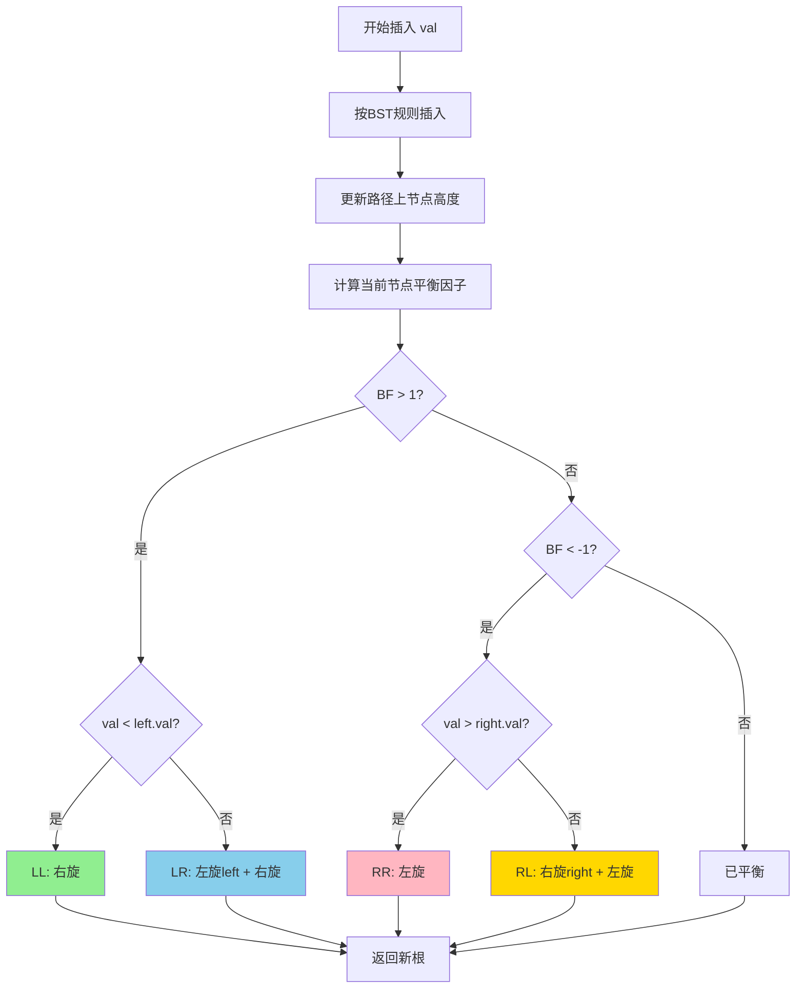

# AVL树完整学习手册 (Java版)

## 目录
1. [AVL树基础概念](#avl树基础概念)
2. [AVL树节点定义](#avl树节点定义)
3. [AVL树性质](#avl树性质)
4. [旋转操作详解](#旋转操作详解)
5. [插入操作完整实现](#插入操作完整实现)
6. [删除操作完整实现](#删除操作完整实现)
7. [查找操作](#查找操作)
8. [遍历操作](#遍历操作)
9. [AVL树完整实现](#avl树完整实现)
10. [LeetCode相关题目](#leetcode相关题目)

---

## AVL树基础概念

### 为什么需要AVL树？

普通二叉搜索树在最坏情况下会退化成链表（时间复杂度O(n)），而AVL树通过严格的平衡条件保证了：
- 所有操作的时间复杂度都是 O(log n)
- 树的高度始终保持在 O(log n)

### AVL树的特点

| 特性 | 说明 |
|------|------|
| 平衡因子 | 左子树高度 - 右子树高度，取值范围 {-1, 0, 1} |
| 平衡条件 | 严格：每个节点的平衡因子必须在 {-1, 0, 1} |
| 查找效率 | O(log n)，比红黑树稍快 |
| 插入/删除效率 | O(log n)，但可能需要多次旋转 |
| 适用场景 | 查找操作远多于插入删除的场景 |

---

## AVL树节点定义

```java
public class AVLNode {
    int val;                // 节点值
    AVLNode left;           // 左子节点
    AVLNode right;          // 右子节点
    int height;             // 节点高度（从该节点到叶子节点的最长路径）
    
    // 构造函数
    public AVLNode(int val) {
        this.val = val;
        this.left = null;
        this.right = null;
        this.height = 1;    // 新节点的高度为1
    }
    
    public AVLNode(int val, int height) {
        this.val = val;
        this.left = null;
        this.right = null;
        this.height = height;
    }
}
```

### 为什么AVL树需要维护高度？

与红黑树不同，AVL树不使用颜色属性，而是通过**高度**来判断是否需要旋转：
- 每个节点存储其高度
- 通过高度计算平衡因子
- 根据平衡因子决定旋转方向

---

## AVL树性质

### 核心性质

AVL树必须满足以下性质：

#### 性质1：二叉搜索树性质
- 左子树所有节点的值 < 根节点的值
- 右子树所有节点的值 > 根节点的值

#### 性质2：平衡性质
**对于任意节点，其左右子树的高度差（平衡因子）的绝对值不超过1**

```
平衡因子 (Balance Factor) = 左子树高度 - 右子树高度
BF ∈ {-1, 0, 1}
```

### 平衡因子详解

```java
// 获取节点高度
private int getHeight(AVLNode node) {
    return node == null ? 0 : node.height;
}

// 计算平衡因子
private int getBalanceFactor(AVLNode node) {
    if (node == null) return 0;
    return getHeight(node.left) - getHeight(node.right);
}

// 更新节点高度
private void updateHeight(AVLNode node) {
    if (node == null) return;
    node.height = Math.max(getHeight(node.left), getHeight(node.right)) + 1;
}
```

### 平衡因子的含义

| 平衡因子 | 含义 | 是否需要旋转 |
|---------|------|-------------|
| 0 | 左右子树等高 | 否 |
| 1 | 左子树高1 | 否 |
| -1 | 右子树高1 | 否 |
| ≥2 | 左子树过高 | **需要右旋** |
| ≤-2 | 右子树过高 | **需要左旋** |


### 高度与节点数的关系

对于包含 n 个节点的AVL树：
- **最小高度：** h = ⌊log₂(n+1)⌋
- **最大高度：** h ≈ 1.44 × log₂(n+2) - 0.328

因此，AVL树的高度始终是 O(log n)。

---

## 旋转操作详解

AVL树有4种旋转操作，用于恢复平衡：

### 1. 左旋 (Left Rotate) - LL旋转

**适用场景：** 右子树的右子树过高（RR情况）

```
    y                    x
   / \    左旋(y)       / \
  T1  x   -------->    y   T3
     / \              / \
    T2 T3            T1 T2
```

**代码实现：**
```java
private AVLNode leftRotate(AVLNode y) {
    // 保存x和T2
    AVLNode x = y.right;
    AVLNode T2 = x.left;
    
    // 执行旋转
    x.left = y;
    y.right = T2;
    
    // 更新高度（先更新y，再更新x）
    updateHeight(y);
    updateHeight(x);
    
    // 返回新的根节点
    return x;
}
```

### 2. 右旋 (Right Rotate) - RR旋转

**适用场景：** 左子树的左子树过高（LL情况）

```
      y                x
     / \   右旋(y)    / \
    x  T3  -------->  T1  y
   / \                   / \
  T1 T2                 T2 T3
```

**代码实现：**
```java
private AVLNode rightRotate(AVLNode y) {
    // 保存x和T2
    AVLNode x = y.left;
    AVLNode T2 = x.right;
    
    // 执行旋转
    x.right = y;
    y.left = T2;
    
    // 更新高度
    updateHeight(y);
    updateHeight(x);
    
    // 返回新的根节点
    return x;
}
```

### 3. 左右旋 (Left-Right Rotate) - LR旋转

**适用场景：** 左子树的右子树过高（LR情况）

```
      y              y              z
     / \            / \            / \
    x  T4   先左   z  T4   再右   x   y
   / \      旋x   / \      旋y   / \ / \
  T1  z    --->  x  T3    --->  T1 T2 T3 T4
     / \        / \
    T2 T3      T1 T2
```

**代码实现：**
```java
// 先对x左旋，再对y右旋
private AVLNode leftRightRotate(AVLNode y) {
    y.left = leftRotate(y.left);   // 先左旋
    return rightRotate(y);          // 再右旋
}
```

### 4. 右左旋 (Right-Left Rotate) - RL旋转

**适用场景：** 右子树的左子树过高（RL情况）

```
    y                y              z
   / \              / \            / \
  T1  x    先右    T1  z    再左   y   x
     / \   旋x        / \   旋y   / \ / \
    z  T4   --->     T2  x  --->  T1 T2 T3 T4
   / \                  / \
  T2 T3                T3 T4
```

**代码实现：**
```java
// 先对x右旋，再对y左旋
private AVLNode rightLeftRotate(AVLNode y) {
    y.right = rightRotate(y.right);  // 先右旋
    return leftRotate(y);             // 再左旋
}
```

### 旋转决策流程图



### 四种失衡情况对比

| 情况 | 失衡位置 | 旋转操作 | 旋转次数 |
|------|---------|---------|---------|
| LL | 左子树的左子树 | 右旋 | 1 |
| RR | 右子树的右子树 | 左旋 | 1 |
| LR | 左子树的右子树 | 先左旋左子树，再右旋 | 2 |
| RL | 右子树的左子树 | 先右旋右子树，再左旋 | 2 |

---

## 插入操作完整实现

### 插入流程概述

1. **按BST规则插入新节点**
2. **更新路径上所有节点的高度**
3. **检查平衡因子，必要时旋转**

### 插入主函数

```java
public void insert(int val) {
    root = insertHelper(root, val);
}

private AVLNode insertHelper(AVLNode node, int val) {
    // 1. 按BST规则插入
    if (node == null) {
        return new AVLNode(val);
    }
    
    if (val < node.val) {
        node.left = insertHelper(node.left, val);
    } else if (val > node.val) {
        node.right = insertHelper(node.right, val);
    } else {
        // 值已存在，不插入
        return node;
    }
    
    // 2. 更新当前节点高度
    updateHeight(node);
    
    // 3. 获取平衡因子
    int balance = getBalanceFactor(node);
    
    // 4. 根据平衡因子判断需要的旋转操作
    
    // LL情况（左子树的左子树）
    if (balance > 1 && val < node.left.val) {
        return rightRotate(node);
    }
    
    // RR情况（右子树的右子树）
    if (balance < -1 && val > node.right.val) {
        return leftRotate(node);
    }
    
    // LR情况（左子树的右子树）
    if (balance > 1 && val > node.left.val) {
        node.left = leftRotate(node.left);
        return rightRotate(node);
    }
    
    // RL情况（右子树的左子树）
    if (balance < -1 && val < node.right.val) {
        node.right = rightRotate(node.right);
        return leftRotate(node);
    }
    
    // 节点已经平衡，直接返回
    return node;
}
```

### 插入示例演示

**示例1：插入导致LL失衡**

```
初始状态：         插入1后：           右旋后：
    3                 3                  2
   /                 /                  / \
  2                 2                  1   3
                   /
                  1
(BF=1)          (BF=2)              (BF=0)
```

**示例2：插入导致LR失衡**

```
初始状态：         插入2后：          先左旋1：         再右旋3：
    3                 3                  3                  2
   /                 /                  /                  / \
  1                 1                  2                  1   3
                     \                /
                      2              1
(BF=1)          (BF=2)           (BF=2)              (BF=0)
```

### 插入操作流程图



---

## 删除操作完整实现

### 删除流程概述

1. **按BST规则删除节点**
2. **更新路径上所有节点的高度**
3. **检查平衡因子，必要时旋转**

### 删除主函数

```java
public void delete(int val) {
    root = deleteHelper(root, val);
}

private AVLNode deleteHelper(AVLNode node, int val) {
    // 1. 按BST规则删除
    if (node == null) {
        return null;
    }
    
    if (val < node.val) {
        node.left = deleteHelper(node.left, val);
    } else if (val > node.val) {
        node.right = deleteHelper(node.right, val);
    } else {
        // 找到要删除的节点
        
        // 情况1：只有右子节点或无子节点
        if (node.left == null) {
            return node.right;
        }
        // 情况2：只有左子节点
        else if (node.right == null) {
            return node.left;
        }
        // 情况3：有两个子节点
        else {
            // 找到右子树的最小节点（中序后继）
            AVLNode successor = findMin(node.right);
            
            // 用后继节点的值替换当前节点
            node.val = successor.val;
            
            // 删除后继节点
            node.right = deleteHelper(node.right, successor.val);
        }
    }
    
    // 如果树只有一个节点，直接返回
    if (node == null) {
        return null;
    }
    
    // 2. 更新当前节点高度
    updateHeight(node);
    
    // 3. 获取平衡因子
    int balance = getBalanceFactor(node);
    
    // 4. 根据平衡因子判断需要的旋转操作
    
    // LL情况
    if (balance > 1 && getBalanceFactor(node.left) >= 0) {
        return rightRotate(node);
    }
    
    // LR情况
    if (balance > 1 && getBalanceFactor(node.left) < 0) {
        node.left = leftRotate(node.left);
        return rightRotate(node);
    }
    
    // RR情况
    if (balance < -1 && getBalanceFactor(node.right) <= 0) {
        return leftRotate(node);
    }
    
    // RL情况
    if (balance < -1 && getBalanceFactor(node.right) > 0) {
        node.right = rightRotate(node.right);
        return leftRotate(node);
    }
    
    return node;
}

// 找到最小节点
private AVLNode findMin(AVLNode node) {
    while (node.left != null) {
        node = node.left;
    }
    return node;
}
```

### 删除后的平衡调整

删除节点后的平衡调整与插入类似，但有一个关键区别：
- **插入：** 只需要旋转一次就能恢复平衡
- **删除：** 可能需要沿着路径向上进行多次旋转

### 删除示例演示

**示例：删除导致失衡**

```
初始状态：         删除7后：           左旋后：
    5                 5                  10
   / \               / \                /  \
  3   10            3   10             5    15
     /  \              /  \           /    /
    7   15            15  20         3    20
         \
         20
(平衡)           (BF=-2)           (平衡)
```

---

## 查找操作

AVL树的查找操作与普通BST相同，但效率更高：

```java
public AVLNode search(int val) {
    return searchHelper(root, val);
}

// 递归版本
private AVLNode searchHelper(AVLNode node, int val) {
    if (node == null || node.val == val) {
        return node;
    }
    
    if (val < node.val) {
        return searchHelper(node.left, val);
    } else {
        return searchHelper(node.right, val);
    }
}

// 迭代版本
public AVLNode searchIterative(int val) {
    AVLNode current = root;
    
    while (current != null) {
        if (val == current.val) {
            return current;
        } else if (val < current.val) {
            current = current.left;
        } else {
            current = current.right;
        }
    }
    
    return null;
}

// 查找最小值
public AVLNode findMin() {
    if (root == null) return null;
    return findMin(root);
}

// 查找最大值
public AVLNode findMax() {
    if (root == null) return null;
    
    AVLNode current = root;
    while (current.right != null) {
        current = current.right;
    }
    return current;
}

// 查找前驱节点（比val小的最大值）
public AVLNode predecessor(int val) {
    AVLNode node = search(val);
    if (node == null) return null;
    
    // 如果有左子树，前驱是左子树的最大值
    if (node.left != null) {
        return findMax(node.left);
    }
    
    // 否则，向上找第一个是右子节点的祖先
    AVLNode predecessor = null;
    AVLNode current = root;
    
    while (current != null) {
        if (val > current.val) {
            predecessor = current;
            current = current.right;
        } else if (val < current.val) {
            current = current.left;
        } else {
            break;
        }
    }
    
    return predecessor;
}

// 查找后继节点（比val大的最小值）
public AVLNode successor(int val) {
    AVLNode node = search(val);
    if (node == null) return null;
    
    // 如果有右子树，后继是右子树的最小值
    if (node.right != null) {
        return findMin(node.right);
    }
    
    // 否则，向上找第一个是左子节点的祖先
    AVLNode successor = null;
    AVLNode current = root;
    
    while (current != null) {
        if (val < current.val) {
            successor = current;
            current = current.left;
        } else if (val > current.val) {
            current = current.right;
        } else {
            break;
        }
    }
    
    return successor;
}

private AVLNode findMax(AVLNode node) {
    while (node.right != null) {
        node = node.right;
    }
    return node;
}
```

---

## 遍历操作

### 中序遍历（有序输出）

```java
public List<Integer> inorderTraversal() {
    List<Integer> result = new ArrayList<>();
    inorderHelper(root, result);
    return result;
}

private void inorderHelper(AVLNode node, List<Integer> result) {
    if (node == null) return;
    
    inorderHelper(node.left, result);
    result.add(node.val);
    inorderHelper(node.right, result);
}
```

### 前序遍历

```java
public List<Integer> preorderTraversal() {
    List<Integer> result = new ArrayList<>();
    preorderHelper(root, result);
    return result;
}

private void preorderHelper(AVLNode node, List<Integer> result) {
    if (node == null) return;
    
    result.add(node.val);
    preorderHelper(node.left, result);
    preorderHelper(node.right, result);
}
```

### 后序遍历

```java
public List<Integer> postorderTraversal() {
    List<Integer> result = new ArrayList<>();
    postorderHelper(root, result);
    return result;
}

private void postorderHelper(AVLNode node, List<Integer> result) {
    if (node == null) return;
    
    postorderHelper(node.left, result);
    postorderHelper(node.right, result);
    result.add(node.val);
}
```

### 层序遍历

```java
public List<List<Integer>> levelOrderTraversal() {
    List<List<Integer>> result = new ArrayList<>();
    if (root == null) return result;
    
    Queue<AVLNode> queue = new LinkedList<>();
    queue.offer(root);
    
    while (!queue.isEmpty()) {
        int levelSize = queue.size();
        List<Integer> currentLevel = new ArrayList<>();
        
        for (int i = 0; i < levelSize; i++) {
            AVLNode node = queue.poll();
            currentLevel.add(node.val);
            
            if (node.left != null) queue.offer(node.left);
            if (node.right != null) queue.offer(node.right);
        }
        
        result.add(currentLevel);
    }
    
    return result;
}
```

---

## AVL树完整实现

```java
public class AVLTree {
    private AVLNode root;
    
    // 节点类定义
    static class AVLNode {
        int val;
        AVLNode left, right;
        int height;
        
        AVLNode(int val) {
            this.val = val;
            this.height = 1;
        }
    }
    
    public AVLTree() {
        this.root = null;
    }
    
    // ========== 辅助方法 ==========
    
    private int getHeight(AVLNode node) {
        return node == null ? 0 : node.height;
    }
    
    private int getBalanceFactor(AVLNode node) {
        if (node == null) return 0;
        return getHeight(node.left) - getHeight(node.right);
    }
    
    private void updateHeight(AVLNode node) {
        if (node == null) return;
        node.height = Math.max(getHeight(node.left), getHeight(node.right)) + 1;
    }
    
    // ========== 旋转操作 ==========
    
    private AVLNode leftRotate(AVLNode y) {
        AVLNode x = y.right;
        AVLNode T2 = x.left;
        
        x.left = y;
        y.right = T2;
        
        updateHeight(y);
        updateHeight(x);
        
        return x;
    }
    
    private AVLNode rightRotate(AVLNode y) {
        AVLNode x = y.left;
        AVLNode T2 = x.right;
        
        x.right = y;
        y.left = T2;
        
        updateHeight(y);
        updateHeight(x);
        
        return x;
    }
    
    // ========== 插入操作 ==========
    
    public void insert(int val) {
        root = insertHelper(root, val);
    }
    
    private AVLNode insertHelper(AVLNode node, int val) {
        // 1. BST插入
        if (node == null) {
            return new AVLNode(val);
        }
        
        if (val < node.val) {
            node.left = insertHelper(node.left, val);
        } else if (val > node.val) {
            node.right = insertHelper(node.right, val);
        } else {
            return node;  // 值已存在
        }
        
        // 2. 更新高度
        updateHeight(node);
        
        // 3. 获取平衡因子
        int balance = getBalanceFactor(node);
        
        // 4. 旋转调整
        // LL
        if (balance > 1 && val < node.left.val) {
            return rightRotate(node);
        }
        // RR
        if (balance < -1 && val > node.right.val) {
            return leftRotate(node);
        }
        // LR
        if (balance > 1 && val > node.left.val) {
            node.left = leftRotate(node.left);
            return rightRotate(node);
        }
        // RL
        if (balance < -1 && val < node.right.val) {
            node.right = rightRotate(node.right);
            return leftRotate(node);
        }
        
        return node;
    }
    
    // ========== 删除操作 ==========
    
    public void delete(int val) {
        root = deleteHelper(root, val);
    }
    
    private AVLNode deleteHelper(AVLNode node, int val) {
        // 1. BST删除
        if (node == null) {
            return null;
        }
        
        if (val < node.val) {
            node.left = deleteHelper(node.left, val);
        } else if (val > node.val) {
            node.right = deleteHelper(node.right, val);
        } else {
            if (node.left == null) {
                return node.right;
            } else if (node.right == null) {
                return node.left;
            } else {
                AVLNode successor = findMin(node.right);
                node.val = successor.val;
                node.right = deleteHelper(node.right, successor.val);
            }
        }
        
        if (node == null) return null;
        
        // 2. 更新高度
        updateHeight(node);
        
        // 3. 获取平衡因子
        int balance = getBalanceFactor(node);
        
        // 4. 旋转调整
        // LL
        if (balance > 1 && getBalanceFactor(node.left) >= 0) {
            return rightRotate(node);
        }
        // LR
        if (balance > 1 && getBalanceFactor(node.left) < 0) {
            node.left = leftRotate(node.left);
            return rightRotate(node);
        }
        // RR
        if (balance < -1 && getBalanceFactor(node.right) <= 0) {
            return leftRotate(node);
        }
        // RL
        if (balance < -1 && getBalanceFactor(node.right) > 0) {
            node.right = rightRotate(node.right);
            return leftRotate(node);
        }
        
        return node;
    }
    
    private AVLNode findMin(AVLNode node) {
        while (node.left != null) {
            node = node.left;
        }
        return node;
    }
    
    // ========== 查找操作 ==========
    
    public AVLNode search(int val) {
        AVLNode current = root;
        while (current != null) {
            if (val == current.val) return current;
            else if (val < current.val) current = current.left;
            else current = current.right;
        }
        return null;
    }
    
    public AVLNode findMin() {
        if (root == null) return null;
        return findMin(root);
    }
    
    public AVLNode findMax() {
        if (root == null) return null;
        AVLNode current = root;
        while (current.right != null) {
            current = current.right;
        }
        return current;
    }
    
    // ========== 遍历操作 ==========
    
    public void inorder() {
        inorderHelper(root);
        System.out.println();
    }
    
    private void inorderHelper(AVLNode node) {
        if (node == null) return;
        inorderHelper(node.left);
        System.out.print(node.val + "(h=" + node.height + ") ");
        inorderHelper(node.right);
    }
    
    // ========== 验证AVL树性质 ==========
    
    public boolean validate() {
        return validateHelper(root) != -1;
    }
    
    private int validateHelper(AVLNode node) {
        if (node == null) return 0;
        
        int leftHeight = validateHelper(node.left);
        if (leftHeight == -1) return -1;
        
        int rightHeight = validateHelper(node.right);
        if (rightHeight == -1) return -1;
        
        // 检查平衡因子
        int balance = leftHeight - rightHeight;
        if (Math.abs(balance) > 1) {
            System.out.println("节点" + node.val + "不平衡，BF=" + balance);
            return -1;
        }
        
        // 检查高度是否正确
        int expectedHeight = Math.max(leftHeight, rightHeight) + 1;
        if (node.height != expectedHeight) {
            System.out.println("节点" + node.val + "高度错误");
            return -1;
        }
        
        return node.height;
    }
    
    // ========== 获取树的信息 ==========
    
    public int getTreeHeight() {
        return getHeight(root);
    }
    
    public int countNodes() {
        return countNodesHelper(root);
    }
    
    private int countNodesHelper(AVLNode node) {
        if (node == null) return 0;
        return 1 + countNodesHelper(node.left) + countNodesHelper(node.right);
    }
    
    // ========== 打印树结构 ==========
    
    public void printTree() {
        printTreeHelper(root, "", true);
    }
    
    private void printTreeHelper(AVLNode node, String prefix, boolean isTail) {
        if (node == null) return;
        
        System.out.println(prefix + (isTail ? "└── " : "├── ") + 
                          node.val + "(h=" + node.height + ", BF=" + getBalanceFactor(node) + ")");
        
        if (node.left != null || node.right != null) {
            if (node.right != null) {
                printTreeHelper(node.right, prefix + (isTail ? "    " : "│   "), false);
            }
            if (node.left != null) {
                printTreeHelper(node.left, prefix + (isTail ? "    " : "│   "), true);
            }
        }
    }
}
```

---

## LeetCode相关题目

### 题目1: 将有序数组转换为平衡BST (LeetCode 108)

**问题：** 给你一个整数数组 nums，其中元素已经按升序排列，请你将其转换为一棵高度平衡二叉搜索树。

```java
public AVLNode sortedArrayToBST(int[] nums) {
    return buildBST(nums, 0, nums.length - 1);
}

private AVLNode buildBST(int[] nums, int left, int right) {
    if (left > right) return null;
    
    // 选择中间元素作为根
    int mid = left + (right - left) / 2;
    AVLNode root = new AVLNode(nums[mid]);
    
    // 递归构造左右子树
    root.left = buildBST(nums, left, mid - 1);
    root.right = buildBST(nums, mid + 1, right);
    
    // 更新高度
    updateHeight(root);
    
    return root;
}
```

### 题目2: 平衡二叉树 (LeetCode 110)

**问题：** 给定一个二叉树，判断它是否是高度平衡的二叉树。

```java
public boolean isBalanced(AVLNode root) {
    return checkBalance(root) != -1;
}

private int checkBalance(AVLNode node) {
    if (node == null) return 0;
    
    int leftHeight = checkBalance(node.left);
    if (leftHeight == -1) return -1;
    
    int rightHeight = checkBalance(node.right);
    if (rightHeight == -1) return -1;
    
    // 检查平衡因子
    if (Math.abs(leftHeight - rightHeight) > 1) {
        return -1;
    }
    
    return Math.max(leftHeight, rightHeight) + 1;
}
```

### 题目3: 二叉搜索树迭代器 (LeetCode 173)

**问题：** 实现一个二叉搜索树迭代器类 BSTIterator，表示一个按中序遍历二叉搜索树（BST）的迭代器。

```java
class BSTIterator {
    private Stack<AVLNode> stack;
    
    public BSTIterator(AVLNode root) {
        stack = new Stack<>();
        pushLeft(root);
    }
    
    private void pushLeft(AVLNode node) {
        while (node != null) {
            stack.push(node);
            node = node.left;
        }
    }
    
    public int next() {
        AVLNode node = stack.pop();
        pushLeft(node.right);
        return node.val;
    }
    
    public boolean hasNext() {
        return !stack.isEmpty();
    }
}
```

### 题目4: 二叉搜索树中第K小的元素 (LeetCode 230)

**问题：** 给定一个二叉搜索树的根节点 root，和一个整数 k，请你设计一个算法查找其中第 k 个最小元素（从 1 开始计数）。

```java
private int count = 0;
private int result = 0;

public int kthSmallest(AVLNode root, int k) {
    inorderCount(root, k);
    return result;
}

private void inorderCount(AVLNode node, int k) {
    if (node == null) return;
    
    inorderCount(node.left, k);
    
    count++;
    if (count == k) {
        result = node.val;
        return;
    }
    
    inorderCount(node.right, k);
}
```

### 题目5: 验证二叉搜索树 (LeetCode 98)

**问题：** 给你一个二叉树的根节点 root，判断其是否是一个有效的二叉搜索树。

```java
public boolean isValidBST(AVLNode root) {
    return validate(root, null, null);
}

private boolean validate(AVLNode node, Integer lower, Integer upper) {
    if (node == null) return true;
    
    int val = node.val;
    
    if (lower != null && val <= lower) return false;
    if (upper != null && val >= upper) return false;
    
    return validate(node.left, lower, val) && validate(node.right, val, upper);
}
```

### 题目6: 二叉搜索树的最近公共祖先 (LeetCode 235)

**问题：** 给定一个二叉搜索树，找到该树中两个指定节点的最近公共祖先。

```java
public AVLNode lowestCommonAncestor(AVLNode root, AVLNode p, AVLNode q) {
    int parentVal = root.val;
    int pVal = p.val;
    int qVal = q.val;
    
    if (pVal < parentVal && qVal < parentVal) {
        return lowestCommonAncestor(root.left, p, q);
    } else if (pVal > parentVal && qVal > parentVal) {
        return lowestCommonAncestor(root.right, p, q);
    } else {
        return root;
    }
}
```

### 题目7: 修剪二叉搜索树 (LeetCode 669)

**问题：** 给你二叉搜索树的根节点 root，同时给定最小边界 low 和最大边界 high。通过修剪二叉搜索树，使得所有节点的值在 [low, high] 中。

```java
public AVLNode trimBST(AVLNode root, int low, int high) {
    if (root == null) return null;
    
    if (root.val < low) {
        return trimBST(root.right, low, high);
    }
    
    if (root.val > high) {
        return trimBST(root.left, low, high);
    }
    
    root.left = trimBST(root.left, low, high);
    root.right = trimBST(root.right, low, high);
    
    updateHeight(root);
    return root;
}
```

### 题目8: 区间求和 (Range Sum Query)

**问题：** 给定AVL树和区间 [low, high]，返回区间内所有值的和。

```java
public int rangeSumBST(AVLNode root, int low, int high) {
    if (root == null) return 0;
    
    int sum = 0;
    
    // 当前节点在范围内
    if (root.val >= low && root.val <= high) {
        sum += root.val;
    }
    
    // 可能在左子树
    if (root.val > low) {
        sum += rangeSumBST(root.left, low, high);
    }
    
    // 可能在右子树
    if (root.val < high) {
        sum += rangeSumBST(root.right, low, high);
    }
    
    return sum;
}
```

### 题目9: 将BST转换为更大树 (LeetCode 538)

**问题：** 给出二叉搜索树的根节点，该树的节点值各不相同，请你将其转换为累加树（Greater Sum Tree），使每个节点 node 的新值等于原树中大于或等于 node.val 的值之和。

```java
private int sum = 0;

public AVLNode convertBST(AVLNode root) {
    if (root == null) return null;
    
    // 反向中序遍历（右-根-左）
    convertBST(root.right);
    
    sum += root.val;
    root.val = sum;
    
    convertBST(root.left);
    
    return root;
}
```

### 题目10: 查找模式 (LeetCode 501)

**问题：** 给你一个含重复值的二叉搜索树（BST）的根节点 root，找出并返回 BST 中的所有众数（即，出现频率最高的元素）。

```java
private Integer prev = null;
private int count = 1;
private int maxCount = 0;
private List<Integer> modes = new ArrayList<>();

public int[] findMode(AVLNode root) {
    inorderMode(root);
    
    int[] result = new int[modes.size()];
    for (int i = 0; i < modes.size(); i++) {
        result[i] = modes.get(i);
    }
    return result;
}

private void inorderMode(AVLNode node) {
    if (node == null) return;
    
    inorderMode(node.left);
    
    if (prev != null && node.val == prev) {
        count++;
    } else {
        count = 1;
    }
    
    if (count > maxCount) {
        maxCount = count;
        modes.clear();
        modes.add(node.val);
    } else if (count == maxCount) {
        modes.add(node.val);
    }
    
    prev = node.val;
    
    inorderMode(node.right);
}
```

---

## AVL树性能分析

### 时间复杂度

| 操作 | 平均情况 | 最坏情况 |
|------|---------|---------|
| 查找 | O(log n) | O(log n) |
| 插入 | O(log n) | O(log n) |
| 删除 | O(log n) | O(log n) |
| 遍历 | O(n) | O(n) |

### 空间复杂度

- **存储空间：** O(n)
- **递归栈空间：** O(log n)

### 旋转次数分析

| 操作 | 最多旋转次数 |
|------|-------------|
| 插入 | 1次（单旋）或2次（双旋） |
| 删除 | O(log n)次（可能需要向上传播） |

### AVL树的高度界限

对于包含 n 个节点的AVL树：
- 高度 h ≤ 1.44 × log₂(n+2) - 0.328
- 这比完全二叉树只高约44%

---

## AVL树 vs 红黑树对比

### 详细对比表

| 特性 | AVL树 | 红黑树 |
|------|-------|--------|
| 平衡条件 | 严格：高度差≤1 | 宽松：黑高平衡 |
| 平衡维护 | 高度 | 颜色 |
| 最大高度 | 1.44 log n | 2 log n |
| 查找速度 | 更快 | 稍慢 |
| 插入旋转 | 最多2次 | 最多2次 |
| 删除旋转 | O(log n)次 | 最多3次 |
| 插入删除速度 | 较慢 | 更快 |
| 内存占用 | 每节点存高度（4字节） | 每节点存颜色（1位） |
| 适用场景 | 查找密集型 | 插入删除密集型 |
| 实际应用 | Windows内核, 数据库索引 | Java TreeMap, Linux调度器 |

### 选择建议

**选择AVL树：**

- 查找操作 >> 插入删除操作
- 需要严格的平衡保证
- 对查询性能要求极高

**选择红黑树：**
- 插入删除操作频繁
- 需要稳定的性能
- 标准库实现（Java, C++）

---

## 常见面试题

### 1. AVL树和红黑树有什么区别？
**答案：**
- **平衡条件：** AVL更严格（高度差≤1），红黑树更宽松（黑高平衡）
- **查找效率：** AVL更快，因为树更平衡
- **插入删除：** 红黑树更快，旋转次数更少
- **应用场景：** AVL适合读多写少，红黑树适合读写均衡

### 2. 为什么AVL树需要存储高度？
**答案：**
- 用于计算平衡因子（左子树高度 - 右子树高度）
- 根据平衡因子判断是否需要旋转
- 每次插入/删除后需要更新路径上所有节点的高度

### 3. 插入操作最多需要几次旋转？
**答案：**
- 最多2次（双旋转：LR或RL）
- 单旋转（LL或RR）只需1次

### 4. 删除操作为什么可能需要O(log n)次旋转？
**答案：**
- 删除可能导致不平衡向上传播
- 每调整一层可能需要一次旋转
- 最坏情况下需要从叶子旋转到根

### 5. 如何判断一棵树是否为AVL树？
**答案：**
1. 检查是否是BST
2. 检查每个节点的平衡因子是否在 {-1, 0, 1}
3. 检查存储的高度是否正确

### 6. AVL树的高度最多是多少？
**答案：**
- h ≤ 1.44 × log₂(n+2) - 0.328
- 约为完全二叉树高度的1.44倍

### 7. 什么时候选择AVL树而不是红黑树？
**答案：**
- 查找操作远多于插入删除
- 需要严格的O(log n)查找保证
- 对查询性能要求极高的场景

### 8. AVL树能存储重复值吗？
**答案：**
- 可以，有两种方式：
  1. 节点中增加计数器
  2. 允许等值节点插入左子树或右子树

---

## 调试技巧

### 1. 打印树结构
```java
public void printTree() {
    printTreeHelper(root, "", true);
}

private void printTreeHelper(AVLNode node, String prefix, boolean isTail) {
    if (node == null) return;
    
    System.out.println(prefix + (isTail ? "└── " : "├── ") + 
                      node.val + "(h=" + node.height + ", BF=" + getBalanceFactor(node) + ")");
    
    if (node.left != null || node.right != null) {
        if (node.right != null) {
            printTreeHelper(node.right, prefix + (isTail ? "    " : "│   "), false);
        }
        if (node.left != null) {
            printTreeHelper(node.left, prefix + (isTail ? "    " : "│   "), true);
        }
    }
}
```

### 2. 验证AVL性质
```java
public boolean validate() {
    return validateHelper(root) != -1;
}

private int validateHelper(AVLNode node) {
    if (node == null) return 0;
    
    int leftHeight = validateHelper(node.left);
    if (leftHeight == -1) return -1;
    
    int rightHeight = validateHelper(node.right);
    if (rightHeight == -1) return -1;
    
    int balance = leftHeight - rightHeight;
    if (Math.abs(balance) > 1) {
        System.out.println("节点" + node.val + "违反平衡性，BF=" + balance);
        return -1;
    }
    
    return Math.max(leftHeight, rightHeight) + 1;
}
```

### 3. 单步调试插入
```java
public void debugInsert(int val) {
    System.out.println("插入值: " + val);
    root = debugInsertHelper(root, val, 0);
}

private AVLNode debugInsertHelper(AVLNode node, int val, int depth) {
    String indent = "  ".repeat(depth);
    
    if (node == null) {
        System.out.println(indent + "创建新节点: " + val);
        return new AVLNode(val);
    }
    
    System.out.println(indent + "当前节点: " + node.val);
    
    if (val < node.val) {
        node.left = debugInsertHelper(node.left, val, depth + 1);
    } else if (val > node.val) {
        node.right = debugInsertHelper(node.right, val, depth + 1);
    } else {
        return node;
    }
    
    updateHeight(node);
    int balance = getBalanceFactor(node);
    
    System.out.println(indent + "更新后 - 节点: " + node.val + 
                      ", 高度: " + node.height + ", 平衡因子: " + balance);
    
    // 旋转操作...
    if (balance > 1) {
        System.out.println(indent + "需要右旋或LR旋转");
    } else if (balance < -1) {
        System.out.println(indent + "需要左旋或RL旋转");
    }
    
    // 执行旋转...
    
    return node;
}
```

---

## 测试用例

### 基础测试
```java
public static void main(String[] args) {
    AVLTree tree = new AVLTree();
    
    // 测试插入
    System.out.println("=== 测试插入 ===");
    int[] values = {10, 20, 30, 40, 50, 25};
    for (int val : values) {
        tree.insert(val);
        System.out.println("插入 " + val + " 后:");
        tree.printTree();
        System.out.println("树高度: " + tree.getTreeHeight());
        System.out.println("验证: " + (tree.validate() ? "通过" : "失败"));
        System.out.println();
    }
    
    // 测试查找
    System.out.println("=== 测试查找 ===");
    System.out.println("查找25: " + (tree.search(25) != null));
    System.out.println("查找100: " + (tree.search(100) != null));
    System.out.println();
    
    // 测试遍历
    System.out.println("=== 中序遍历 ===");
    tree.inorder();
    System.out.println();
    
    // 测试删除
    System.out.println("=== 测试删除 ===");
    tree.delete(40);
    System.out.println("删除40后:");
    tree.printTree();
    System.out.println("验证: " + (tree.validate() ? "通过" : "失败"));
}
```

---

## 总结

AVL树是一种严格平衡的二叉搜索树，通过维护高度信息和旋转操作保持平衡。

### 核心要点
1. ✅ 平衡因子 ∈ {-1, 0, 1}
2. ✅ 4种旋转：LL、RR、LR、RL
3. ✅ 插入最多2次旋转
4. ✅ 删除可能O(log n)次旋转
5. ✅ 查找效率优于红黑树

### 优点
- ✅ 查找效率高
- ✅ 严格平衡保证
- ✅ 实现相对简单

### 缺点
- ❌ 插入删除可能需要多次旋转
- ❌ 需要存储高度信息
- ❌ 不如红黑树应用广泛

### 应用场景
- 数据库索引（读多写少）
- 内存管理系统
- 需要快速查找的场景

**祝你学习顺利！🌲**
