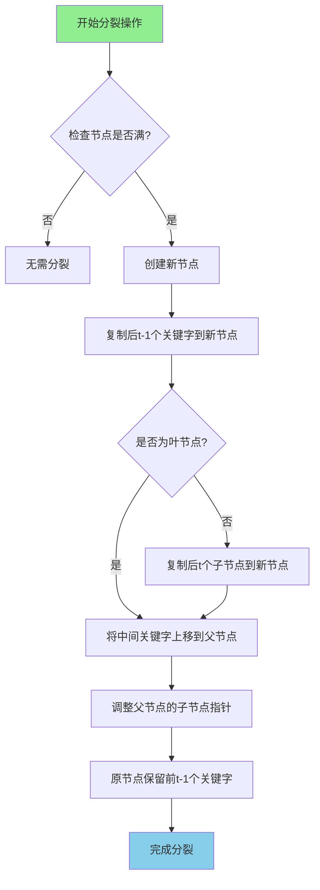
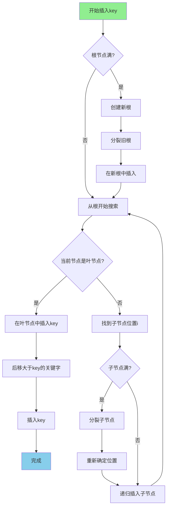

# B树完整学习手册 (Java版)

## 目录
1. [B树基础概念](#b树基础概念)
2. [B树节点定义](#b树节点定义)
3. [B树性质](#b树性质)
4. [分裂操作详解](#分裂操作详解)
5. [插入操作完整实现](#插入操作完整实现)
6. [删除操作完整实现](#删除操作完整实现)
7. [查找操作](#查找操作)
8. [遍历操作](#遍历操作)
9. [B树完整实现](#b树完整实现)
10. [LeetCode相关题目](#leetcode相关题目)

---

## B树基础概念

### 什么是B树？

B树（B-Tree）是一种自平衡的多路搜索树，主要用于磁盘或其他直接存取的辅助存储设备。B树通过允许节点有多个子节点来减少树的高度，从而减少磁盘I/O次数。

### 为什么需要B树？

**磁盘I/O是昂贵的：**
- 内存访问：纳秒级（ns）
- 磁盘访问：毫秒级（ms），比内存慢10^6倍
- B树通过减少树高来减少磁盘访问次数

**二叉树的问题：**
- 对于10亿个数据，二叉树高度约30层
- 需要30次磁盘I/O
- B树高度通常只需要3-4层

### B树 vs 二叉搜索树

| 特性 | B树 | 二叉搜索树 |
|------|-----|----------|
| 子节点数 | 多个（2到m个） | 2个 |
| 树高 | 低（log_m n） | 高（log_2 n） |
| 磁盘I/O | 少 | 多 |
| 适用场景 | 数据库索引、文件系统 | 内存数据结构 |
| 平衡性 | 完美平衡 | 需要额外平衡机制 |

### B树的应用

1. **数据库索引**
   - MySQL InnoDB: B+树（B树的变种）
   - PostgreSQL: B树索引
   - Oracle: B树索引

2. **文件系统**
   - NTFS: B树管理文件
   - HFS+: B树索引目录
   - Ext4: HTree（B树变种）

---

## B树节点定义

### 基本定义

一棵m阶B树是满足以下性质的m路搜索树：
- 每个节点最多有 m 个子节点
- 每个非叶节点（除根节点）最少有 ⌈m/2⌉ 个子节点
- 根节点至少有2个子节点（如果不是叶节点）
- 所有叶节点都在同一层

### Java节点实现

```java
public class BTreeNode<T extends Comparable<T>> {
    int n;                      // 当前节点关键字数量
    T[] keys;                   // 关键字数组
    BTreeNode<T>[] children;    // 子节点数组
    boolean isLeaf;             // 是否为叶节点
    int t;                      // 最小度数（minimum degree）
    
    // 构造函数
    @SuppressWarnings("unchecked")
    public BTreeNode(int t, boolean isLeaf) {
        this.t = t;
        this.isLeaf = isLeaf;
        this.keys = (T[]) new Comparable[2 * t - 1];      // 最多 2t-1 个关键字
        this.children = new BTreeNode[2 * t];             // 最多 2t 个子节点
        this.n = 0;
    }
    
    // 获取关键字
    public T getKey(int i) {
        return keys[i];
    }
    
    // 获取子节点
    public BTreeNode<T> getChild(int i) {
        return children[i];
    }
    
    // 是否满节点
    public boolean isFull() {
        return n == 2 * t - 1;
    }
    
    // 是否最少关键字
    public boolean isMinimal() {
        return n == t - 1;
    }
}
```

### 关键参数说明

**最小度数 t (minimum degree):**
- 每个节点最少有 t-1 个关键字（根节点除外）
- 每个节点最多有 2t-1 个关键字
- 每个内部节点最少有 t 个子节点
- 每个内部节点最多有 2t 个子节点

**常见配置：**
- t=2: 2-3-4树（每个节点1-3个关键字）
- t=3: 3-5树（每个节点2-5个关键字）
- t=128: 适合磁盘块大小为4KB的系统

---

## B树性质

### 基本性质

#### 性质1：节点关键字数量
- 每个节点最多有 2t-1 个关键字
- 每个非根节点最少有 t-1 个关键字
- 根节点最少有 1 个关键字

#### 性质2：子节点数量
- 如果节点有 n 个关键字，则有 n+1 个子节点
- 内部节点最多有 2t 个子节点
- 内部节点最少有 t 个子节点（根节点至少2个）

#### 性质3：关键字顺序
- 节点内关键字按升序排列：k₁ < k₂ < ... < kₙ
- 对于任意关键字 kᵢ，左子树所有关键字 < kᵢ，右子树所有关键字 > kᵢ

#### 性质4：所有叶节点同层
- 所有叶节点都在同一层
- 保证了树的完美平衡

### B树高度分析

**定理：** 包含 n 个关键字的B树，最小度数为 t，高度 h 满足：

```
h ≤ log_t((n+1)/2)
```

**示例：**
- 10亿关键字，t=1001
- h ≤ log₁₀₀₁(500000000) ≈ 2
- 只需要2次磁盘I/O即可找到任意关键字！

### B树示例图

#### 一个 t=3 的B树示例

```
                    [30, 60]
                   /    |    \
                  /     |     \
           [10,20]   [40,50]   [70,80,90]
          /  |   \   /  |  \   /  |  |  \
        [5] [15] [25][35][45][55][65][75][85][95]
```

**说明：**
- 每个节点最少2个关键字（t-1=2）
- 每个节点最多5个关键字（2t-1=5）
- 所有叶节点在同一层
- 节点内关键字有序，子节点遵循大小关系

---

## 分裂操作详解

### 为什么需要分裂？

当节点关键字数量达到 2t-1 时，节点已满。插入新关键字前必须先分裂该节点，保持B树性质。

### 分裂操作原理

**将满节点分裂成三部分：**
1. 左半部分：前 t-1 个关键字
2. 中间关键字：第 t 个关键字（上移到父节点）
3. 右半部分：后 t-1 个关键字

### 分裂示例（t=3）

**分裂前：** 节点已满（5个关键字）
```
父节点: [30]
       /    \
  [10,20,25,27,28]  [40]
```

**分裂后：** 中间关键字25上移
```
父节点: [25, 30]
       /    |    \
  [10,20] [27,28] [40]
```

### 分裂代码实现

```java
// 分裂子节点 children[i]（该节点必须是满的）
private void splitChild(BTreeNode<T> parent, int i) {
    BTreeNode<T> fullChild = parent.children[i];
    BTreeNode<T> newChild = new BTreeNode<>(t, fullChild.isLeaf);
    
    // 新节点获得后 t-1 个关键字
    newChild.n = t - 1;
    
    // 复制后半部分关键字到新节点
    for (int j = 0; j < t - 1; j++) {
        newChild.keys[j] = fullChild.keys[j + t];
    }
    
    // 如果不是叶节点，复制子节点指针
    if (!fullChild.isLeaf) {
        for (int j = 0; j < t; j++) {
            newChild.children[j] = fullChild.children[j + t];
        }
    }
    
    // 原节点只保留前 t-1 个关键字
    fullChild.n = t - 1;
    
    // 在父节点中为新子节点腾出空间
    for (int j = parent.n; j > i; j--) {
        parent.children[j + 1] = parent.children[j];
    }
    parent.children[i + 1] = newChild;
    
    // 将中间关键字上移到父节点
    for (int j = parent.n - 1; j >= i; j--) {
        parent.keys[j + 1] = parent.keys[j];
    }
    parent.keys[i] = fullChild.keys[t - 1];
    parent.n++;
}
```

### 分裂流程图



---

## 插入操作完整实现

### 插入流程概述

B树的插入采用**自顶向下的预防性分裂策略**：
1. 从根开始搜索插入位置
2. 遇到满节点先分裂，再继续向下
3. 最终在叶节点插入关键字

### 插入主函数

```java
public void insert(T key) {
    BTreeNode<T> root = this.root;
    
    // 情况1：根节点满，需要分裂
    if (root.isFull()) {
        // 创建新根
        BTreeNode<T> newRoot = new BTreeNode<>(t, false);
        newRoot.children[0] = root;
        
        // 分裂旧根
        splitChild(newRoot, 0);
        
        // 更新根节点
        this.root = newRoot;
        
        // 在新根中插入关键字
        insertNonFull(newRoot, key);
    } else {
        // 情况2：根节点未满，直接插入
        insertNonFull(root, key);
    }
}
```

### 非满节点插入

```java
// 在非满节点中插入关键字
private void insertNonFull(BTreeNode<T> node, T key) {
    int i = node.n - 1;  // 从最后一个关键字开始
    
    if (node.isLeaf) {
        // 情况1：叶节点，直接插入
        
        // 将大于key的关键字后移
        while (i >= 0 && key.compareTo(node.keys[i]) < 0) {
            node.keys[i + 1] = node.keys[i];
            i--;
        }
        
        // 插入新关键字
        node.keys[i + 1] = key;
        node.n++;
        
    } else {
        // 情况2：内部节点，递归插入
        
        // 找到应该插入的子节点位置
        while (i >= 0 && key.compareTo(node.keys[i]) < 0) {
            i--;
        }
        i++;  // 子节点索引
        
        // 如果子节点满，先分裂
        if (node.children[i].isFull()) {
            splitChild(node, i);
            
            // 分裂后需要重新确定插入位置
            if (key.compareTo(node.keys[i]) > 0) {
                i++;
            }
        }
        
        // 递归插入到子节点
        insertNonFull(node.children[i], key);
    }
}
```

### 插入示例（t=3）

**初始状态：**
```
        [30, 60]
       /    |    \
  [10,20] [40,50] [70,80]
```

**插入 45：**

步骤1：从根开始，45 在 30 和 60 之间，进入中间子树
```
        [30, 60]
       /    |    \
  [10,20] [40,50] [70,80]
            ↑
         找到这里
```

步骤2：[40,50] 未满，直接插入
```
        [30, 60]
       /    |    \
  [10,20] [40,45,50] [70,80]
```

**插入 55（导致分裂）：**

步骤1：[40,45,50] 插入 55 后变成 [40,45,50,55]，已满

步骤2：继续插入 52 时需要先分裂
```
分裂前: [40,45,50,55]
分裂后: [40,45] ← 50上移 → [55]

        [30, 50, 60]
       /    |    |    \
  [10,20] [40,45] [55] [70,80]
```

### 插入流程图



---

## 删除操作完整实现

### 删除流程概述

B树的删除比插入复杂得多，需要处理多种情况以保持B树性质。

### 删除的三大情况

#### 情况1：关键字在叶节点
- **子情况1a：** 叶节点关键字数 ≥ t，直接删除
- **子情况1b：** 叶节点关键字数 = t-1，需要调整

#### 情况2：关键字在内部节点
- **子情况2a：** 左子节点关键字数 ≥ t，用前驱替换
- **子情况2b：** 右子节点关键字数 ≥ t，用后继替换
- **子情况2c：** 两个子节点都只有 t-1 个关键字，合并

#### 情况3：关键字不在当前节点
- 递归到子节点，确保子节点有足够关键字

### 删除主函数

```java
public void delete(T key) {
    if (root == null) {
        System.out.println("树为空");
        return;
    }
    
    delete(root, key);
    
    // 如果根节点没有关键字了，将第一个子节点设为新根
    if (root.n == 0) {
        if (!root.isLeaf && root.children[0] != null) {
            root = root.children[0];
        }
    }
}
```

### 删除核心递归函数

```java
private void delete(BTreeNode<T> node, T key) {
    int i = findKeyIndex(node, key);
    
    if (i < node.n && key.compareTo(node.keys[i]) == 0) {
        // 情况1 & 2：关键字在当前节点
        if (node.isLeaf) {
            removeFromLeaf(node, i);
        } else {
            removeFromNonLeaf(node, i);
        }
    } else {
        // 情况3：关键字不在当前节点
        if (node.isLeaf) {
            System.out.println("关键字 " + key + " 不存在");
            return;
        }
        
        // 判断关键字是否在最后一个子节点
        boolean isInLastChild = (i == node.n);
        
        // 确保子节点有足够的关键字
        if (node.children[i].n < t) {
            fill(node, i);
        }
        
        // 如果最后一个子节点被合并了，递归到前一个子节点
        if (isInLastChild && i > node.n) {
            delete(node.children[i - 1], key);
        } else {
            delete(node.children[i], key);
        }
    }
}
```

### 从叶节点删除

```java
// 情况1：从叶节点删除关键字
private void removeFromLeaf(BTreeNode<T> node, int i) {
    // 将后面的关键字前移
    for (int j = i + 1; j < node.n; j++) {
        node.keys[j - 1] = node.keys[j];
    }
    node.n--;
}
```

### 从内部节点删除

```java
// 情况2：从内部节点删除关键字
private void removeFromNonLeaf(BTreeNode<T> node, int i) {
    T key = node.keys[i];
    
    if (node.children[i].n >= t) {
        // 情况2a：左子节点有足够关键字，用前驱替换
        T predecessor = getPredecessor(node, i);
        node.keys[i] = predecessor;
        delete(node.children[i], predecessor);
        
    } else if (node.children[i + 1].n >= t) {
        // 情况2b：右子节点有足够关键字,用后继替换
        T successor = getSuccessor(node, i);
        node.keys[i] = successor;
        delete(node.children[i + 1], successor);
        
    } else {
        // 情况2c：两个子节点都只有t-1个关键字，合并
        merge(node, i);
        delete(node.children[i], key);
    }
}
```

### 获取前驱和后继

```java
// 获取前驱关键字（左子树的最大值）
private T getPredecessor(BTreeNode<T> node, int i) {
    BTreeNode<T> current = node.children[i];
    while (!current.isLeaf) {
        current = current.children[current.n];
    }
    return current.keys[current.n - 1];
}

// 获取后继关键字（右子树的最小值）
private T getSuccessor(BTreeNode<T> node, int i) {
    BTreeNode<T> current = node.children[i + 1];
    while (!current.isLeaf) {
        current = current.children[0];
    }
    return current.keys[0];
}
```

### 填充子节点

```java
// 填充子节点，确保有至少t个关键字
private void fill(BTreeNode<T> node, int i) {
    // 如果前一个兄弟节点有足够关键字，从它借一个
    if (i != 0 && node.children[i - 1].n >= t) {
        borrowFromPrev(node, i);
    }
    // 如果后一个兄弟节点有足够关键字，从它借一个
    else if (i != node.n && node.children[i + 1].n >= t) {
        borrowFromNext(node, i);
    }
    // 否则，与兄弟节点合并
    else {
        if (i != node.n) {
            merge(node, i);
        } else {
            merge(node, i - 1);
        }
    }
}
```

### 从兄弟节点借关键字

```java
// 从前一个兄弟节点借关键字
private void borrowFromPrev(BTreeNode<T> node, int i) {
    BTreeNode<T> child = node.children[i];
    BTreeNode<T> sibling = node.children[i - 1];
    
    // 将父节点的关键字下移到子节点
    for (int j = child.n - 1; j >= 0; j--) {
        child.keys[j + 1] = child.keys[j];
    }
    
    if (!child.isLeaf) {
        for (int j = child.n; j >= 0; j--) {
            child.children[j + 1] = child.children[j];
        }
    }
    
    child.keys[0] = node.keys[i - 1];
    
    if (!child.isLeaf) {
        child.children[0] = sibling.children[sibling.n];
    }
    
    // 将兄弟节点的最后一个关键字上移到父节点
    node.keys[i - 1] = sibling.keys[sibling.n - 1];
    
    child.n++;
    sibling.n--;
}

// 从后一个兄弟节点借关键字
private void borrowFromNext(BTreeNode<T> node, int i) {
    BTreeNode<T> child = node.children[i];
    BTreeNode<T> sibling = node.children[i + 1];
    
    // 将父节点的关键字下移到子节点
    child.keys[child.n] = node.keys[i];
    
    if (!child.isLeaf) {
        child.children[child.n + 1] = sibling.children[0];
    }
    
    // 将兄弟节点的第一个关键字上移到父节点
    node.keys[i] = sibling.keys[0];
    
    // 兄弟节点的关键字前移
    for (int j = 1; j < sibling.n; j++) {
        sibling.keys[j - 1] = sibling.keys[j];
    }
    
    if (!sibling.isLeaf) {
        for (int j = 1; j <= sibling.n; j++) {
            sibling.children[j - 1] = sibling.children[j];
        }
    }
    
    child.n++;
    sibling.n--;
}
```

### 合并节点

```java
// 合并子节点 children[i] 和 children[i+1]
private void merge(BTreeNode<T> node, int i) {
    BTreeNode<T> child = node.children[i];
    BTreeNode<T> sibling = node.children[i + 1];
    
    // 将父节点的关键字下移
    child.keys[t - 1] = node.keys[i];
    
    // 将兄弟节点的关键字复制到子节点
    for (int j = 0; j < sibling.n; j++) {
        child.keys[j + t] = sibling.keys[j];
    }
    
    // 如果不是叶节点，复制子节点指针
    if (!child.isLeaf) {
        for (int j = 0; j <= sibling.n; j++) {
            child.children[j + t] = sibling.children[j];
        }
    }
    
    // 父节点的关键字前移
    for (int j = i + 1; j < node.n; j++) {
        node.keys[j - 1] = node.keys[j];
    }
    
    // 父节点的子节点指针前移
    for (int j = i + 2; j <= node.n; j++) {
        node.children[j - 1] = node.children[j];
    }
    
    child.n += sibling.n + 1;
    node.n--;
}
```

### 删除示例（t=3）

**初始状态：**
```
        [30, 60]
       /    |    \
  [10,20] [40,50] [70,80]
```

**删除 50（情况1a）：**
```
        [30, 60]
       /    |    \
  [10,20] [40] [70,80]
```

**删除 30（情况2a - 用前驱替换）：**
```
步骤1：找到前驱20
步骤2：用20替换30
步骤3：从叶节点删除20

结果：
        [20, 60]
       /    |    \
    [10]  [40]  [70,80]
```

**删除 60（需要合并）：**
```
步骤1：左右子节点都只有t-1个关键字
步骤2：合并 [40] 和 [70,80]，60下移

结果：
        [20]
       /    \
    [10]  [40,60,70,80]
```

---

## 查找操作

### 查找原理

B树的查找类似于二叉搜索树，但在每个节点内需要顺序或二分查找。

### 查找实现

```java
public T search(T key) {
    return search(root, key);
}

private T search(BTreeNode<T> node, T key) {
    if (node == null) {
        return null;
    }
    
    int i = 0;
    
    // 在当前节点中找到第一个 ≥ key 的位置
    while (i < node.n && key.compareTo(node.keys[i]) > 0) {
        i++;
    }
    
    // 找到关键字
    if (i < node.n && key.compareTo(node.keys[i]) == 0) {
        return node.keys[i];
    }
    
    // 如果是叶节点，未找到
    if (node.isLeaf) {
        return null;
    }
    
    // 递归搜索子节点
    return search(node.children[i], key);
}
```

### 优化：二分查找

```java
// 在节点内使用二分查找
private int binarySearch(BTreeNode<T> node, T key) {
    int left = 0;
    int right = node.n - 1;
    
    while (left <= right) {
        int mid = left + (right - left) / 2;
        int cmp = key.compareTo(node.keys[mid]);
        
        if (cmp == 0) {
            return mid;  // 找到
        } else if (cmp < 0) {
            right = mid - 1;
        } else {
            left = mid + 1;
        }
    }
    
    return left;  // 返回应该插入的位置
}
```

### 查找辅助方法

```java
// 查找关键字索引
private int findKeyIndex(BTreeNode<T> node, T key) {
    int i = 0;
    while (i < node.n && key.compareTo(node.keys[i]) > 0) {
        i++;
    }
    return i;
}

// 检查关键字是否存在
public boolean contains(T key) {
    return search(key) != null;
}

// 查找最小值
public T findMin() {
    if (root == null) return null;
    
    BTreeNode<T> current = root;
    while (!current.isLeaf) {
        current = current.children[0];
    }
    return current.keys[0];
}

// 查找最大值
public T findMax() {
    if (root == null) return null;
    
    BTreeNode<T> current = root;
    while (!current.isLeaf) {
        current = current.children[current.n];
    }
    return current.keys[current.n - 1];
}
```

---

## 遍历操作

### 中序遍历

中序遍历B树可以得到所有关键字的有序序列。

```java
public void inorderTraversal() {
    inorderTraversal(root);
}

private void inorderTraversal(BTreeNode<T> node) {
    if (node == null) return;
    
    int i;
    for (i = 0; i < node.n; i++) {
        // 先遍历左子树
        if (!node.isLeaf) {
            inorderTraversal(node.children[i]);
        }
        
        // 打印当前关键字
        System.out.print(node.keys[i] + " ");
    }
    
    // 遍历最后一个子树
    if (!node.isLeaf) {
        inorderTraversal(node.children[i]);
    }
}
```

### 层序遍历

```java
public void levelOrderTraversal() {
    if (root == null) return;
    
    Queue<BTreeNode<T>> queue = new LinkedList<>();
    queue.offer(root);
    
    while (!queue.isEmpty()) {
        int levelSize = queue.size();
        
        for (int i = 0; i < levelSize; i++) {
            BTreeNode<T> node = queue.poll();
            
            // 打印当前节点的所有关键字
            System.out.print("[");
            for (int j = 0; j < node.n; j++) {
                System.out.print(node.keys[j]);
                if (j < node.n - 1) System.out.print(",");
            }
            System.out.print("] ");
            
            // 将子节点加入队列
            if (!node.isLeaf) {
                for (int j = 0; j <= node.n; j++) {
                    queue.offer(node.children[j]);
                }
            }
        }
        System.out.println();
    }
}
```

### 范围查询

```java
// 查找范围 [low, high] 内的所有关键字
public List<T> rangeQuery(T low, T high) {
    List<T> result = new ArrayList<>();
    rangeQuery(root, low, high, result);
    return result;
}

private void rangeQuery(BTreeNode<T> node, T low, T high, List<T> result) {
    if (node == null) return;
    
    int i = 0;
    
    // 找到第一个 >= low 的位置
    while (i < node.n && low.compareTo(node.keys[i]) > 0) {
        i++;
    }
    
    // 遍历范围内的关键字
    while (i < node.n && high.compareTo(node.keys[i]) >= 0) {
        // 先搜索左子树
        if (!node.isLeaf) {
            rangeQuery(node.children[i], low, high, result);
        }
        
        // 添加当前关键字
        if (low.compareTo(node.keys[i]) <= 0) {
            result.add(node.keys[i]);
        }
        
        i++;
    }
    
    // 搜索最后一个子树
    if (!node.isLeaf && i <= node.n) {
        rangeQuery(node.children[i], low, high, result);
    }
}
```

---

## B树完整实现

```java
import java.util.*;

public class BTree<T extends Comparable<T>> {
    private BTreeNode<T> root;
    private int t;  // 最小度数
    
    // ========== 构造函数 ==========
    
    public BTree(int t) {
        if (t < 2) {
            throw new IllegalArgumentException("最小度数必须 >= 2");
        }
        this.root = null;
        this.t = t;
    }
    
    // ========== 节点内部类 ==========
    
    class BTreeNode<T extends Comparable<T>> {
        int n;
        T[] keys;
        BTreeNode<T>[] children;
        boolean isLeaf;
        int t;
        
        @SuppressWarnings("unchecked")
        public BTreeNode(int t, boolean isLeaf) {
            this.t = t;
            this.isLeaf = isLeaf;
            this.keys = (T[]) new Comparable[2 * t - 1];
            this.children = new BTreeNode[2 * t];
            this.n = 0;
        }
        
        public boolean isFull() {
            return n == 2 * t - 1;
        }
        
        public boolean isMinimal() {
            return n == t - 1;
        }
    }
    
    // ========== 插入操作 ==========
    
    public void insert(T key) {
        if (root == null) {
            root = new BTreeNode<>(t, true);
            root.keys[0] = key;
            root.n = 1;
            return;
        }
        
        if (root.isFull()) {
            BTreeNode<T> newRoot = new BTreeNode<>(t, false);
            newRoot.children[0] = root;
            splitChild(newRoot, 0);
            root = newRoot;
        }
        
        insertNonFull(root, key);
    }
    
    private void insertNonFull(BTreeNode<T> node, T key) {
        int i = node.n - 1;
        
        if (node.isLeaf) {
            while (i >= 0 && key.compareTo(node.keys[i]) < 0) {
                node.keys[i + 1] = node.keys[i];
                i--;
            }
            node.keys[i + 1] = key;
            node.n++;
        } else {
            while (i >= 0 && key.compareTo(node.keys[i]) < 0) {
                i--;
            }
            i++;
            
            if (node.children[i].isFull()) {
                splitChild(node, i);
                if (key.compareTo(node.keys[i]) > 0) {
                    i++;
                }
            }
            
            insertNonFull(node.children[i], key);
        }
    }
    
    private void splitChild(BTreeNode<T> parent, int i) {
        BTreeNode<T> fullChild = parent.children[i];
        BTreeNode<T> newChild = new BTreeNode<>(t, fullChild.isLeaf);
        
        newChild.n = t - 1;
        
        for (int j = 0; j < t - 1; j++) {
            newChild.keys[j] = fullChild.keys[j + t];
        }
        
        if (!fullChild.isLeaf) {
            for (int j = 0; j < t; j++) {
                newChild.children[j] = fullChild.children[j + t];
            }
        }
        
        fullChild.n = t - 1;
        
        for (int j = parent.n; j > i; j--) {
            parent.children[j + 1] = parent.children[j];
        }
        parent.children[i + 1] = newChild;
        
        for (int j = parent.n - 1; j >= i; j--) {
            parent.keys[j + 1] = parent.keys[j];
        }
        parent.keys[i] = fullChild.keys[t - 1];
        parent.n++;
    }
    
    // ========== 删除操作 ==========
    
    public void delete(T key) {
        if (root == null) {
            System.out.println("树为空");
            return;
        }
        
        delete(root, key);
        
        if (root.n == 0) {
            if (!root.isLeaf && root.children[0] != null) {
                root = root.children[0];
            }
        }
    }
    
    private void delete(BTreeNode<T> node, T key) {
        int i = findKeyIndex(node, key);
        
        if (i < node.n && key.compareTo(node.keys[i]) == 0) {
            if (node.isLeaf) {
                removeFromLeaf(node, i);
            } else {
                removeFromNonLeaf(node, i);
            }
        } else {
            if (node.isLeaf) {
                System.out.println("关键字不存在");
                return;
            }
            
            boolean isInLastChild = (i == node.n);
            
            if (node.children[i].n < t) {
                fill(node, i);
            }
            
            if (isInLastChild && i > node.n) {
                delete(node.children[i - 1], key);
            } else {
                delete(node.children[i], key);
            }
        }
    }
    
    private void removeFromLeaf(BTreeNode<T> node, int i) {
        for (int j = i + 1; j < node.n; j++) {
            node.keys[j - 1] = node.keys[j];
        }
        node.n--;
    }
    
    private void removeFromNonLeaf(BTreeNode<T> node, int i) {
        T key = node.keys[i];
        
        if (node.children[i].n >= t) {
            T predecessor = getPredecessor(node, i);
            node.keys[i] = predecessor;
            delete(node.children[i], predecessor);
        } else if (node.children[i + 1].n >= t) {
            T successor = getSuccessor(node, i);
            node.keys[i] = successor;
            delete(node.children[i + 1], successor);
        } else {
            merge(node, i);
            delete(node.children[i], key);
        }
    }
    
    private T getPredecessor(BTreeNode<T> node, int i) {
        BTreeNode<T> current = node.children[i];
        while (!current.isLeaf) {
            current = current.children[current.n];
        }
        return current.keys[current.n - 1];
    }
    
    private T getSuccessor(BTreeNode<T> node, int i) {
        BTreeNode<T> current = node.children[i + 1];
        while (!current.isLeaf) {
            current = current.children[0];
        }
        return current.keys[0];
    }
    
    private void fill(BTreeNode<T> node, int i) {
        if (i != 0 && node.children[i - 1].n >= t) {
            borrowFromPrev(node, i);
        } else if (i != node.n && node.children[i + 1].n >= t) {
            borrowFromNext(node, i);
        } else {
            if (i != node.n) {
                merge(node, i);
            } else {
                merge(node, i - 1);
            }
        }
    }
    
    private void borrowFromPrev(BTreeNode<T> node, int i) {
        BTreeNode<T> child = node.children[i];
        BTreeNode<T> sibling = node.children[i - 1];
        
        for (int j = child.n - 1; j >= 0; j--) {
            child.keys[j + 1] = child.keys[j];
        }
        
        if (!child.isLeaf) {
            for (int j = child.n; j >= 0; j--) {
                child.children[j + 1] = child.children[j];
            }
        }
        
        child.keys[0] = node.keys[i - 1];
        
        if (!child.isLeaf) {
            child.children[0] = sibling.children[sibling.n];
        }
        
        node.keys[i - 1] = sibling.keys[sibling.n - 1];
        
        child.n++;
        sibling.n--;
    }
    
    private void borrowFromNext(BTreeNode<T> node, int i) {
        BTreeNode<T> child = node.children[i];
        BTreeNode<T> sibling = node.children[i + 1];
        
        child.keys[child.n] = node.keys[i];
        
        if (!child.isLeaf) {
            child.children[child.n + 1] = sibling.children[0];
        }
        
        node.keys[i] = sibling.keys[0];
        
        for (int j = 1; j < sibling.n; j++) {
            sibling.keys[j - 1] = sibling.keys[j];
        }
        
        if (!sibling.isLeaf) {
            for (int j = 1; j <= sibling.n; j++) {
                sibling.children[j - 1] = sibling.children[j];
            }
        }
        
        child.n++;
        sibling.n--;
    }
    
    private void merge(BTreeNode<T> node, int i) {
        BTreeNode<T> child = node.children[i];
        BTreeNode<T> sibling = node.children[i + 1];
        
        child.keys[t - 1] = node.keys[i];
        
        for (int j = 0; j < sibling.n; j++) {
            child.keys[j + t] = sibling.keys[j];
        }
        
        if (!child.isLeaf) {
            for (int j = 0; j <= sibling.n; j++) {
                child.children[j + t] = sibling.children[j];
            }
        }
        
        for (int j = i + 1; j < node.n; j++) {
            node.keys[j - 1] = node.keys[j];
        }
        
        for (int j = i + 2; j <= node.n; j++) {
            node.children[j - 1] = node.children[j];
        }
        
        child.n += sibling.n + 1;
        node.n--;
    }
    
    // ========== 查找操作 ==========
    
    public T search(T key) {
        return search(root, key);
    }
    
    private T search(BTreeNode<T> node, T key) {
        if (node == null) return null;
        
        int i = 0;
        while (i < node.n && key.compareTo(node.keys[i]) > 0) {
            i++;
        }
        
        if (i < node.n && key.compareTo(node.keys[i]) == 0) {
            return node.keys[i];
        }
        
        if (node.isLeaf) {
            return null;
        }
        
        return search(node.children[i], key);
    }
    
    private int findKeyIndex(BTreeNode<T> node, T key) {
        int i = 0;
        while (i < node.n && key.compareTo(node.keys[i]) > 0) {
            i++;
        }
        return i;
    }
    
    public boolean contains(T key) {
        return search(key) != null;
    }
    
    // ========== 遍历操作 ==========
    
    public void inorderTraversal() {
        inorderTraversal(root);
        System.out.println();
    }
    
    private void inorderTraversal(BTreeNode<T> node) {
        if (node == null) return;
        
        int i;
        for (i = 0; i < node.n; i++) {
            if (!node.isLeaf) {
                inorderTraversal(node.children[i]);
            }
            System.out.print(node.keys[i] + " ");
        }
        
        if (!node.isLeaf) {
            inorderTraversal(node.children[i]);
        }
    }
    
    public void levelOrderTraversal() {
        if (root == null) return;
        
        Queue<BTreeNode<T>> queue = new LinkedList<>();
        queue.offer(root);
        
        while (!queue.isEmpty()) {
            int levelSize = queue.size();
            
            for (int i = 0; i < levelSize; i++) {
                BTreeNode<T> node = queue.poll();
                
                System.out.print("[");
                for (int j = 0; j < node.n; j++) {
                    System.out.print(node.keys[j]);
                    if (j < node.n - 1) System.out.print(",");
                }
                System.out.print("] ");
                
                if (!node.isLeaf) {
                    for (int j = 0; j <= node.n; j++) {
                        queue.offer(node.children[j]);
                    }
                }
            }
            System.out.println();
        }
    }
    
    // ========== 范围查询 ==========
    
    public List<T> rangeQuery(T low, T high) {
        List<T> result = new ArrayList<>();
        rangeQuery(root, low, high, result);
        return result;
    }
    
    private void rangeQuery(BTreeNode<T> node, T low, T high, List<T> result) {
        if (node == null) return;
        
        int i = 0;
        while (i < node.n && low.compareTo(node.keys[i]) > 0) {
            i++;
        }
        
        while (i < node.n && high.compareTo(node.keys[i]) >= 0) {
            if (!node.isLeaf) {
                rangeQuery(node.children[i], low, high, result);
            }
            
            if (low.compareTo(node.keys[i]) <= 0) {
                result.add(node.keys[i]);
            }
            
            i++;
        }
        
        if (!node.isLeaf && i <= node.n) {
            rangeQuery(node.children[i], low, high, result);
        }
    }
    
    // ========== 验证B树性质 ==========
    
    public boolean validate() {
        if (root == null) return true;
        return validateHelper(root, null, null) != -1;
    }
    
    private int validateHelper(BTreeNode<T> node, T min, T max) {
        if (node == null) return 0;
        
        // 检查关键字数量
        if (node != root && node.n < t - 1) {
            System.out.println("节点关键字数量少于 t-1");
            return -1;
        }
        
        if (node.n > 2 * t - 1) {
            System.out.println("节点关键字数量超过 2t-1");
            return -1;
        }
        
        // 检查关键字有序性
        for (int i = 0; i < node.n; i++) {
            if (min != null && node.keys[i].compareTo(min) <= 0) {
                System.out.println("关键字违反下界");
                return -1;
            }
            if (max != null && node.keys[i].compareTo(max) >= 0) {
                System.out.println("关键字违反上界");
                return -1;
            }
            if (i > 0 && node.keys[i].compareTo(node.keys[i - 1]) <= 0) {
                System.out.println("关键字未按升序排列");
                return -1;
            }
        }
        
        if (node.isLeaf) {
            return 0;
        }
        
        // 检查子节点数量
        if (node.n + 1 != countChildren(node)) {
            System.out.println("子节点数量不正确");
            return -1;
        }
        
        // 递归检查子树
        int height = -1;
        for (int i = 0; i <= node.n; i++) {
            T newMin = (i == 0) ? min : node.keys[i - 1];
            T newMax = (i == node.n) ? max : node.keys[i];
            
            int h = validateHelper(node.children[i], newMin, newMax);
            if (h == -1) return -1;
            
            if (height == -1) {
                height = h;
            } else if (height != h) {
                System.out.println("子树高度不一致");
                return -1;
            }
        }
        
        return height + 1;
    }
    
    private int countChildren(BTreeNode<T> node) {
        int count = 0;
        for (int i = 0; i <= node.n; i++) {
            if (node.children[i] != null) count++;
        }
        return count;
    }
    
    // ========== 打印树结构 ==========
    
    public void printTree() {
        printTree(root, "", true);
    }
    
    private void printTree(BTreeNode<T> node, String prefix, boolean isTail) {
        if (node == null) return;
        
        System.out.print(prefix + (isTail ? "└── " : "├── ") + "[");
        for (int i = 0; i < node.n; i++) {
            System.out.print(node.keys[i]);
            if (i < node.n - 1) System.out.print(",");
        }
        System.out.println("]");
        
        if (!node.isLeaf) {
            for (int i = 0; i <= node.n; i++) {
                boolean isLast = (i == node.n);
                printTree(node.children[i], 
                         prefix + (isTail ? "    " : "│   "), 
                         isLast);
            }
        }
    }
    
    // ========== 测试主函数 ==========
    
    public static void main(String[] args) {
        BTree<Integer> tree = new BTree<>(3);
        
        System.out.println("=== 插入测试 ===");
        int[] values = {10, 20, 5, 6, 12, 30, 7, 17};
        for (int val : values) {
            System.out.println("插入: " + val);
            tree.insert(val);
        }
        
        System.out.println("\n层序遍历:");
        tree.levelOrderTraversal();
        
        System.out.println("\n中序遍历:");
        tree.inorderTraversal();
        
        System.out.println("\n树结构:");
        tree.printTree();
        
        System.out.println("\n=== 查找测试 ===");
        System.out.println("查找 6: " + tree.search(6));
        System.out.println("查找 15: " + tree.search(15));
        
        System.out.println("\n=== 范围查询测试 ===");
        List<Integer> range = tree.rangeQuery(6, 20);
        System.out.println("范围 [6, 20]: " + range);
        
        System.out.println("\n=== 删除测试 ===");
        tree.delete(6);
        System.out.println("删除 6 后:");
        tree.inorderTraversal();
        
        tree.delete(13);
        System.out.println("删除 13 后:");
        tree.inorderTraversal();
        
        System.out.println("\n=== 验证B树性质 ===");
        System.out.println("验证结果: " + (tree.validate() ? "通过" : "失败"));
    }
}
```

---

## LeetCode相关题目

虽然LeetCode上没有直接考B树实现的题目，但以下题目涉及B树的应用或相关概念：

### 题目1: 数据库索引设计

**问题：** 设计一个简单的数据库索引结构，支持高效的范围查询。

```java
public class DatabaseIndex<K extends Comparable<K>, V> {
    private BTree<IndexEntry<K, V>> btree;
    
    class IndexEntry<K extends Comparable<K>, V> implements Comparable<IndexEntry<K, V>> {
        K key;
        V value;
        
        public IndexEntry(K key, V value) {
            this.key = key;
            this.value = value;
        }
        
        @Override
        public int compareTo(IndexEntry<K, V> other) {
            return this.key.compareTo(other.key);
        }
    }
    
    public DatabaseIndex(int t) {
        this.btree = new BTree<>(t);
    }
    
    public void insert(K key, V value) {
        btree.insert(new IndexEntry<>(key, value));
    }
    
    public V get(K key) {
        IndexEntry<K, V> entry = btree.search(new IndexEntry<>(key, null));
        return entry == null ? null : entry.value;
    }
    
    public List<V> rangeQuery(K low, K high) {
        List<IndexEntry<K, V>> entries = btree.rangeQuery(
            new IndexEntry<>(low, null), 
            new IndexEntry<>(high, null)
        );
        
        List<V> result = new ArrayList<>();
        for (IndexEntry<K, V> entry : entries) {
            result.add(entry.value);
        }
        return result;
    }
}
```

### 题目2: 文件系统目录索引

**问题：** 实现一个文件系统目录结构，支持快速文件查找和列目录。

```java
public class FileSystemIndex {
    private BTree<FileEntry> btree;
    
    class FileEntry implements Comparable<FileEntry> {
        String path;
        long size;
        long timestamp;
        
        public FileEntry(String path) {
            this.path = path;
        }
        
        public FileEntry(String path, long size, long timestamp) {
            this.path = path;
            this.size = size;
            this.timestamp = timestamp;
        }
        
        @Override
        public int compareTo(FileEntry other) {
            return this.path.compareTo(other.path);
        }
    }
    
    public FileSystemIndex(int t) {
        this.btree = new BTree<>(t);
    }
    
    public void addFile(String path, long size) {
        btree.insert(new FileEntry(path, size, System.currentTimeMillis()));
    }
    
    public FileEntry findFile(String path) {
        return btree.search(new FileEntry(path));
    }
    
    public List<FileEntry> listDirectory(String dirPath) {
        String low = dirPath + "/";
        String high = dirPath + "0";  // '0' > '/'
        return btree.rangeQuery(new FileEntry(low), new FileEntry(high));
    }
}
```

### 题目3: 多级缓存系统

**问题：** 实现一个多级缓存系统，使用B树作为索引层。

```java
public class MultiLevelCache<K extends Comparable<K>, V> {
    private BTree<CacheEntry<K, V>> index;
    private Map<K, V> l1Cache;  // 快速缓存
    private int l1Size;
    
    class CacheEntry<K extends Comparable<K>, V> implements Comparable<CacheEntry<K, V>> {
        K key;
        V value;
        int accessCount;
        long lastAccess;
        
        public CacheEntry(K key, V value) {
            this.key = key;
            this.value = value;
            this.accessCount = 0;
            this.lastAccess = System.currentTimeMillis();
        }
        
        @Override
        public int compareTo(CacheEntry<K, V> other) {
            return this.key.compareTo(other.key);
        }
    }
    
    public MultiLevelCache(int t, int l1Size) {
        this.index = new BTree<>(t);
        this.l1Cache = new LinkedHashMap<>(l1Size, 0.75f, true);
        this.l1Size = l1Size;
    }
    
    public void put(K key, V value) {
        // L1缓存
        if (l1Cache.size() >= l1Size) {
            K evictKey = l1Cache.keySet().iterator().next();
            l1Cache.remove(evictKey);
        }
        l1Cache.put(key, value);
        
        // B树索引
        index.insert(new CacheEntry<>(key, value));
    }
    
    public V get(K key) {
        // 先查L1
        if (l1Cache.containsKey(key)) {
            return l1Cache.get(key);
        }
        
        // 再查B树
        CacheEntry<K, V> entry = index.search(new CacheEntry<>(key, null));
        if (entry != null) {
            // 提升到L1
            if (l1Cache.size() >= l1Size) {
                K evictKey = l1Cache.keySet().iterator().next();
                l1Cache.remove(evictKey);
            }
            l1Cache.put(key, entry.value);
            return entry.value;
        }
        
        return null;
    }
}
```

### 题目4: 时间序列数据存储

**问题：** 实现一个时间序列数据库，支持高效的时间范围查询。

```java
public class TimeSeriesDB {
    private BTree<TimeSeriesEntry> btree;
    
    class TimeSeriesEntry implements Comparable<TimeSeriesEntry> {
        long timestamp;
        double value;
        String metric;
        
        public TimeSeriesEntry(long timestamp) {
            this.timestamp = timestamp;
        }
        
        public TimeSeriesEntry(long timestamp, String metric, double value) {
            this.timestamp = timestamp;
            this.metric = metric;
            this.value = value;
        }
        
        @Override
        public int compareTo(TimeSeriesEntry other) {
            int cmp = Long.compare(this.timestamp, other.timestamp);
            if (cmp != 0) return cmp;
            return this.metric.compareTo(other.metric);
        }
    }
    
    public TimeSeriesDB(int t) {
        this.btree = new BTree<>(t);
    }
    
    public void insert(long timestamp, String metric, double value) {
        btree.insert(new TimeSeriesEntry(timestamp, metric, value));
    }
    
    // 查询时间范围内的数据
    public List<TimeSeriesEntry> queryRange(long startTime, long endTime) {
        return btree.rangeQuery(
            new TimeSeriesEntry(startTime),
            new TimeSeriesEntry(endTime)
        );
    }
    
    // 计算时间范围内的平均值
    public double average(String metric, long startTime, long endTime) {
        List<TimeSeriesEntry> entries = queryRange(startTime, endTime);
        double sum = 0;
        int count = 0;
        
        for (TimeSeriesEntry entry : entries) {
            if (entry.metric.equals(metric)) {
                sum += entry.value;
                count++;
            }
        }
        
        return count > 0 ? sum / count : 0;
    }
}
```

### 题目5: 区间重叠检测

**问题：** 给定一组区间，使用B树高效检测新区间是否与现有区间重叠。

```java
public class IntervalOverlapDetector {
    private BTree<Interval> btree;
    
    class Interval implements Comparable<Interval> {
        int start;
        int end;
        
        public Interval(int start, int end) {
            this.start = start;
            this.end = end;
        }
        
        @Override
        public int compareTo(Interval other) {
            return Integer.compare(this.start, other.start);
        }
        
        public boolean overlaps(Interval other) {
            return !(this.end < other.start || other.end < this.start);
        }
    }
    
    public IntervalOverlapDetector(int t) {
        this.btree = new BTree<>(t);
    }
    
    public void addInterval(int start, int end) {
        btree.insert(new Interval(start, end));
    }
    
    public List<Interval> findOverlapping(int start, int end) {
        Interval query = new Interval(start, end);
        
        // 查找可能重叠的区间范围
        List<Interval> candidates = btree.rangeQuery(
            new Interval(start - getMaxIntervalLength(), start),
            new Interval(end, end + getMaxIntervalLength())
        );
        
        List<Interval> result = new ArrayList<>();
        for (Interval interval : candidates) {
            if (interval.overlaps(query)) {
                result.add(interval);
            }
        }
        
        return result;
    }
    
    private int getMaxIntervalLength() {
        // 假设最大区间长度为1000
        return 1000;
    }
}
```

### 题目6: 实现简单的SQL索引

**问题：** 实现一个简单的SQL表索引，支持WHERE子句的高效查询。

```java
public class SQLIndex<T extends Comparable<T>> {
    private BTree<T> btree;
    private Map<T, List<Integer>> rowIdMap;  // 值到行ID的映射
    
    public SQLIndex(int t) {
        this.btree = new BTree<>(t);
        this.rowIdMap = new HashMap<>();
    }
    
    // 插入索引项
    public void insert(T value, int rowId) {
        btree.insert(value);
        
        rowIdMap.computeIfAbsent(value, k -> new ArrayList<>()).add(rowId);
    }
    
    // 等值查询: WHERE column = value
    public List<Integer> equals(T value) {
        T result = btree.search(value);
        return result != null ? rowIdMap.get(value) : new ArrayList<>();
    }
    
    // 范围查询: WHERE column BETWEEN low AND high
    public List<Integer> between(T low, T high) {
        List<T> values = btree.rangeQuery(low, high);
        
        List<Integer> rowIds = new ArrayList<>();
        for (T value : values) {
            rowIds.addAll(rowIdMap.get(value));
        }
        
        return rowIds;
    }
    
    // 大于查询: WHERE column > value
    public List<Integer> greaterThan(T value) {
        // 获取最大值
        T max = getMaxValue();
        if (max == null) return new ArrayList<>();
        
        List<T> values = btree.rangeQuery(value, max);
        
        List<Integer> rowIds = new ArrayList<>();
        for (T v : values) {
            if (v.compareTo(value) > 0) {
                rowIds.addAll(rowIdMap.get(v));
            }
        }
        
        return rowIds;
    }
    
    private T getMaxValue() {
        // 实现获取B树最大值的逻辑
        return null;  // 简化实现
    }
}
```

---

## B树性能分析

### 时间复杂度

| 操作 | 平均情况 | 最坏情况 | 说明 |
|------|---------|---------|------|
| 查找 | O(log_t n) | O(log_t n) | t越大越快 |
| 插入 | O(log_t n) | O(log_t n) | 包含分裂 |
| 删除 | O(log_t n) | O(log_t n) | 包含合并 |
| 范围查询 | O(log_t n + k) | O(log_t n + k) | k为结果数 |

### 空间复杂度

- **节点存储：** 每个节点最多 2t-1 个关键字
- **总空间：** O(n)
- **单次操作栈空间：** O(log_t n)

### 磁盘I/O分析

**关键优势：减少磁盘访问次数**

**示例计算：**
- 1亿条记录
- t = 1001（每个节点约8KB，适合磁盘页）
- 树高 h = log₁₀₀₁(100000000) ≈ 3
- **查找任意记录只需3次磁盘I/O！**

**对比二叉树：**
- 同样1亿条记录
- 平衡二叉树高度约27
- 需要27次磁盘I/O

### B树参数选择

**最小度数 t 的选择依据：**

1. **磁盘块大小**
```
t ≈ (磁盘块大小) / (2 × 关键字大小)
```

2. **常见配置：**
- 4KB磁盘块，32位整数: t ≈ 512
- 8KB磁盘块，64位指针: t ≈ 512
- 16KB磁盘块: t ≈ 1024

3. **权衡：**
- t太小：树高增加，I/O增多
- t太大：内存中搜索慢，分裂/合并代价大

---

## B树变种

### B+树

**特点：**
- 所有数据都在叶节点
- 内部节点只存索引
- 叶节点形成链表

**优势：**
- 范围查询更高效
- 更好的缓存局部性
- 被MySQL InnoDB采用

```java
class BPlusNode<T> {
    T[] keys;
    BPlusNode<T>[] children;
    BPlusNode<T> next;  // 叶节点链表
    boolean isLeaf;
}
```

### B*树

**特点：**
- 非根非叶节点最少 (2t-1) 个关键字
- 延迟分裂，先尝试与兄弟节点重分配

**优势：**
- 空间利用率更高（约66%）
- 分裂频率更低

### 2-3树

**特点：**
- B树的特例（t=2）
- 每个节点2或3个子节点
- 实现相对简单

---

## B树应用场景

### 1. 数据库索引
**最重要的应用！**
- MySQL: InnoDB引擎使用B+树
- PostgreSQL: 默认索引类型
- Oracle: B树索引
- SQL Server: B树索引

**为什么数据库用B树？**
- 减少磁盘I/O次数
- 支持高效范围查询
- 保持良好的空间利用率

### 2. 文件系统
- **NTFS**: Master File Table使用B树
- **HFS+**: Catalog文件使用B树
- **Ext4**: 目录使用HTree（B树变种）
- **Btrfs**: 完全基于B树设计

### 3. 键值存储
- **LevelDB**: LSM树（类B树结构）
- **RocksDB**: 同上
- **MongoDB**: 索引使用B树

### 4. 其他应用
- 操作系统页表管理
- 网络路由表
- 内存管理

---

## 学习建议

### 入门阶段
1. 理解多路搜索树的概念
2. 掌握B树的定义和性质
3. 理解分裂操作的原理
4. 能手动模拟简单的插入过程

### 进阶阶段
1. 掌握完整的插入算法
2. 理解删除的各种情况
3. 能实现完整的B树代码
4. 理解B树与磁盘I/O的关系

### 高级阶段
1. 对比B树和B+树的优劣
2. 分析不同场景下的参数选择
3. 研究B树在数据库中的应用
4. 深入理解LSM树等变种

### 实践建议
1. 实现一个简单的B树
2. 测试不同t值对性能的影响
3. 实现B+树并对比性能
4. 研究MySQL的InnoDB索引实现

---

## 常见面试题

### 1. B树和B+树的区别？
**B树：**
- 数据存在所有节点
- 节点内只有关键字和子节点指针

**B+树：**
- 数据只存在叶节点
- 内部节点只存索引
- 叶节点形成链表
- 更适合范围查询

### 2. 为什么数据库索引用B+树而不是B树？
1. **范围查询更高效**：叶节点链表支持顺序扫描
2. **更高的扇出**：内部节点不存数据，可以有更多子节点
3. **更稳定的查询性能**：所有查询都到叶节点，高度一致
4. **更好的缓存友好性**：顺序访问叶节点链表

### 3. 为什么B树适合磁盘存储？
1. **减少I/O次数**：多路搜索，树高低
2. **充分利用磁盘块**：一个节点正好一个磁盘块
3. **顺序访问友好**：预读性能好
4. **空间利用率高**：最少50%利用率

### 4. B树的最小度数如何选择？
**考虑因素：**
- 磁盘块大小
- 关键字大小
- 指针大小

**公式：**
```
每节点字节数 = 磁盘块大小
2t × (关键字 + 指针) ≈ 磁盘块大小
t ≈ 磁盘块大小 / (2 × 单位大小)
```

### 5. B树查找的时间复杂度？
- **树高：** h = log_t(n)
- **节点内查找：** O(t) 或 O(log t)（二分查找）
- **总时间：** O(t × log_t n) 或 O(log t × log_t n)
- **磁盘I/O次数：** O(log_t n) - 这是关键！

### 6. B树和AVL树、红黑树的区别？
| 特性 | B树 | AVL树 | 红黑树 |
|------|-----|-------|-------|
| 子节点数 | 多路 | 2 | 2 |
| 适用存储 | 磁盘 | 内存 | 内存 |
| I/O次数 | 少 | 多 | 多 |
| 节点大小 | 大 | 小 | 小 |

---

## 总结

B树是一种为磁盘存储优化的自平衡多路搜索树。

**核心要点：**
1. 通过多路减少树高
2. 所有叶节点在同一层
3. 节点关键字数动态变化
4. 插入时预防性分裂
5. 删除时按需合并

**关键性质：**
- 最小度数 t ≥ 2
- 每个节点 t-1 到 2t-1 个关键字
- 根节点至少1个关键字
- 树高 O(log_t n)

**应用价值：**
- 数据库索引的基石
- 文件系统的核心
- 大数据存储的关键

**学习路径：**
多路搜索树 → B树性质 → 分裂操作 → 插入算法 → 删除算法 → B+树 → 实际应用

**祝你学习顺利！🌳**
