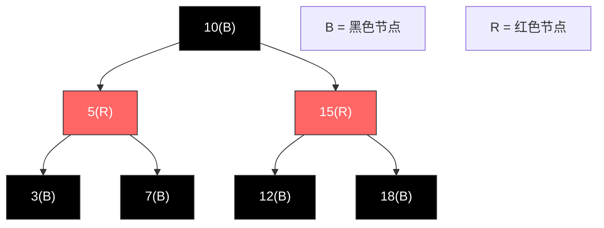
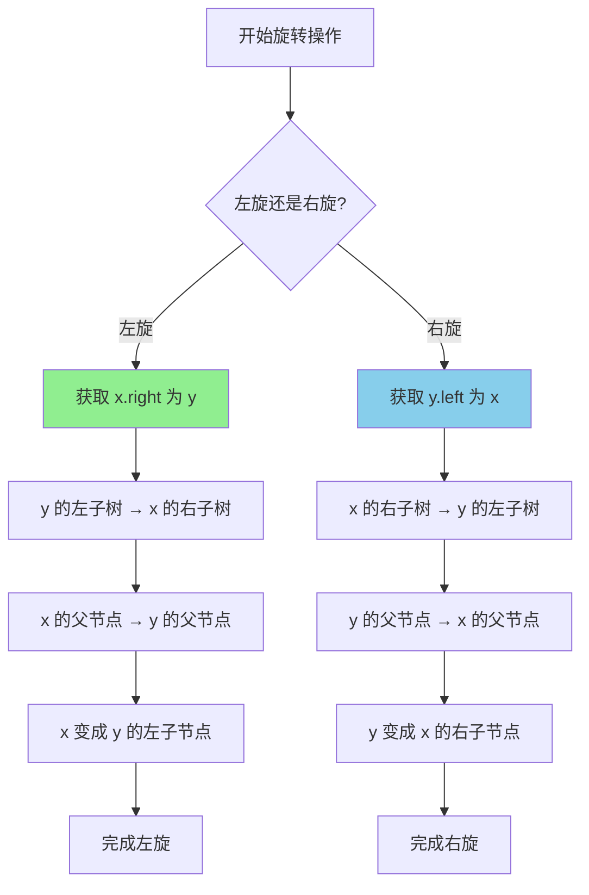
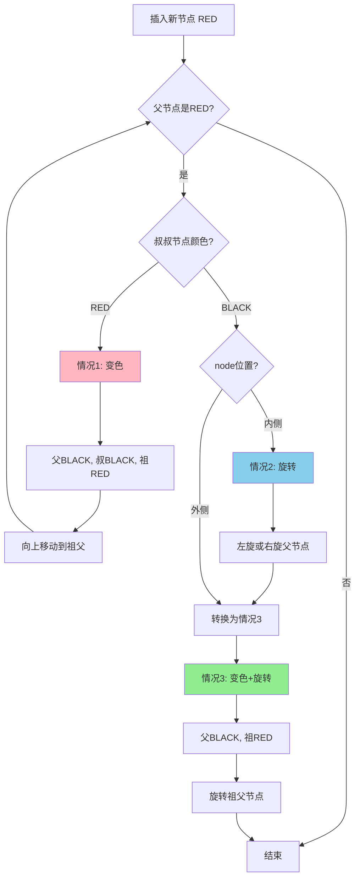

# 红黑树完整学习手册 (Java版)

## 目录
1. [红黑树基础概念](#红黑树基础概念)
2. [红黑树节点定义](#红黑树节点定义)
3. [红黑树性质](#红黑树性质)
4. [旋转操作详解](#旋转操作详解)
5. [插入操作完整实现](#插入操作完整实现)
6. [删除操作完整实现](#删除操作完整实现)
7. [查找操作](#查找操作)
8. [遍历操作](#遍历操作)
9. [红黑树完整实现](#红黑树完整实现)
10. [LeetCode相关题目](#leetcode相关题目)

---

## 红黑树基础概念

### 什么是红黑树？

红黑树（Red-Black Tree）是一种自平衡二叉搜索树，通过在节点上添加颜色属性（红色或黑色）并维护特定规则来保持树的平衡。

### 为什么需要红黑树？

普通的二叉搜索树在最坏情况下会退化成链表（O(n)），而红黑树通过自平衡机制保证了所有操作的时间复杂度为 O(log n)。

### 红黑树 vs AVL树

| 特性 | 红黑树 | AVL树 |
|------|--------|-------|
| 平衡条件 | 较宽松（黑高平衡） | 严格（高度差≤1） |
| 查找效率 | O(log n) | O(log n)，稍快 |
| 插入/删除效率 | 较快，旋转次数少 | 较慢，旋转次数多 |
| 适用场景 | 插入删除频繁 | 查找频繁 |
| 应用实例 | Java TreeMap, C++ map | Windows内核 |

---

## 红黑树节点定义

```java
public class RBNode {
    int val;                    // 节点值
    RBNode left;                // 左子节点
    RBNode right;               // 右子节点
    RBNode parent;              // 父节点（红黑树需要父指针）
    boolean color;              // 颜色：true = RED, false = BLACK
    
    // 颜色常量
    public static final boolean RED = true;
    public static final boolean BLACK = false;
    
    // 构造函数
    public RBNode(int val) {
        this.val = val;
        this.color = RED;       // 新节点默认为红色
        this.left = null;
        this.right = null;
        this.parent = null;
    }
    
    public RBNode(int val, boolean color) {
        this.val = val;
        this.color = color;
        this.left = null;
        this.right = null;
        this.parent = null;
    }
}
```

---

## 红黑树性质

红黑树必须满足以下5条性质：

### 性质1：节点颜色
每个节点要么是红色，要么是黑色。

### 性质2：根节点
根节点必须是黑色。

### 性质3：叶子节点
所有叶子节点（NIL节点）都是黑色。

### 性质4：红色节点限制
**如果一个节点是红色，那么它的两个子节点都必须是黑色。**
（即：不能有两个连续的红色节点）

### 性质5：黑高一致
**从任一节点到其每个叶子节点的所有路径都包含相同数目的黑色节点。**

### 性质推论

根据以上性质，可以得出：
- 从根到叶子的最长路径不会超过最短路径的2倍
- 包含 n 个节点的红黑树高度 h ≤ 2log(n+1)

### 红黑树示例图



---

## 旋转操作详解

旋转是红黑树维持平衡的核心操作，分为左旋和右旋。

### 左旋 (Left Rotate)

**作用：** 将节点 x 的右子节点提升为父节点

```
    x                    y
   / \    左旋(x)      / \
  α   y   -------->   x   γ
     / \             / \
    β   γ           α   β
```

**代码实现：**
```java
private void leftRotate(RBNode x) {
    RBNode y = x.right;           // y是x的右子节点
    
    // 1. 将y的左子树变成x的右子树
    x.right = y.left;
    if (y.left != null) {
        y.left.parent = x;
    }
    
    // 2. 将x的父节点变成y的父节点
    y.parent = x.parent;
    if (x.parent == null) {       // x是根节点
        this.root = y;
    } else if (x == x.parent.left) {  // x是左子节点
        x.parent.left = y;
    } else {                          // x是右子节点
        x.parent.right = y;
    }
    
    // 3. 将x变成y的左子节点
    y.left = x;
    x.parent = y;
}
```

### 右旋 (Right Rotate)

**作用：** 将节点 y 的左子节点提升为父节点

```
      y                x
     / \   右旋(y)    / \
    x   γ  -------->  α   y
   / \                   / \
  α   β                 β   γ
```

**代码实现：**
```java
private void rightRotate(RBNode y) {
    RBNode x = y.left;            // x是y的左子节点
    
    // 1. 将x的右子树变成y的左子树
    y.left = x.right;
    if (x.right != null) {
        x.right.parent = y;
    }
    
    // 2. 将y的父节点变成x的父节点
    x.parent = y.parent;
    if (y.parent == null) {       // y是根节点
        this.root = x;
    } else if (y == y.parent.left) {  // y是左子节点
        y.parent.left = x;
    } else {                          // y是右子节点
        y.parent.right = x;
    }
    
    // 3. 将y变成x的右子节点
    x.right = y;
    y.parent = x;
}
```

### 旋转操作流程图



---

## 插入操作完整实现

### 插入流程概述

1. **按BST规则插入新节点**（新节点颜色为红色）
2. **修复红黑树性质**（调整颜色和旋转）

### 插入主函数

```java
public void insert(int val) {
    RBNode newNode = new RBNode(val);
    
    // 1. 按BST规则插入
    if (root == null) {
        root = newNode;
        root.color = RBNode.BLACK;  // 根节点必须是黑色
        return;
    }
    
    RBNode parent = null;
    RBNode current = root;
    
    while (current != null) {
        parent = current;
        if (val < current.val) {
            current = current.left;
        } else if (val > current.val) {
            current = current.right;
        } else {
            return;  // 值已存在，不插入
        }
    }
    
    // 设置父节点
    newNode.parent = parent;
    if (val < parent.val) {
        parent.left = newNode;
    } else {
        parent.right = newNode;
    }
    
    // 2. 修复红黑树性质
    insertFixup(newNode);
}
```

### 插入修复函数

插入后可能违反性质4（红红冲突），需要分3种情况处理：

```java
private void insertFixup(RBNode node) {
    // 当父节点是红色时，需要修复
    while (node.parent != null && node.parent.color == RBNode.RED) {
        
        if (node.parent == node.parent.parent.left) {
            // 父节点是祖父节点的左子节点
            RBNode uncle = node.parent.parent.right;  // 叔叔节点
            
            if (uncle != null && uncle.color == RBNode.RED) {
                // 情况1：叔叔是红色
                node.parent.color = RBNode.BLACK;
                uncle.color = RBNode.BLACK;
                node.parent.parent.color = RBNode.RED;
                node = node.parent.parent;  // 向上继续检查
            } else {
                // 叔叔是黑色
                if (node == node.parent.right) {
                    // 情况2：node是右子节点
                    node = node.parent;
                    leftRotate(node);  // 转换成情况3
                }
                // 情况3：node是左子节点
                node.parent.color = RBNode.BLACK;
                node.parent.parent.color = RBNode.RED;
                rightRotate(node.parent.parent);
            }
        } else {
            // 父节点是祖父节点的右子节点（镜像情况）
            RBNode uncle = node.parent.parent.left;  // 叔叔节点
            
            if (uncle != null && uncle.color == RBNode.RED) {
                // 情况1：叔叔是红色
                node.parent.color = RBNode.BLACK;
                uncle.color = RBNode.BLACK;
                node.parent.parent.color = RBNode.RED;
                node = node.parent.parent;
            } else {
                // 叔叔是黑色
                if (node == node.parent.left) {
                    // 情况2：node是左子节点
                    node = node.parent;
                    rightRotate(node);  // 转换成情况3
                }
                // 情况3：node是右子节点
                node.parent.color = RBNode.BLACK;
                node.parent.parent.color = RBNode.RED;
                leftRotate(node.parent.parent);
            }
        }
    }
    
    // 确保根节点是黑色
    root.color = RBNode.BLACK;
}
```

### 插入修复的三种情况

#### 情况1：叔叔节点是红色

```
        G(B)                  G(R)
       /   \                 /   \
     P(R)  U(R)    --->    P(B)  U(B)
     /                     /
   N(R)                 N(R)
```

**操作：** 重新着色，将问题上移到祖父节点

#### 情况2：叔叔是黑色，N是右子节点

```
      G(B)                G(B)
     /   \               /   \
   P(R)  U(B)  --->    N(R)  U(B)
     \                 /
     N(R)            P(R)
```

**操作：** 左旋父节点，转换成情况3

#### 情况3：叔叔是黑色，N是左子节点

```
        G(B)                P(B)
       /   \               /   \
     P(R)  U(B)  --->    N(R)  G(R)
     /                           \
   N(R)                          U(B)
```

**操作：** 右旋祖父节点，重新着色

### 插入流程图



---

## 删除操作完整实现

### 删除流程概述

1. **按BST规则删除节点**
2. **如果删除的是黑色节点，需要修复**

### 删除主函数

```java
public void delete(int val) {
    RBNode node = search(val);
    if (node == null) return;
    
    deleteNode(node);
}

private void deleteNode(RBNode node) {
    RBNode replace;    // 实际被删除节点的替代节点
    RBNode child;      // 替代节点的子节点
    boolean originalColor = node.color;
    
    if (node.left == null) {
        // 情况1：只有右子节点或无子节点
        child = node.right;
        transplant(node, node.right);
        replace = child;
    } else if (node.right == null) {
        // 情况2：只有左子节点
        child = node.left;
        transplant(node, node.left);
        replace = child;
    } else {
        // 情况3：有两个子节点
        // 找后继节点（右子树的最小节点）
        RBNode successor = minimum(node.right);
        originalColor = successor.color;
        child = successor.right;
        
        if (successor.parent == node) {
            if (child != null) {
                child.parent = successor;
            }
        } else {
            transplant(successor, successor.right);
            successor.right = node.right;
            successor.right.parent = successor;
        }
        
        transplant(node, successor);
        successor.left = node.left;
        successor.left.parent = successor;
        successor.color = node.color;
        replace = child;
    }
    
    // 如果删除的是黑色节点，需要修复
    if (originalColor == RBNode.BLACK && replace != null) {
        deleteFixup(replace);
    }
}

// 用v替换u
private void transplant(RBNode u, RBNode v) {
    if (u.parent == null) {
        root = v;
    } else if (u == u.parent.left) {
        u.parent.left = v;
    } else {
        u.parent.right = v;
    }
    
    if (v != null) {
        v.parent = u.parent;
    }
}

// 找最小节点
private RBNode minimum(RBNode node) {
    while (node.left != null) {
        node = node.left;
    }
    return node;
}
```

### 删除修复函数

删除黑色节点后，可能破坏性质5（黑高一致），需要修复：

```java
private void deleteFixup(RBNode node) {
    while (node != root && node.color == RBNode.BLACK) {
        
        if (node == node.parent.left) {
            // node是左子节点
            RBNode sibling = node.parent.right;  // 兄弟节点
            
            if (sibling.color == RBNode.RED) {
                // 情况1：兄弟是红色
                sibling.color = RBNode.BLACK;
                node.parent.color = RBNode.RED;
                leftRotate(node.parent);
                sibling = node.parent.right;
            }
            
            if ((sibling.left == null || sibling.left.color == RBNode.BLACK) &&
                (sibling.right == null || sibling.right.color == RBNode.BLACK)) {
                // 情况2：兄弟是黑色，且两个侄子都是黑色
                sibling.color = RBNode.RED;
                node = node.parent;
            } else {
                if (sibling.right == null || sibling.right.color == RBNode.BLACK) {
                    // 情况3：兄弟是黑色，左侄子是红色，右侄子是黑色
                    if (sibling.left != null) {
                        sibling.left.color = RBNode.BLACK;
                    }
                    sibling.color = RBNode.RED;
                    rightRotate(sibling);
                    sibling = node.parent.right;
                }
                
                // 情况4：兄弟是黑色，右侄子是红色
                sibling.color = node.parent.color;
                node.parent.color = RBNode.BLACK;
                if (sibling.right != null) {
                    sibling.right.color = RBNode.BLACK;
                }
                leftRotate(node.parent);
                node = root;  // 结束循环
            }
        } else {
            // node是右子节点（镜像情况）
            RBNode sibling = node.parent.left;
            
            if (sibling.color == RBNode.RED) {
                // 情况1：兄弟是红色
                sibling.color = RBNode.BLACK;
                node.parent.color = RBNode.RED;
                rightRotate(node.parent);
                sibling = node.parent.left;
            }
            
            if ((sibling.left == null || sibling.left.color == RBNode.BLACK) &&
                (sibling.right == null || sibling.right.color == RBNode.BLACK)) {
                // 情况2：兄弟是黑色，且两个侄子都是黑色
                sibling.color = RBNode.RED;
                node = node.parent;
            } else {
                if (sibling.left == null || sibling.left.color == RBNode.BLACK) {
                    // 情况3：兄弟是黑色，右侄子是红色，左侄子是黑色
                    if (sibling.right != null) {
                        sibling.right.color = RBNode.BLACK;
                    }
                    sibling.color = RBNode.RED;
                    leftRotate(sibling);
                    sibling = node.parent.left;
                }
                
                // 情况4：兄弟是黑色，左侄子是红色
                sibling.color = node.parent.color;
                node.parent.color = RBNode.BLACK;
                if (sibling.left != null) {
                    sibling.left.color = RBNode.BLACK;
                }
                rightRotate(node.parent);
                node = root;
            }
        }
    }
    
    node.color = RBNode.BLACK;
}
```

### 删除修复的四种情况

#### 情况1：兄弟节点是红色

```
       P(B)                  S(B)
      /   \                 /   \
    N(B)  S(R)    --->    P(R)  SR(B)
          /  \            /  \
        SL(B) SR(B)     N(B) SL(B)
```

**操作：** 旋转+变色，转换为情况2/3/4

#### 情况2：兄弟黑色，两个侄子都是黑色

```
       P(?)                  P(B)
      /   \                 /   \
    N(B)  S(B)    --->    N(B)  S(R)
          /  \                  /  \
        SL(B) SR(B)           SL(B) SR(B)
```

**操作：** 兄弟变红，问题上移

#### 情况3：兄弟黑色，左侄子红色，右侄子黑色

```
       P(?)                  P(?)
      /   \                 /   \
    N(B)  S(B)    --->    N(B)  SL(B)
          /  \                    \
        SL(R) SR(B)               S(R)
                                    \
                                    SR(B)
```

**操作：** 旋转兄弟，转换为情况4

#### 情况4：兄弟黑色，右侄子红色

```
       P(?)                  S(?)
      /   \                 /   \
    N(B)  S(B)    --->    P(B)  SR(B)
          /  \            /  \
        SL(?) SR(R)     N(B) SL(?)
```

**操作：** 旋转父节点+变色，完成修复

---

## 查找操作

红黑树的查找和普通BST相同：

```java
public RBNode search(int val) {
    return searchHelper(root, val);
}

private RBNode searchHelper(RBNode node, int val) {
    if (node == null || node.val == val) {
        return node;
    }
    
    if (val < node.val) {
        return searchHelper(node.left, val);
    } else {
        return searchHelper(node.right, val);
    }
}

// 迭代版本
public RBNode searchIterative(int val) {
    RBNode current = root;
    
    while (current != null) {
        if (val == current.val) {
            return current;
        } else if (val < current.val) {
            current = current.left;
        } else {
            current = current.right;
        }
    }
    
    return null;
}

// 查找最小值
public RBNode findMin() {
    if (root == null) return null;
    return minimum(root);
}

// 查找最大值
public RBNode findMax() {
    if (root == null) return null;
    
    RBNode current = root;
    while (current.right != null) {
        current = current.right;
    }
    return current;
}
```

---

## 遍历操作

### 中序遍历（有序输出）

```java
public List<Integer> inorderTraversal() {
    List<Integer> result = new ArrayList<>();
    inorderHelper(root, result);
    return result;
}

private void inorderHelper(RBNode node, List<Integer> result) {
    if (node == null) return;
    
    inorderHelper(node.left, result);
    result.add(node.val);
    inorderHelper(node.right, result);
}
```

### 前序遍历

```java
public List<Integer> preorderTraversal() {
    List<Integer> result = new ArrayList<>();
    preorderHelper(root, result);
    return result;
}

private void preorderHelper(RBNode node, List<Integer> result) {
    if (node == null) return;
    
    result.add(node.val);
    preorderHelper(node.left, result);
    preorderHelper(node.right, result);
}
```

### 后序遍历

```java
public List<Integer> postorderTraversal() {
    List<Integer> result = new ArrayList<>();
    postorderHelper(root, result);
    return result;
}

private void postorderHelper(RBNode node, List<Integer> result) {
    if (node == null) return;
    
    postorderHelper(node.left, result);
    postorderHelper(node.right, result);
    result.add(node.val);
}
```

### 层序遍历

```java
public List<List<Integer>> levelOrderTraversal() {
    List<List<Integer>> result = new ArrayList<>();
    if (root == null) return result;
    
    Queue<RBNode> queue = new LinkedList<>();
    queue.offer(root);
    
    while (!queue.isEmpty()) {
        int levelSize = queue.size();
        List<Integer> currentLevel = new ArrayList<>();
        
        for (int i = 0; i < levelSize; i++) {
            RBNode node = queue.poll();
            currentLevel.add(node.val);
            
            if (node.left != null) queue.offer(node.left);
            if (node.right != null) queue.offer(node.right);
        }
        
        result.add(currentLevel);
    }
    
    return result;
}
```

---

## 红黑树完整实现

```java
public class RedBlackTree {
    private RBNode root;
    
    // 节点类定义
    static class RBNode {
        int val;
        RBNode left, right, parent;
        boolean color;  // true = RED, false = BLACK
        
        static final boolean RED = true;
        static final boolean BLACK = false;
        
        RBNode(int val) {
            this.val = val;
            this.color = RED;
        }
    }
    
    public RedBlackTree() {
        this.root = null;
    }
    
    // ========== 辅助方法 ==========
    
    private boolean isRed(RBNode node) {
        return node != null && node.color == RBNode.RED;
    }
    
    private boolean isBlack(RBNode node) {
        return node == null || node.color == RBNode.BLACK;
    }
    
    // ========== 旋转操作 ==========
    
    private void leftRotate(RBNode x) {
        RBNode y = x.right;
        x.right = y.left;
        
        if (y.left != null) {
            y.left.parent = x;
        }
        
        y.parent = x.parent;
        if (x.parent == null) {
            root = y;
        } else if (x == x.parent.left) {
            x.parent.left = y;
        } else {
            x.parent.right = y;
        }
        
        y.left = x;
        x.parent = y;
    }
    
    private void rightRotate(RBNode y) {
        RBNode x = y.left;
        y.left = x.right;
        
        if (x.right != null) {
            x.right.parent = y;
        }
        
        x.parent = y.parent;
        if (y.parent == null) {
            root = x;
        } else if (y == y.parent.left) {
            y.parent.left = x;
        } else {
            y.parent.right = x;
        }
        
        x.right = y;
        y.parent = x;
    }
    
    // ========== 插入操作 ==========
    
    public void insert(int val) {
        RBNode newNode = new RBNode(val);
        
        if (root == null) {
            root = newNode;
            root.color = RBNode.BLACK;
            return;
        }
        
        RBNode parent = null;
        RBNode current = root;
        
        while (current != null) {
            parent = current;
            if (val < current.val) {
                current = current.left;
            } else if (val > current.val) {
                current = current.right;
            } else {
                return;
            }
        }
        
        newNode.parent = parent;
        if (val < parent.val) {
            parent.left = newNode;
        } else {
            parent.right = newNode;
        }
        
        insertFixup(newNode);
    }
    
    private void insertFixup(RBNode node) {
        while (node.parent != null && node.parent.color == RBNode.RED) {
            if (node.parent == node.parent.parent.left) {
                RBNode uncle = node.parent.parent.right;
                
                if (uncle != null && uncle.color == RBNode.RED) {
                    node.parent.color = RBNode.BLACK;
                    uncle.color = RBNode.BLACK;
                    node.parent.parent.color = RBNode.RED;
                    node = node.parent.parent;
                } else {
                    if (node == node.parent.right) {
                        node = node.parent;
                        leftRotate(node);
                    }
                    node.parent.color = RBNode.BLACK;
                    node.parent.parent.color = RBNode.RED;
                    rightRotate(node.parent.parent);
                }
            } else {
                RBNode uncle = node.parent.parent.left;
                
                if (uncle != null && uncle.color == RBNode.RED) {
                    node.parent.color = RBNode.BLACK;
                    uncle.color = RBNode.BLACK;
                    node.parent.parent.color = RBNode.RED;
                    node = node.parent.parent;
                } else {
                    if (node == node.parent.left) {
                        node = node.parent;
                        rightRotate(node);
                    }
                    node.parent.color = RBNode.BLACK;
                    node.parent.parent.color = RBNode.RED;
                    leftRotate(node.parent.parent);
                }
            }
        }
        root.color = RBNode.BLACK;
    }
    
    // ========== 删除操作 ==========
    
    public void delete(int val) {
        RBNode node = search(val);
        if (node == null) return;
        deleteNode(node);
    }
    
    private void deleteNode(RBNode node) {
        RBNode child;
        boolean originalColor = node.color;
        
        if (node.left == null) {
            child = node.right;
            transplant(node, node.right);
        } else if (node.right == null) {
            child = node.left;
            transplant(node, node.left);
        } else {
            RBNode successor = minimum(node.right);
            originalColor = successor.color;
            child = successor.right;
            
            if (successor.parent == node) {
                if (child != null) child.parent = successor;
            } else {
                transplant(successor, successor.right);
                successor.right = node.right;
                successor.right.parent = successor;
            }
            
            transplant(node, successor);
            successor.left = node.left;
            successor.left.parent = successor;
            successor.color = node.color;
        }
        
        if (originalColor == RBNode.BLACK && child != null) {
            deleteFixup(child);
        }
    }
    
    private void deleteFixup(RBNode node) {
        while (node != root && node.color == RBNode.BLACK) {
            if (node == node.parent.left) {
                RBNode sibling = node.parent.right;
                
                if (sibling.color == RBNode.RED) {
                    sibling.color = RBNode.BLACK;
                    node.parent.color = RBNode.RED;
                    leftRotate(node.parent);
                    sibling = node.parent.right;
                }
                
                if ((sibling.left == null || sibling.left.color == RBNode.BLACK) &&
                    (sibling.right == null || sibling.right.color == RBNode.BLACK)) {
                    sibling.color = RBNode.RED;
                    node = node.parent;
                } else {
                    if (sibling.right == null || sibling.right.color == RBNode.BLACK) {
                        if (sibling.left != null) sibling.left.color = RBNode.BLACK;
                        sibling.color = RBNode.RED;
                        rightRotate(sibling);
                        sibling = node.parent.right;
                    }
                    sibling.color = node.parent.color;
                    node.parent.color = RBNode.BLACK;
                    if (sibling.right != null) sibling.right.color = RBNode.BLACK;
                    leftRotate(node.parent);
                    node = root;
                }
            } else {
                RBNode sibling = node.parent.left;
                
                if (sibling.color == RBNode.RED) {
                    sibling.color = RBNode.BLACK;
                    node.parent.color = RBNode.RED;
                    rightRotate(node.parent);
                    sibling = node.parent.left;
                }
                
                if ((sibling.left == null || sibling.left.color == RBNode.BLACK) &&
                    (sibling.right == null || sibling.right.color == RBNode.BLACK)) {
                    sibling.color = RBNode.RED;
                    node = node.parent;
                } else {
                    if (sibling.left == null || sibling.left.color == RBNode.BLACK) {
                        if (sibling.right != null) sibling.right.color = RBNode.BLACK;
                        sibling.color = RBNode.RED;
                        leftRotate(sibling);
                        sibling = node.parent.left;
                    }
                    sibling.color = node.parent.color;
                    node.parent.color = RBNode.BLACK;
                    if (sibling.left != null) sibling.left.color = RBNode.BLACK;
                    rightRotate(node.parent);
                    node = root;
                }
            }
        }
        node.color = RBNode.BLACK;
    }
    
    private void transplant(RBNode u, RBNode v) {
        if (u.parent == null) {
            root = v;
        } else if (u == u.parent.left) {
            u.parent.left = v;
        } else {
            u.parent.right = v;
        }
        if (v != null) v.parent = u.parent;
    }
    
    // ========== 查找操作 ==========
    
    public RBNode search(int val) {
        RBNode current = root;
        while (current != null) {
            if (val == current.val) return current;
            else if (val < current.val) current = current.left;
            else current = current.right;
        }
        return null;
    }
    
    private RBNode minimum(RBNode node) {
        while (node.left != null) {
            node = node.left;
        }
        return node;
    }
    
    // ========== 遍历操作 ==========
    
    public void inorder() {
        inorderHelper(root);
        System.out.println();
    }
    
    private void inorderHelper(RBNode node) {
        if (node == null) return;
        inorderHelper(node.left);
        System.out.print(node.val + "(" + (node.color ? "R" : "B") + ") ");
        inorderHelper(node.right);
    }
    
    // ========== 验证红黑树性质 ==========
    
    public boolean validate() {
        if (root == null) return true;
        
        // 性质2：根节点必须是黑色
        if (root.color == RBNode.RED) {
            System.out.println("违反性质2：根节点不是黑色");
            return false;
        }
        
        // 检查性质4和性质5
        return validateHelper(root) != -1;
    }
    
    private int validateHelper(RBNode node) {
        if (node == null) return 0;  // NIL节点是黑色
        
        // 性质4：红色节点的子节点必须是黑色
        if (node.color == RBNode.RED) {
            if ((node.left != null && node.left.color == RBNode.RED) ||
                (node.right != null && node.right.color == RBNode.RED)) {
                System.out.println("违反性质4：红色节点" + node.val + "有红色子节点");
                return -1;
            }
        }
        
        // 性质5：黑高一致
        int leftBlackHeight = validateHelper(node.left);
        int rightBlackHeight = validateHelper(node.right);
        
        if (leftBlackHeight == -1 || rightBlackHeight == -1) {
            return -1;
        }
        
        if (leftBlackHeight != rightBlackHeight) {
            System.out.println("违反性质5：节点" + node.val + "的左右黑高不同");
            return -1;
        }
        
        return leftBlackHeight + (node.color == RBNode.BLACK ? 1 : 0);
    }
    
    // ========== 打印树结构 ==========
    
    public void printTree() {
        printTreeHelper(root, "", true);
    }
    
    private void printTreeHelper(RBNode node, String prefix, boolean isTail) {
        if (node == null) return;
        
        System.out.println(prefix + (isTail ? "└── " : "├── ") + 
                          node.val + "(" + (node.color ? "R" : "B") + ")");
        
        if (node.left != null || node.right != null) {
            if (node.right != null) {
                printTreeHelper(node.right, prefix + (isTail ? "    " : "│   "), false);
            }
            if (node.left != null) {
                printTreeHelper(node.left, prefix + (isTail ? "    " : "│   "), true);
            }
        }
    }
}
```

---

## LeetCode相关题目

虽然LeetCode上没有直接考红黑树实现的题目，但以下题目涉及红黑树的应用或相关概念：

### 题目1: 实现TreeMap (相关概念)

**问题：** Java的TreeMap底层就是用红黑树实现的。实现一个简单的有序映射结构，支持插入、删除、查找操作。

```java
public class SimpleTreeMap<K extends Comparable<K>, V> {
    private RBNode root;
    
    class RBNode {
        K key;
        V value;
        RBNode left, right, parent;
        boolean color;
        
        RBNode(K key, V value) {
            this.key = key;
            this.value = value;
            this.color = true;  // RED
        }
    }
    
    public void put(K key, V value) {
        // 使用红黑树插入逻辑
        // ...实现细节同上
    }
    
    public V get(K key) {
        RBNode node = getNode(root, key);
        return node == null ? null : node.value;
    }
    
    private RBNode getNode(RBNode node, K key) {
        if (node == null) return null;
        
        int cmp = key.compareTo(node.key);
        if (cmp < 0) return getNode(node.left, key);
        else if (cmp > 0) return getNode(node.right, key);
        else return node;
    }
    
    public void remove(K key) {
        // 使用红黑树删除逻辑
        // ...实现细节同上
    }
}
```

### 题目2: 区间查询 (Range Query)

**问题：** 给定一个红黑树，查询所有在区间 [low, high] 范围内的值。

```java
public List<Integer> rangeQuery(int low, int high) {
    List<Integer> result = new ArrayList<>();
    rangeQueryHelper(root, low, high, result);
    return result;
}

private void rangeQueryHelper(RBNode node, int low, int high, List<Integer> result) {
    if (node == null) return;
    
    // 如果当前节点值大于low，搜索左子树
    if (node.val > low) {
        rangeQueryHelper(node.left, low, high, result);
    }
    
    // 如果当前节点值在范围内，添加到结果
    if (node.val >= low && node.val <= high) {
        result.add(node.val);
    }
    
    // 如果当前节点值小于high，搜索右子树
    if (node.val < high) {
        rangeQueryHelper(node.right, low, high, result);
    }
}
```

### 题目3: 查找第K小的元素

**问题：** 在红黑树中查找第k小的元素。

```java
// 需要在节点中维护子树大小
class RBNodeWithSize {
    int val;
    int size;  // 子树节点数
    RBNodeWithSize left, right, parent;
    boolean color;
    
    RBNodeWithSize(int val) {
        this.val = val;
        this.size = 1;
        this.color = true;
    }
}

public int kthSmallest(int k) {
    return kthSmallestHelper(root, k);
}

private int kthSmallestHelper(RBNodeWithSize node, int k) {
    if (node == null) return -1;
    
    int leftSize = (node.left != null) ? node.left.size : 0;
    
    if (k == leftSize + 1) {
        return node.val;
    } else if (k <= leftSize) {
        return kthSmallestHelper(node.left, k);
    } else {
        return kthSmallestHelper(node.right, k - leftSize - 1);
    }
}
```

### 题目4: 查找两个节点的最近公共祖先

**问题：** 给定红黑树中的两个节点，找到它们的最近公共祖先。

```java
public RBNode lowestCommonAncestor(RBNode p, RBNode q) {
    // 确保p < q
    if (p.val > q.val) {
        RBNode temp = p;
        p = q;
        q = temp;
    }
    
    return lcaHelper(root, p, q);
}

private RBNode lcaHelper(RBNode node, RBNode p, RBNode q) {
    if (node == null) return null;
    
    // 如果p和q都在左子树
    if (node.val > q.val) {
        return lcaHelper(node.left, p, q);
    }
    // 如果p和q都在右子树
    else if (node.val < p.val) {
        return lcaHelper(node.right, p, q);
    }
    // p和q分别在左右子树，或者node就是其中一个
    else {
        return node;
    }
}
```

### 题目5: 红黑树转有序数组

**问题：** 将红黑树转换为有序数组。

```java
public int[] toSortedArray() {
    List<Integer> list = new ArrayList<>();
    inorderToList(root, list);
    
    int[] result = new int[list.size()];
    for (int i = 0; i < list.size(); i++) {
        result[i] = list.get(i);
    }
    return result;
}

private void inorderToList(RBNode node, List<Integer> list) {
    if (node == null) return;
    
    inorderToList(node.left, list);
    list.add(node.val);
    inorderToList(node.right, list);
}
```

### 题目6: 判断是否为合法红黑树

**问题：** 给定一棵二叉树，判断它是否满足红黑树的所有性质。

```java
public boolean isValidRedBlackTree(RBNode root) {
    // 性质1：节点是红色或黑色（由定义保证）
    
    // 性质2：根节点是黑色
    if (root != null && root.color == RBNode.RED) {
        return false;
    }
    
    // 性质3：叶子节点是黑色（NIL节点，由定义保证）
    
    // 性质4和5：通过递归检查
    return checkProperties(root) != -1;
}

// 返回黑高，-1表示违反性质
private int checkProperties(RBNode node) {
    if (node == null) return 0;
    
    // 性质4：红色节点的子节点必须是黑色
    if (node.color == RBNode.RED) {
        if ((node.left != null && node.left.color == RBNode.RED) ||
            (node.right != null && node.right.color == RBNode.RED)) {
            return -1;
        }
    }
    
    int leftBlackHeight = checkProperties(node.left);
    int rightBlackHeight = checkProperties(node.right);
    
    if (leftBlackHeight == -1 || rightBlackHeight == -1) {
        return -1;
    }
    
    // 性质5：黑高一致
    if (leftBlackHeight != rightBlackHeight) {
        return -1;
    }
    
    return leftBlackHeight + (node.color == RBNode.BLACK ? 1 : 0);
}
```

---

## 红黑树性能分析

### 时间复杂度

| 操作 | 平均情况 | 最坏情况 |
|------|---------|---------|
| 查找 | O(log n) | O(log n) |
| 插入 | O(log n) | O(log n) |
| 删除 | O(log n) | O(log n) |
| 遍历 | O(n) | O(n) |

### 空间复杂度

- **存储空间：** O(n)
- **递归栈空间：** O(log n)

### 旋转次数分析

- **插入操作：** 最多2次旋转
- **删除操作：** 最多3次旋转

---

## 红黑树应用场景

### 1. Java集合框架
- `TreeMap`: 基于红黑树的有序映射
- `TreeSet`: 基于红黑树的有序集合

### 2. C++ STL
- `std::map`: 红黑树实现
- `std::set`: 红黑树实现
- `std::multimap`: 红黑树实现
- `std::multiset`: 红黑树实现

### 3. Linux内核
- 进程调度器（CFS）使用红黑树
- 虚拟内存管理

### 4. 数据库索引
- 某些数据库使用红黑树实现索引

### 5. 其他应用
- 优先队列
- 事件调度
- 区间查询

---

## 学习建议

### 入门阶段
1. 理解二叉搜索树的基本操作
2. 掌握红黑树的5条性质
3. 理解左旋和右旋操作
4. 能手动模拟简单的插入过程

### 进阶阶段
1. 掌握插入的3种情况处理
2. 理解删除的4种情况处理
3. 能实现完整的红黑树代码
4. 理解红黑树与2-3-4树的等价关系

### 高级阶段
1. 对比红黑树和AVL树的优劣
2. 分析红黑树的性能
3. 应用红黑树解决实际问题
4. 研究B树、B+树等高级数据结构

---

## 常见面试题

### 1. 红黑树和AVL树的区别？
- 平衡条件不同：红黑树更宽松，AVL更严格
- 旋转次数：红黑树更少
- 适用场景：红黑树适合插入删除频繁，AVL适合查找频繁

### 2. 为什么新插入的节点是红色？
- 如果是黑色，会立即违反性质5（黑高一致）
- 红色只可能违反性质4，更容易修复

### 3. 红黑树的高度最多是多少？
- 最多 2log(n+1)

### 4. 什么时候需要旋转？
- 插入后出现红红冲突且叔叔是黑色
- 删除后出现双黑节点

### 5. TreeMap的底层实现？
- 红黑树，保证有序性和O(log n)操作

---

## 总结

红黑树是一种高效的自平衡二叉搜索树，通过颜色和旋转操作维持平衡。

**核心要点：**
1. 5条性质保证树的平衡
2. 插入3种情况，删除4种情况
3. 旋转操作是平衡的关键
4. 广泛应用于标准库和系统软件

**学习路径：**
BST → 平衡树概念 → 旋转操作 → 插入修复 → 删除修复 → 完整实现

**祝你学习顺利！🌲**
