# 设计模式速查手册

## 快速对比表

**创建型模式（Creational Patterns）**：对象的<u>新增</u>

- Singleton、Factory

**结构型模式（Structural Patterns）**： 对象被<u>包装</u>

- Decorator、Facade

**行为型模式（Behavioral Patterns）**：对象与<u>方法</u>

- Iterator、Observer、State、Strategy、Template Method

| 模式 | 类型 | 核心作用 |
|-----|------|---------|
| **Singleton**✔ | 创建型 | 单个对象 |
| **Factory**✔ | 创建型 | 多个对象 |
| **Decorator**✔ | 结构型 | 装饰器 *包装* 对象 |
| **Facade✔** | 结构型 | 外观 *封装* 子系统 |
| **Observer**✔ | 行为型 | 平台 <u>通知</u> 用户 |
| **Strategy**✔ | 行为型 | 上下文 <u>切换</u> 策略 |
| **Template Method**✔ | 行为型 | 父类 固定<u>流程</u> 子类 |
| **State**✔ | 行为型 | 对象 多种<u>状态</u> |
| **Iterator** | 行为型 | 不同集合 <u>迭代</u> 对应迭代器 |

---

## 目录

### 创建型模式 (Creational Patterns)
1. [Singleton 单例模式](#1-singleton-单例模式)
2. [Factory 工厂模式](#2-factory-工厂模式)

### 结构型模式 (Structural Patterns)
3. [Decorator 装饰器模式](#3-decorator-装饰器模式)
4. [Facade 外观模式](#4-facade-外观模式)

### 行为型模式 (Behavioral Patterns)
5. [Observer 观察者模式](#5-observer-观察者模式)
6. [Strategy 策略模式](#6-strategy-策略模式)
7. [Template Method 模板方法模式](#7-template-method-模板方法模式)
8. [State 状态模式](#8-state-状态模式)
9. [Iterator 迭代器模式](#9-iterator-迭代器模式)

------

## 颜色图例说明

- 🟡 **#FFE4B5** - 具体实现类（ConcreteClass）
- 🟣 **#DDA0DD** - 接口/抽象类（Interface/AbstractClass）
- 🟢 **#90EE90** - 上下文/外观/工厂类（Context/Facade/Factory）
- 🔵 **#E0FFFF** - 客户端（Client）
- 🔴 **#FFB6C1** - 其他辅助类

---

## 1. Singleton 单例模式

### 模式简介

确保一个类只有<u>一个实例</u>，封装实例，并提供<u>全局访问接口</u>。  
**案例**：数据库连接池 - 该应用共享数据库连接的各实例。  
**何时使用**：需要严格控制全局只有一个实例时，如配置管理器、线程池、缓存等。1、多个地方需要访问同一份资源，数据库连接很贵（占内存、占端口）；2、应用需要统一的配置；3、出现场景 = "贵重资源"

### 结构流程图

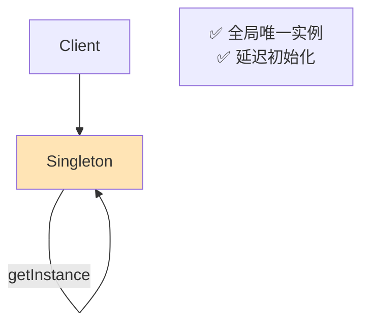
```mermaid
flowchart TD
    Client[Client] --> Singleton[Singleton]
    Singleton -->|getInstance| Singleton
    
    Note[✅ 全局唯一实例<br/>✅ 延迟初始化]
   
style Singleton fill:#FFE4B5
   
```


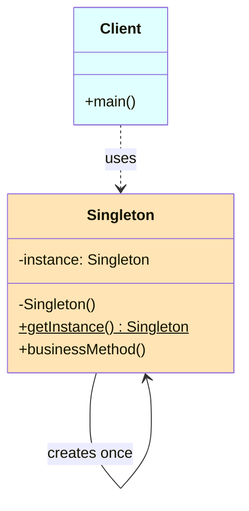
```mermaid
classDiagram
    class Singleton {
        -instance: Singleton
        -Singleton()
        +getInstance()$ Singleton
        +businessMethod()
    }
    
    class Client {
        +main()
    }
    
    Client ..> Singleton : uses
    Singleton --> Singleton : creates once
    
    style Singleton fill:#FFE4B5
    style Client fill:#E0FFFF
```

### 模板代码

```java
// ========== 单例类 ==========
public class Singleton {
    // 私有静态实例
    private static Singleton instance;
    
    // 私有构造函数
    private Singleton() {
        System.out.println("创建单例实例");
    }
    
    // 公有静态获取方法（懒汉式）
    public static Singleton getInstance() {
        if (instance == null) {
            instance = new Singleton();
        }
        return instance;
    }
    
    // 业务方法
    public void businessMethod() {
        System.out.println("执行业务逻辑");
    }
}

// ========== 客户端 ==========
public class Client {
    public static void main(String[] args) {
        // 获取单例实例
        Singleton s1 = Singleton.getInstance();
        Singleton s2 = Singleton.getInstance();
        
        // 验证是同一个实例
        System.out.println(s1 == s2);  // true
        
        s1.businessMethod();
    }
}
```

### 示意流程图

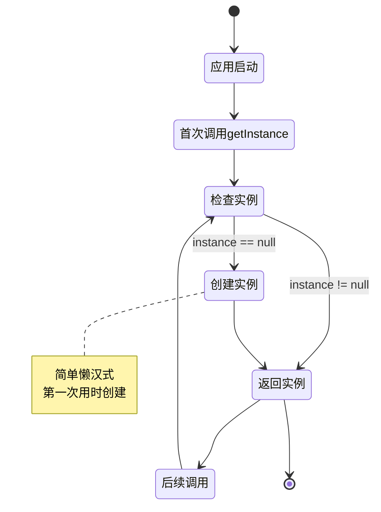
```mermaid
stateDiagram-v2
    [*] --> 应用启动
    应用启动 --> 首次调用getInstance
    
    首次调用getInstance --> 检查实例
    检查实例 --> 创建实例: instance == null
    检查实例 --> 返回实例: instance != null
    
    创建实例 --> 返回实例
    
    返回实例 --> 后续调用
    后续调用 --> 检查实例
    
    返回实例 --> [*]
    
    note right of 创建实例
        简单懒汉式
        第一次用时创建
    end note
```

### 示意代码

```java
// ========== 数据库连接池单例 ==========
public class DatabaseConnection {
    private static DatabaseConnection instance;
    private String connectionUrl;
    
    private DatabaseConnection() {
        // 模拟连接数据库
        this.connectionUrl = "jdbc:mysql://localhost:3306/mydb";
        System.out.println("数据库连接已建立: " + connectionUrl);
    }
    
    public static DatabaseConnection getInstance() {
        if (instance == null) {
            instance = new DatabaseConnection();
        }
        return instance;
    }
    
    public void query(String sql) {
        System.out.println("执行查询: " + sql);
    }
}


// ========== 测试 ==========
public class SingletonDemo {
    public static void main(String[] args) {
        // 数据库连接
        System.out.println("--- 数据库连接示例 ---");
        DatabaseConnection db1 = DatabaseConnection.getInstance();
        DatabaseConnection db2 = DatabaseConnection.getInstance();
        
        System.out.println("db1 == db2: " + (db1 == db2)); // true
        db1.query("SELECT * FROM users");
        
    }
}
```

---

## 2. Factory 工厂模式

### 模式简介

产品接口定义创建<u>不同产品对象</u>的逻辑，工厂switch；或父工厂新建抽象类模板，子工厂切换决定实例化哪个类，客户端进行具体实例化。  
**案例**：数据库工厂 - 根据配置创建MySQL、Oracle或PostgreSQL连接。  
**何时使用**：创建逻辑复杂、需要根据条件决定创建哪种对象；对象需要很多，但是模板都差不多（比如敌人对象）

### 结构流程图

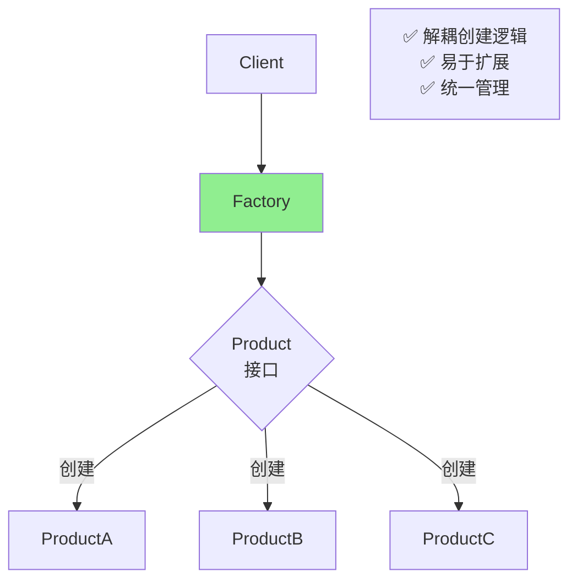
```mermaid
flowchart TD
    Client[Client] --> Factory[Factory]
    Factory --> Product{Product<br/>接口}
    Product -->|创建| PA[ProductA]
    Product -->|创建| PB[ProductB]
    Product -->|创建| PC[ProductC]
    
    Note[✅ 解耦创建逻辑<br/>✅ 易于扩展<br/>✅ 统一管理]
   
style Factory fill:#90EE90
```


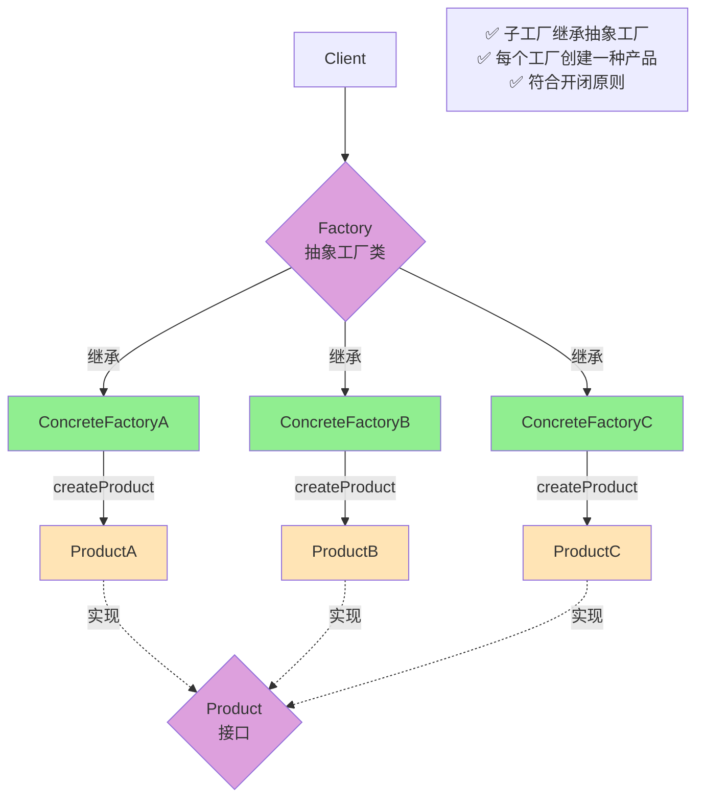
```mermaid
flowchart TD
    Client[Client] --> Factory{Factory<br/>抽象工厂类}
    
    Factory -->|继承| FactoryA[ConcreteFactoryA]
    Factory -->|继承| FactoryB[ConcreteFactoryB]
    Factory -->|继承| FactoryC[ConcreteFactoryC]
    
    FactoryA -->|createProduct| PA[ProductA]
    FactoryB -->|createProduct| PB[ProductB]
    FactoryC -->|createProduct| PC[ProductC]
    
    PA -.实现.-> Product{Product<br/>接口}
    PB -.实现.-> Product
    PC -.实现.-> Product
    
    Note[✅ 子工厂继承抽象工厂<br/>✅ 每个工厂创建一种产品<br/>✅ 符合开闭原则]
   
style Factory fill:#DDA0DD
style FactoryA fill:#90EE90
style FactoryB fill:#90EE90
style FactoryC fill:#90EE90
style Product fill:#DDA0DD
style PA fill:#FFE4B5
style PB fill:#FFE4B5
style PC fill:#FFE4B5
```


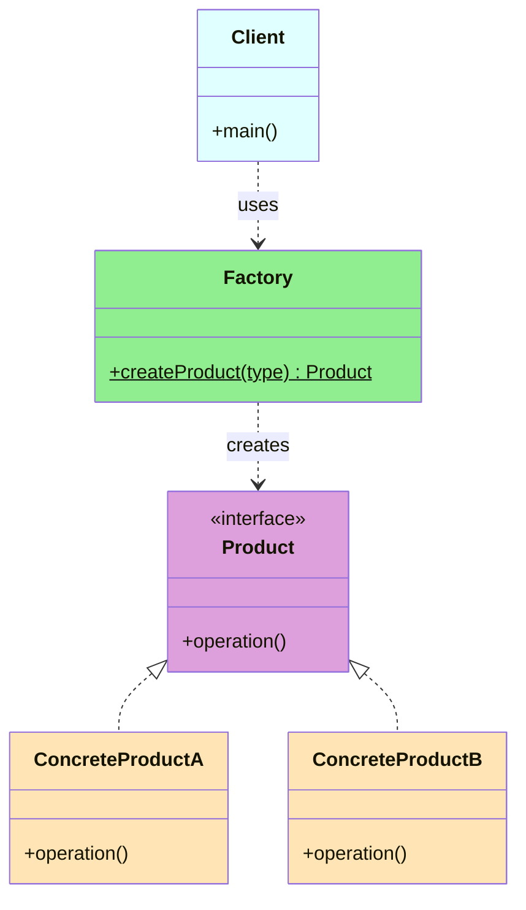
```mermaid
classDiagram
    class Product {
        <<interface>>
        +operation()
    }
    
    class ConcreteProductA {
        +operation()
    }
    
    class ConcreteProductB {
        +operation()
    }
    
    class Factory {
        +createProduct(type)$ Product
    }
    
    class Client {
        +main()
    }
    
    Product <|.. ConcreteProductA
    Product <|.. ConcreteProductB
    Factory ..> Product : creates
    Client ..> Factory : uses
    
    style Product fill:#DDA0DD
    style ConcreteProductA fill:#FFE4B5
    style ConcreteProductB fill:#FFE4B5
    style Factory fill:#90EE90
    style Client fill:#E0FFFF
```

### 模板代码

```java
// ========== 产品接口 ==========
interface Product {
    void operation();
}

// ========== 具体产品A ==========
class ConcreteProductA implements Product {
    @Override
    public void operation() {
        System.out.println("产品A的操作");
    }
}

// ========== 具体产品B ==========
class ConcreteProductB implements Product {
    @Override
    public void operation() {
        System.out.println("产品B的操作");
    }
}

// ========== 工厂类 ==========
class Factory {
    public static Product createProduct(String type) {
        switch (type) {
            case "A":
                return new ConcreteProductA();
            case "B":
                return new ConcreteProductB();
            default:
                throw new IllegalArgumentException("未知产品类型");
        }
    }
}

// ========== 客户端 ==========
public class Client {
    public static void main(String[] args) {
        // 通过工厂创建产品
        Product productA = Factory.createProduct("A");
        productA.operation();
        
        Product productB = Factory.createProduct("B");
        productB.operation();
    }
}
```

### 示意流程图

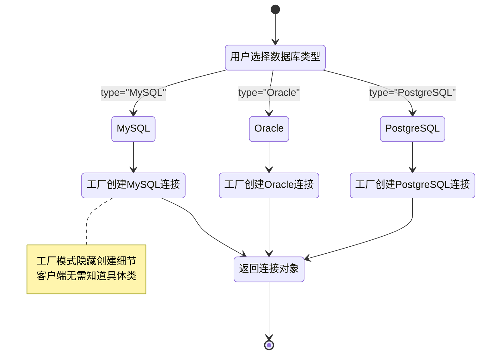
```mermaid
stateDiagram-v2
    [*] --> 用户选择数据库类型
    用户选择数据库类型 --> MySQL: type="MySQL"
    用户选择数据库类型 --> Oracle: type="Oracle"
    用户选择数据库类型 --> PostgreSQL: type="PostgreSQL"
    
    MySQL --> 工厂创建MySQL连接
    Oracle --> 工厂创建Oracle连接
    PostgreSQL --> 工厂创建PostgreSQL连接
    
    工厂创建MySQL连接 --> 返回连接对象
    工厂创建Oracle连接 --> 返回连接对象
    工厂创建PostgreSQL连接 --> 返回连接对象
    
    返回连接对象 --> [*]
    
    note right of 工厂创建MySQL连接
        工厂模式隐藏创建细节
        客户端无需知道具体类
    end note
```

### 示意代码

```java
// ========== 数据库连接接口 ==========
interface DatabaseConnection {
    void connect();
    void query(String sql);
}

// ========== MySQL连接 ==========
class MySQLConnection implements DatabaseConnection {
    @Override
    public void connect() {
        System.out.println("连接到 MySQL 数据库");
    }
    
    @Override
    public void query(String sql) {
        System.out.println("MySQL执行: " + sql);
    }
}

// ========== Oracle连接 ==========
class OracleConnection implements DatabaseConnection {
    @Override
    public void connect() {
        System.out.println("连接到 Oracle 数据库");
    }
    
    @Override
    public void query(String sql) {
        System.out.println("Oracle执行: " + sql);
    }
}

// ========== PostgreSQL连接 ==========
class PostgreSQLConnection implements DatabaseConnection {
    @Override
    public void connect() {
        System.out.println("连接到 PostgreSQL 数据库");
    }
    
    @Override
    public void query(String sql) {
        System.out.println("PostgreSQL执行: " + sql);
    }
}

// ========== 数据库连接工厂 ==========
class DatabaseFactory {
    public static DatabaseConnection createConnection(String type) {
        switch (type.toUpperCase()) {
            case "MYSQL":
                return new MySQLConnection();
            case "ORACLE":
                return new OracleConnection();
            case "POSTGRESQL":
                return new PostgreSQLConnection();
            default:
                throw new IllegalArgumentException("不支持的数据库类型: " + type);
        }
    }
}

// ========== 测试 ==========
public class DatabaseFactoryDemo {
    public static void main(String[] args) {
        // 场景1：使用MySQL
        System.out.println("--- 场景1：MySQL ---");
        DatabaseConnection mysql = DatabaseFactory.createConnection("MySQL");
        mysql.connect();
        mysql.query("SELECT * FROM users");
        
        // 场景2：使用Oracle
        System.out.println("\n--- 场景2：Oracle ---");
        DatabaseConnection oracle = DatabaseFactory.createConnection("Oracle");
        oracle.connect();
        oracle.query("SELECT * FROM employees");
        
        // 场景3：使用PostgreSQL
        System.out.println("\n--- 场景3：PostgreSQL ---");
        DatabaseConnection postgres = DatabaseFactory.createConnection("PostgreSQL");
        postgres.connect();
        postgres.query("SELECT * FROM products");
    }
}
```

---

## 3. Decorator 装饰器模式

### 模式简介

动态给对象添加<u>额外包装</u>，装饰器提供比继承更灵活的扩展方式。  
**案例**：咖啡加料 - 基础咖啡可以加奶、加糖、加巧克力，任意组合。  
**何时使用**：需要在运行时动态添加功能，且不想使用大量子类时。

### 结构流程图

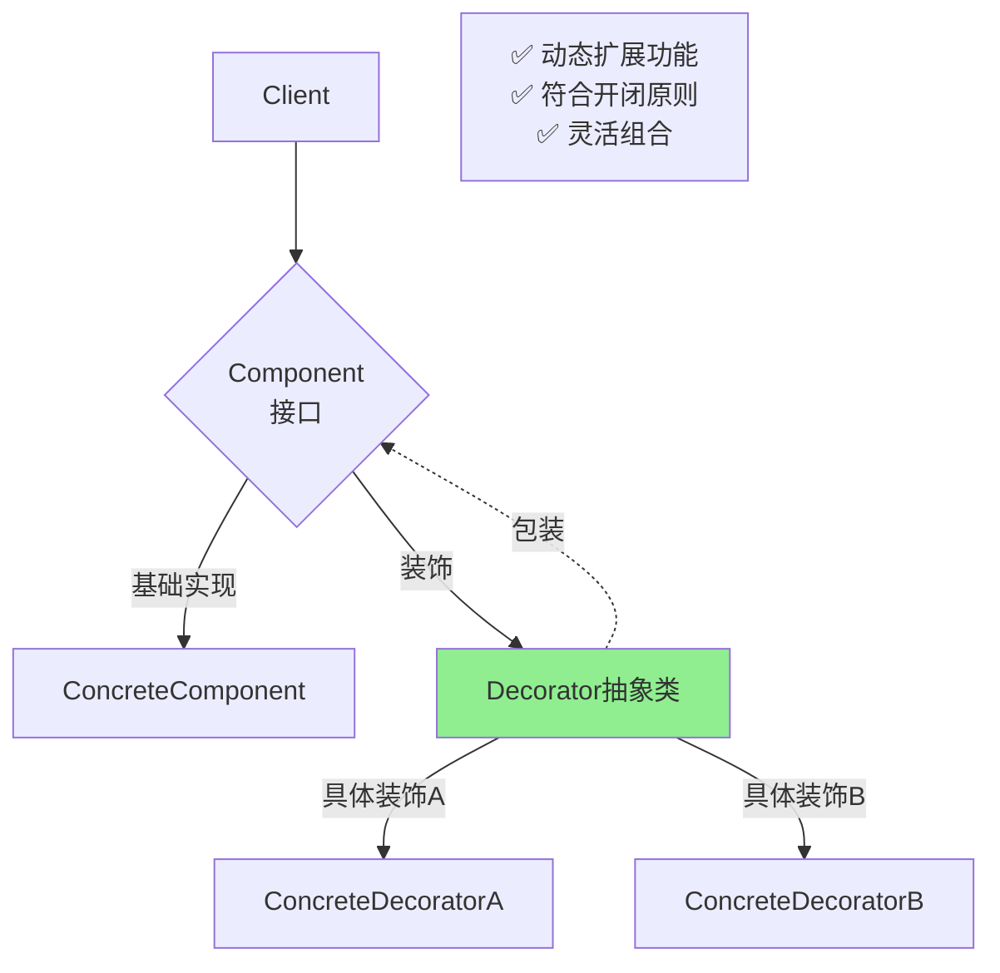
```mermaid
flowchart TD
    Client[Client] --> Component{Component<br/>接口}
    Component -->|基础实现| Concrete[ConcreteComponent]
    Component -->|装饰| Decorator[Decorator抽象类]
    Decorator -->|具体装饰A| DecoratorA[ConcreteDecoratorA]
    Decorator -->|具体装饰B| DecoratorB[ConcreteDecoratorB]
    Decorator -.包装.-> Component
    
    Note[✅ 动态扩展功能<br/>✅ 符合开闭原则<br/>✅ 灵活组合]
   
style Decorator fill:#90EE90
```

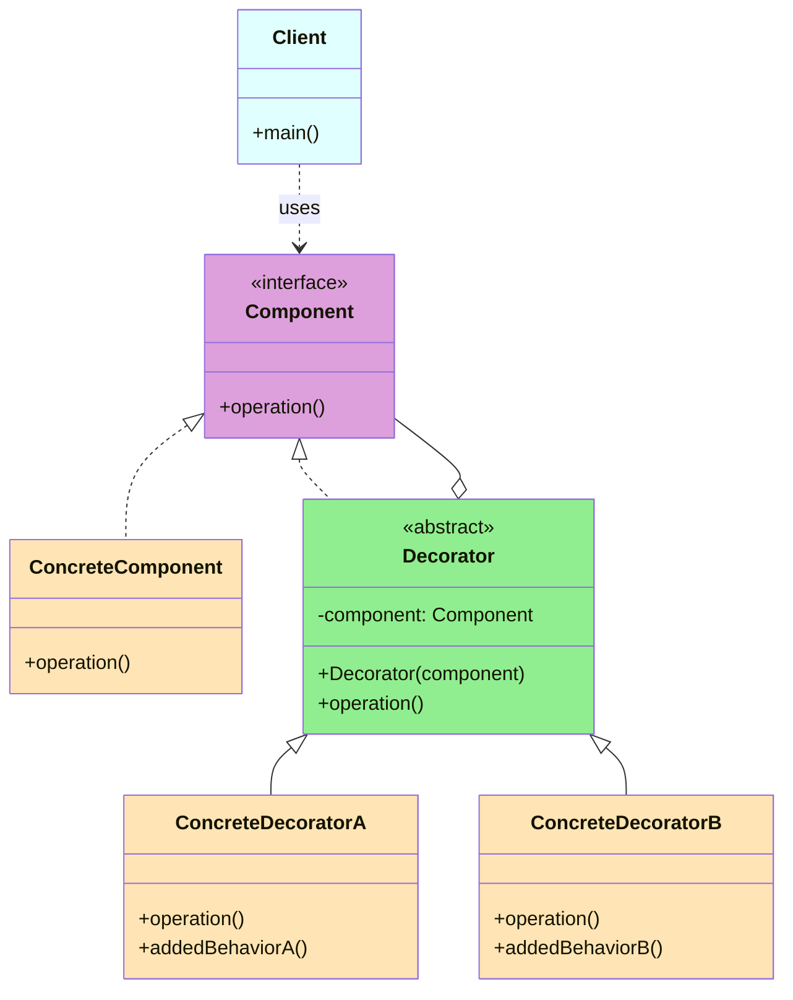
```mermaid
classDiagram
    class Component {
        <<interface>>
        +operation()
    }
    
    class ConcreteComponent {
        +operation()
    }
    
    class Decorator {
        <<abstract>>
        -component: Component
        +Decorator(component)
        +operation()
    }
    
    class ConcreteDecoratorA {
        +operation()
        +addedBehaviorA()
    }
    
    class ConcreteDecoratorB {
        +operation()
        +addedBehaviorB()
    }
    
    class Client {
        +main()
    }
    
    Component <|.. ConcreteComponent
    Component <|.. Decorator
    Decorator <|-- ConcreteDecoratorA
    Decorator <|-- ConcreteDecoratorB
    Decorator o-- Component
    Client ..> Component : uses
    
    style Component fill:#DDA0DD
    style ConcreteComponent fill:#FFE4B5
    style Decorator fill:#90EE90
    style ConcreteDecoratorA fill:#FFE4B5
    style ConcreteDecoratorB fill:#FFE4B5
    style Client fill:#E0FFFF
```

### 模板代码

```java
// ========== 组件接口 ==========
interface Component {
    void operation();
}

// ========== 具体组件 ==========
class ConcreteComponent implements Component {
    @Override
    public void operation() {
        System.out.println("基础组件操作");
    }
}

// ========== 装饰器抽象类 ==========
abstract class Decorator implements Component {
    protected Component component;
    
    public Decorator(Component component) {
        this.component = component;
    }
    
    @Override
    public void operation() {
        component.operation();
    }
}

// ========== 具体装饰器A ==========
class ConcreteDecoratorA extends Decorator {
    public ConcreteDecoratorA(Component component) {
        super(component);
    }
    
    @Override
    public void operation() {
        super.operation();
        addedBehaviorA();
    }
    
    private void addedBehaviorA() {
        System.out.println("装饰器A添加的功能");
    }
}

// ========== 具体装饰器B ==========
class ConcreteDecoratorB extends Decorator {
    public ConcreteDecoratorB(Component component) {
        super(component);
    }
    
    @Override
    public void operation() {
        super.operation();
        addedBehaviorB();
    }
    
    private void addedBehaviorB() {
        System.out.println("装饰器B添加的功能");
    }
}

// ========== 客户端 ==========
public class Client {
    public static void main(String[] args) {
        // 创建基础组件
        Component component = new ConcreteComponent();
        
        // 使用装饰器A装饰
        Component decoratedA = new ConcreteDecoratorA(component);
        decoratedA.operation();
        
        System.out.println();
        
        // 使用装饰器A和B同时装饰
        Component decoratedAB = new ConcreteDecoratorB(
            new ConcreteDecoratorA(component)
        );
        decoratedAB.operation();
    }
}
```

### 示意流程图

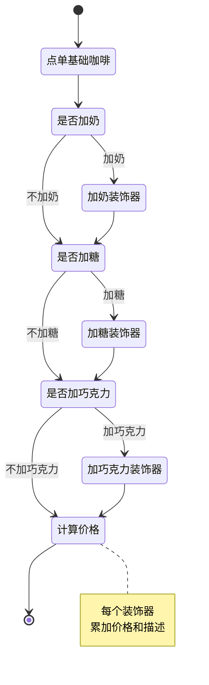
```mermaid
stateDiagram-v2
    [*] --> 点单基础咖啡
    点单基础咖啡 --> 是否加奶
    
    是否加奶 --> 加奶装饰器: 加奶
    是否加奶 --> 是否加糖: 不加奶
    
    加奶装饰器 --> 是否加糖
    
    是否加糖 --> 加糖装饰器: 加糖
    是否加糖 --> 是否加巧克力: 不加糖
    
    加糖装饰器 --> 是否加巧克力
    
    是否加巧克力 --> 加巧克力装饰器: 加巧克力
    是否加巧克力 --> 计算价格: 不加巧克力
    
    加巧克力装饰器 --> 计算价格
    
    计算价格 --> [*]
    
    note right of 计算价格
        每个装饰器
        累加价格和描述
    end note
```

### 示意代码

```java
// ========== 咖啡接口 ==========
interface Coffee {
    String getDescription();
    double getCost();
}

// ========== 基础咖啡 ==========
class SimpleCoffee implements Coffee {
    @Override
    public String getDescription() {
        return "基础咖啡";
    }
    
    @Override
    public double getCost() {
        return 10.0;
    }
}

// ========== 咖啡装饰器抽象类 ==========
abstract class CoffeeDecorator implements Coffee {
    protected Coffee coffee;
    
    public CoffeeDecorator(Coffee coffee) {
        this.coffee = coffee;
    }
    
    @Override
    public String getDescription() {
        return coffee.getDescription();
    }
    
    @Override
    public double getCost() {
        return coffee.getCost();
    }
}

// ========== 牛奶装饰器 ==========
class MilkDecorator extends CoffeeDecorator {
    public MilkDecorator(Coffee coffee) {
        super(coffee);
    }
    
    @Override
    public String getDescription() {
        return coffee.getDescription() + " + 牛奶";
    }
    
    @Override
    public double getCost() {
        return coffee.getCost() + 2.0;
    }
}

// ========== 糖装饰器 ==========
class SugarDecorator extends CoffeeDecorator {
    public SugarDecorator(Coffee coffee) {
        super(coffee);
    }
    
    @Override
    public String getDescription() {
        return coffee.getDescription() + " + 糖";
    }
    
    @Override
    public double getCost() {
        return coffee.getCost() + 1.0;
    }
}

// ========== 巧克力装饰器 ==========
class ChocolateDecorator extends CoffeeDecorator {
    public ChocolateDecorator(Coffee coffee) {
        super(coffee);
    }
    
    @Override
    public String getDescription() {
        return coffee.getDescription() + " + 巧克力";
    }
    
    @Override
    public double getCost() {
        return coffee.getCost() + 3.0;
    }
}

// ========== 测试 ==========
public class CoffeeShopDemo {
    public static void main(String[] args) {
        // 场景1：基础咖啡
        System.out.println("--- 场景1：基础咖啡 ---");
        Coffee coffee1 = new SimpleCoffee();
        System.out.println(coffee1.getDescription());
        System.out.println("价格: ¥" + coffee1.getCost());
        
        // 场景2：加牛奶
        System.out.println("\n--- 场景2：加牛奶 ---");
        Coffee coffee2 = new MilkDecorator(new SimpleCoffee());
        System.out.println(coffee2.getDescription());
        System.out.println("价格: ¥" + coffee2.getCost());
        
        // 场景3：全套配料
        System.out.println("\n--- 场景3：全套配料 ---");
        Coffee coffee3 = new ChocolateDecorator(
            new SugarDecorator(
                new MilkDecorator(
                    new SimpleCoffee()
                )
            )
        );
        System.out.println(coffee3.getDescription());
        System.out.println("价格: ¥" + coffee3.getCost());
    }
}
```

---

## 4. Facade 外观模式

### 模式简介

为子系统中提供统一的外观接口，使子系统更易使用。  
**案例**：订单系统 - 下单需要检查库存、处理支付、创建物流、发送通知，外观类统一调用。  
**何时使用**：需要简化复杂子系统的使用，客户端不依赖子系统时，并且可以协调子系统调用顺序

### 结构流程图

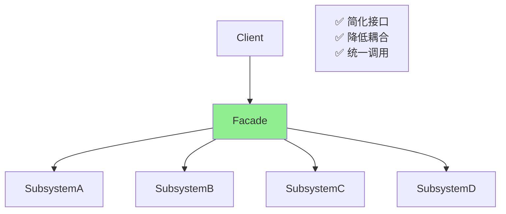
```mermaid
flowchart TD
    Client[Client] --> Facade[Facade]
    Facade --> SubA[SubsystemA]
    Facade --> SubB[SubsystemB]
    Facade --> SubC[SubsystemC]
    Facade --> SubD[SubsystemD]
    
    Note[✅ 简化接口<br/>✅ 降低耦合<br/>✅ 统一调用]
   
style Facade fill:#90EE90
```

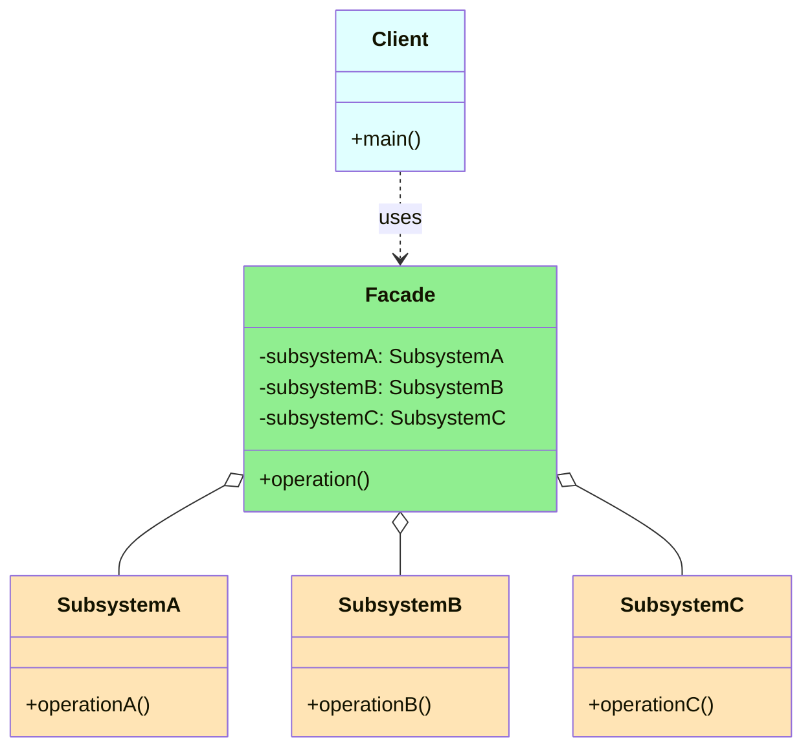
```mermaid
classDiagram
    class Facade {
        -subsystemA: SubsystemA
        -subsystemB: SubsystemB
        -subsystemC: SubsystemC
        +operation()
    }
    
    class SubsystemA {
        +operationA()
    }
    
    class SubsystemB {
        +operationB()
    }
    
    class SubsystemC {
        +operationC()
    }
    
    class Client {
        +main()
    }
    
    Facade o-- SubsystemA
    Facade o-- SubsystemB
    Facade o-- SubsystemC
    Client ..> Facade : uses
    
    style Facade fill:#90EE90
    style SubsystemA fill:#FFE4B5
    style SubsystemB fill:#FFE4B5
    style SubsystemC fill:#FFE4B5
    style Client fill:#E0FFFF
```

### 模板代码

```java
// ========== 子系统A ==========
class SubsystemA {
    public void operationA() {
        System.out.println("子系统A的操作");
    }
}

// ========== 子系统B ==========
class SubsystemB {
    public void operationB() {
        System.out.println("子系统B的操作");
    }
}

// ========== 子系统C ==========
class SubsystemC {
    public void operationC() {
        System.out.println("子系统C的操作");
    }
}

// ========== 外观类 ==========
class Facade {
    private SubsystemA subsystemA;
    private SubsystemB subsystemB;
    private SubsystemC subsystemC;
    
    public Facade() {
        this.subsystemA = new SubsystemA();
        this.subsystemB = new SubsystemB();
        this.subsystemC = new SubsystemC();
    }
    
    public void operation() {
        System.out.println("外观统一操作开始:");
        subsystemA.operationA();
        subsystemB.operationB();
        subsystemC.operationC();
        System.out.println("外观统一操作结束");
    }
}

// ========== 客户端 ==========
public class Client {
    public static void main(String[] args) {
        // 使用外观类
        Facade facade = new Facade();
        facade.operation();
    }
}
```

### 示意流程图

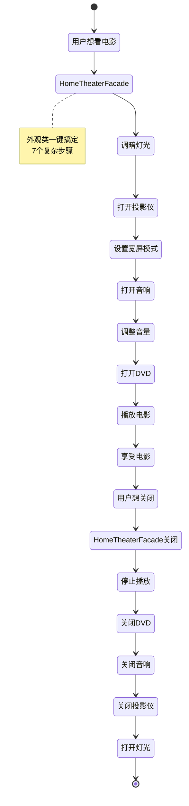
```mermaid
stateDiagram-v2
    [*] --> 用户想看电影
    用户想看电影 --> HomeTheaterFacade
    
    HomeTheaterFacade --> 调暗灯光
    调暗灯光 --> 打开投影仪
    打开投影仪 --> 设置宽屏模式
    设置宽屏模式 --> 打开音响
    打开音响 --> 调整音量
    调整音量 --> 打开DVD
    打开DVD --> 播放电影
    
    播放电影 --> 享受电影
    
    享受电影 --> 用户想关闭
    用户想关闭 --> HomeTheaterFacade关闭
    
    HomeTheaterFacade关闭 --> 停止播放
    停止播放 --> 关闭DVD
    关闭DVD --> 关闭音响
    关闭音响 --> 关闭投影仪
    关闭投影仪 --> 打开灯光
    
    打开灯光 --> [*]
    
    note right of HomeTheaterFacade
        外观类一键搞定
        7个复杂步骤
    end note
```

### 示意代码

```java
// ========== 音响子系统 ==========
class Amplifier {
    public void on() {
        System.out.println("🔊 音响打开");
    }
    
    public void setVolume(int level) {
        System.out.println("🔊 音量调至: " + level);
    }
    
    public void off() {
        System.out.println("🔊 音响关闭");
    }
}

// ========== DVD播放器子系统 ==========
class DvdPlayer {
    public void on() {
        System.out.println("📀 DVD播放器打开");
    }
    
    public void play(String movie) {
        System.out.println("📀 播放电影: " + movie);
    }
    
    public void stop() {
        System.out.println("📀 停止播放");
    }
    
    public void off() {
        System.out.println("📀 DVD播放器关闭");
    }
}

// ========== 投影仪子系统 ==========
class Projector {
    public void on() {
        System.out.println("📽️ 投影仪打开");
    }
    
    public void wideScreenMode() {
        System.out.println("📽️ 设置为宽屏模式");
    }
    
    public void off() {
        System.out.println("📽️ 投影仪关闭");
    }
}

// ========== 灯光子系统 ==========
class Lights {
    public void dim(int level) {
        System.out.println("💡 灯光调暗至: " + level + "%");
    }
    
    public void on() {
        System.out.println("💡 灯光打开");
    }
}

// ========== 家庭影院外观类 ==========
class HomeTheaterFacade {
    private Amplifier amp;
    private DvdPlayer dvd;
    private Projector projector;
    private Lights lights;
    
    public HomeTheaterFacade() {
        this.amp = new Amplifier();
        this.dvd = new DvdPlayer();
        this.projector = new Projector();
        this.lights = new Lights();
    }
    
    // 一键看电影
    public void watchMovie(String movie) {
        System.out.println("\n=== 准备观影模式 ===");
        
        lights.dim(10);              // 1. 灯光调暗
        projector.on();              // 2. 打开投影仪
        projector.wideScreenMode();  // 3. 设置宽屏
        amp.on();                    // 4. 打开音响
        amp.setVolume(20);           // 5. 调整音量
        dvd.on();                    // 6. 打开DVD
        dvd.play(movie);             // 7. 播放电影
        
        System.out.println("✅ 开始享受电影!\n");
    }
    
    // 一键关闭
    public void endMovie() {
        System.out.println("\n=== 关闭影院系统 ===");
        
        dvd.stop();       // 1. 停止播放
        dvd.off();        // 2. 关闭DVD
        amp.off();        // 3. 关闭音响
        projector.off();  // 4. 关闭投影仪
        lights.on();      // 5. 打开灯光
        
        System.out.println("✅ 影院系统已关闭\n");
    }
}

// ========== 测试 ==========
public class HomeTheaterDemo {
    public static void main(String[] args) {
        HomeTheaterFacade homeTheater = new HomeTheaterFacade();
        
        // 场景1：看电影
        homeTheater.watchMovie("阿凡达");
        
        // 场景2：看完关闭
        homeTheater.endMovie();
        
        // 场景3：再看一部
        homeTheater.watchMovie("星际穿越");
        homeTheater.endMovie();
    }
}
```

---

## 5. Observer 观察者模式

### 模式简介

平台与对象间的一对多关系，当平台发送通知或有其他方法时，所有依赖它的对象都会收到通知并自动更新。  
**案例**：订阅通知 - 用户订阅YouTube频道，新视频上传时自动通知所有订阅者。  
**何时使用**：当一个平台对象的改变需要同时改变其他对象，而且不知道具体有多少对象需要改变时。

### 结构流程图

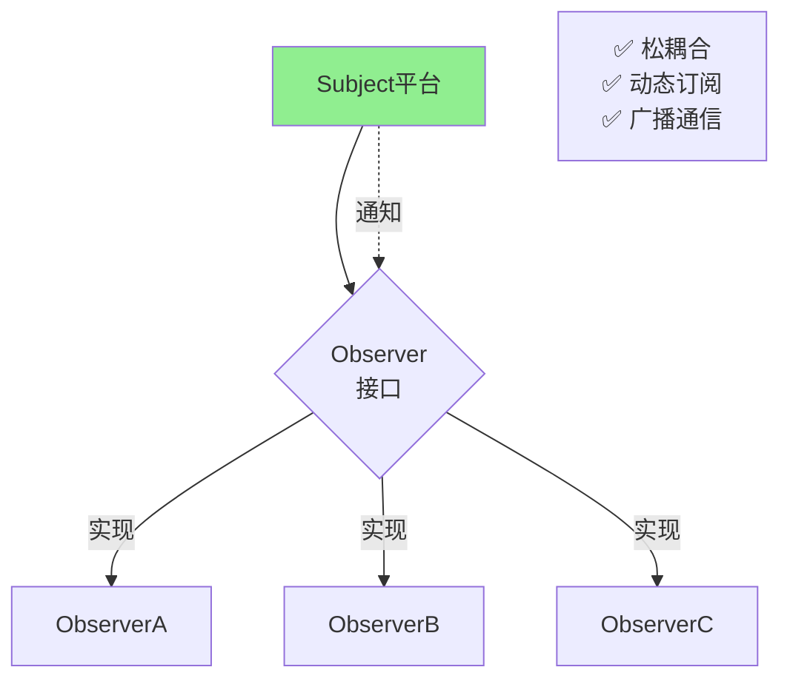
```mermaid
flowchart TD
    Subject[Subject平台] --> Observer{Observer<br/>接口}
    Observer -->|实现| OA[ObserverA]
    Observer -->|实现| OB[ObserverB]
    Observer -->|实现| OC[ObserverC]
    Subject -.通知.-> Observer
    
    Note[✅ 松耦合<br/>✅ 动态订阅<br/>✅ 广播通信]
   
style Subject fill:#90EE90
```

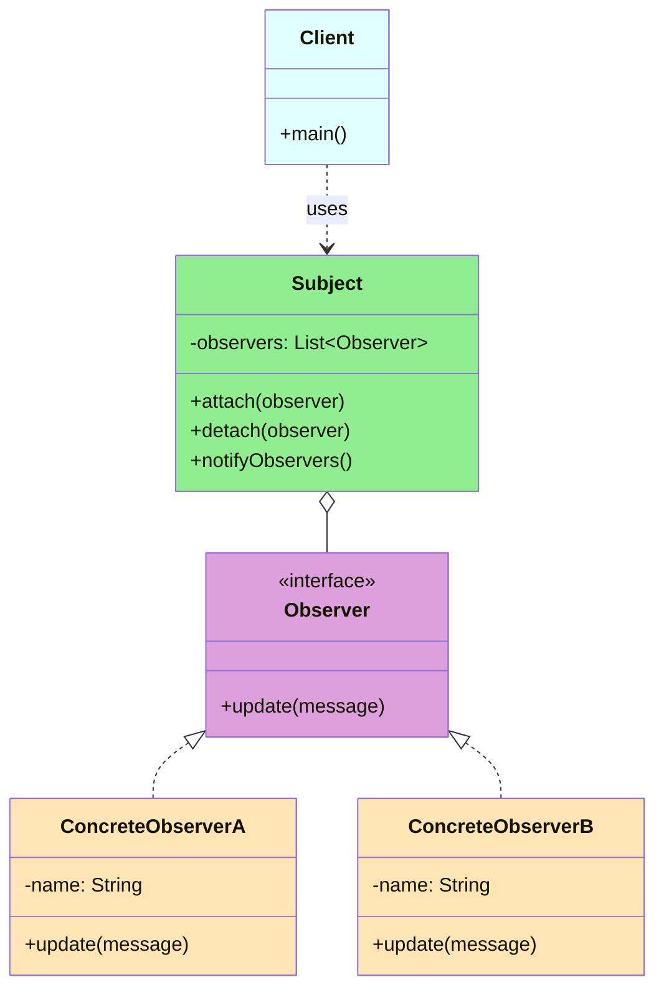
```mermaid
classDiagram
    class Subject {
        -observers: List~Observer~
        +attach(observer)
        +detach(observer)
        +notifyObservers()
    }
    
    class Observer {
        <<interface>>
        +update(message)
    }
    
    class ConcreteObserverA {
        -name: String
        +update(message)
    }
    
    class ConcreteObserverB {
        -name: String
        +update(message)
    }
    
    class Client {
        +main()
    }
    
    Subject o-- Observer
    Observer <|.. ConcreteObserverA
    Observer <|.. ConcreteObserverB
    Client ..> Subject : uses
    
    style Subject fill:#90EE90
    style Observer fill:#DDA0DD
    style ConcreteObserverA fill:#FFE4B5
    style ConcreteObserverB fill:#FFE4B5
    style Client fill:#E0FFFF
```

### 模板代码

```java
// ========== 观察者接口 ==========
interface Observer {
    void update(String message);
}

// ========== 具体观察者A ==========
class ConcreteObserverA implements Observer {
    private String name;
    
    public ConcreteObserverA(String name) {
        this.name = name;
    }
    
    //更新的具体方法
    @Override
    public void update(String message) {
        System.out.println(name + " 收到消息: " + message);
    }
}

// ========== 具体观察者B ==========
class ConcreteObserverB implements Observer {
    private String name;
    
    public ConcreteObserverB(String name) {
        this.name = name;
    }
    
    @Override
    public void update(String message) {
        System.out.println(name + " 收到消息: " + message);
    }
}

// ========== 主题 ==========
class Subject {
    private List<Observer> observers = new ArrayList<>();
    
    public void attach(Observer observer) {
        observers.add(observer);
        System.out.println("新增观察者");
    }
    
    public void detach(Observer observer) {
        observers.remove(observer);
        System.out.println("移除观察者");
    }
    
    public void notifyObservers(String message) {
        System.out.println("\n--- 开始通知所有观察者 ---");
        for (Observer observer : observers) {
            observer.update(message);
        }
        System.out.println("--- 通知结束 ---\n");
    }
}

// ========== 客户端 ==========
public class Client {
    public static void main(String[] args) {
        // 创建主题
        Subject subject = new Subject();
        
        // 创建观察者
        Observer observer1 = new ConcreteObserverA("观察者A");
        Observer observer2 = new ConcreteObserverB("观察者B");
        Observer observer3 = new ConcreteObserverA("观察者C");
        
        // 注册观察者
        subject.attach(observer1);
        subject.attach(observer2);
        subject.attach(observer3);
        
        // 通知所有观察者
        subject.notifyObservers("重要通知!");
        
        // 移除一个观察者
        subject.detach(observer2);
        
        // 再次通知
        subject.notifyObservers("第二次通知");
    }
}
```

### 示意流程图

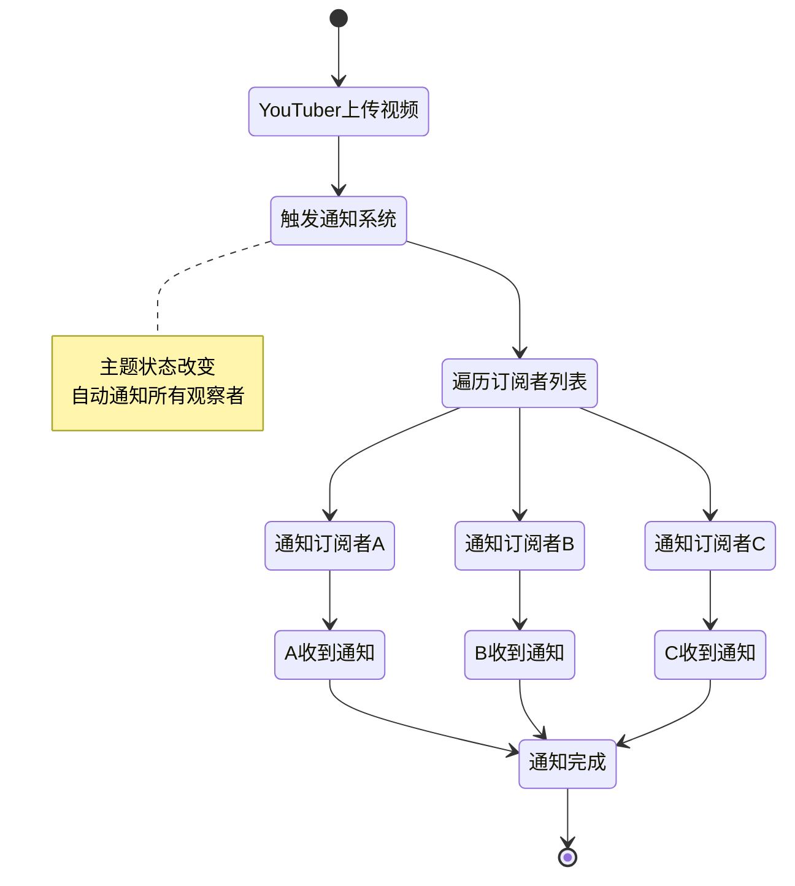
```mermaid
stateDiagram-v2
    [*] --> YouTuber上传视频
    YouTuber上传视频 --> 触发通知系统
    
    触发通知系统 --> 遍历订阅者列表
    
    遍历订阅者列表 --> 通知订阅者A
    遍历订阅者列表 --> 通知订阅者B
    遍历订阅者列表 --> 通知订阅者C
    
    通知订阅者A --> A收到通知
    通知订阅者B --> B收到通知
    通知订阅者C --> C收到通知
    
    A收到通知 --> 通知完成
    B收到通知 --> 通知完成
    C收到通知 --> 通知完成
    
    通知完成 --> [*]
    
    note right of 触发通知系统
        主题状态改变
        自动通知所有观察者
    end note
```

### 示意代码

```java
// ========== 订阅者接口 ==========
interface Subscriber {
    void update(String channelName, String videoTitle);
}

// ========== 具体订阅者 ==========
class User implements Subscriber {
    private String name;
    
    public User(String name) {
        this.name = name;
    }
    
    @Override
    public void update(String channelName, String videoTitle) {
        System.out.println("👤 " + name + " 收到通知: " + 
                         channelName + " 上传了新视频《" + videoTitle + "》");
    }
}

// ========== YouTube频道（平台） ==========
class YouTubeChannel {
    private String channelName;
    private List<Subscriber> subscribers = new ArrayList<>();
    
    public YouTubeChannel(String channelName) {
        this.channelName = channelName;
    }
    
    //订阅：加入用户
    public void subscribe(Subscriber subscriber) {
        subscribers.add(subscriber);
        System.out.println("✅ 新用户订阅了 " + channelName);
    }
    
    //取消订阅：取消用户
    public void unsubscribe(Subscriber subscriber) {
        subscribers.remove(subscriber);
        System.out.println("❌ 用户取消订阅 " + channelName);
    }
    
    //更新：上传视频
    public void uploadVideo(String videoTitle) {
        System.out.println("\n📹 " + channelName + " 上传了新视频: 《" + videoTitle + "》");
        notifySubscribers(videoTitle);
    }
    
    //通知：通知用户
    private void notifySubscribers(String videoTitle) {
        System.out.println("--- 通知所有订阅者 ---");
        for (Subscriber subscriber : subscribers) {
            subscriber.update(channelName, videoTitle);
        }
        System.out.println("--- 通知完成 ---\n");
    }
}

// ========== 测试 ==========
public class YouTubeDemo {
    public static void main(String[] args) {
        // 创建频道
        YouTubeChannel techChannel = new YouTubeChannel("科技频道");
        
        // 创建订阅者
        Subscriber user1 = new User("小明");
        Subscriber user2 = new User("小红");
        Subscriber user3 = new User("小刚");
        
        // 订阅频道
        techChannel.subscribe(user1);
        techChannel.subscribe(user2);
        techChannel.subscribe(user3);
        
        // 场景1：上传第一个视频
        techChannel.uploadVideo("Python入门教程");
        
        // 场景2：小红取消订阅
        techChannel.unsubscribe(user2);
        
        // 场景3：上传第二个视频
        techChannel.uploadVideo("Java高级特性详解");
    }
}
```

---

## 6. Strategy 策略模式

### 模式简介

定义多种算法,把它们封装到不同的策略里，继承同一个策略接口,并使它们在上下文中根据要求进行替换。  
**案例**：支付方式 - 同一个订单可以选择支付宝、微信或银行卡支付,算法可切换（算法为独立代码，非模板）。  
**何时使用**：编译时上下文对象先决定使用哪个策略，运行时可以改变为不同策略。客户端知道选择哪个策略。

### 结构流程图

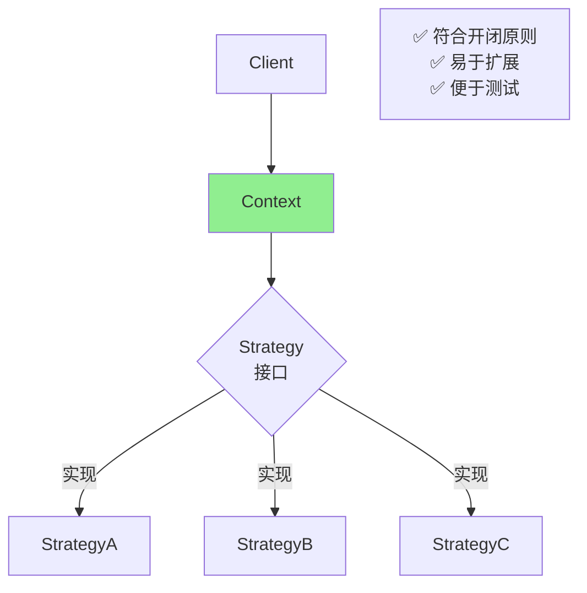
```mermaid
flowchart TD
    Client[Client] --> Context[Context]
    Context --> Strategy{Strategy<br/>接口}
    Strategy -->|实现| SA[StrategyA]
    Strategy -->|实现| SB[StrategyB]
    Strategy -->|实现| SC[StrategyC]
    
    Note[✅ 符合开闭原则<br/>✅ 易于扩展<br/>✅ 便于测试]
   
style Context fill:#90EE90
```

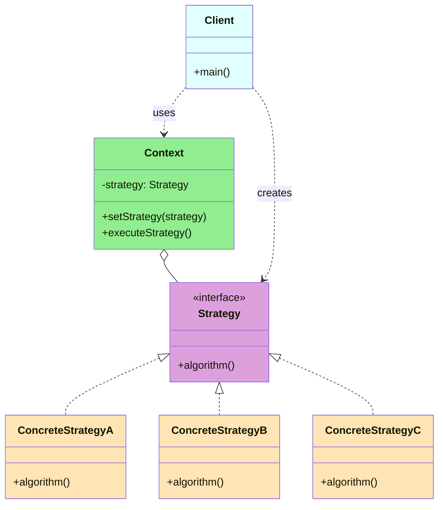
```mermaid
classDiagram
    class Strategy {
        <<interface>>
        +algorithm()
    }
    
    class ConcreteStrategyA {
        +algorithm()
    }
    
    class ConcreteStrategyB {
        +algorithm()
    }
    
    class ConcreteStrategyC {
        +algorithm()
    }
    
    class Context {
        -strategy: Strategy
        +setStrategy(strategy)
        +executeStrategy()
    }
    
    class Client {
        +main()
    }
    
    Strategy <|.. ConcreteStrategyA
    Strategy <|.. ConcreteStrategyB
    Strategy <|.. ConcreteStrategyC
    Context o-- Strategy
    Client ..> Context : uses
    Client ..> Strategy : creates
    
    style Strategy fill:#DDA0DD
    style ConcreteStrategyA fill:#FFE4B5
    style ConcreteStrategyB fill:#FFE4B5
    style ConcreteStrategyC fill:#FFE4B5
    style Context fill:#90EE90
    style Client fill:#E0FFFF
```

### 模板代码

```java
// ========== 策略总接口 ==========
interface Strategy {
    void algorithm();
}

// ========== 具体策略A ==========
class ConcreteStrategyA implements Strategy {
    @Override
    public void algorithm() {
        System.out.println("策略A的算法");
    }
}

// ========== 具体策略B ==========
class ConcreteStrategyB implements Strategy {
    @Override
    public void algorithm() {
        System.out.println("策略B的算法");
    }
}

// ========== 具体策略C ==========
class ConcreteStrategyC implements Strategy {
    @Override
    public void algorithm() {
        System.out.println("策略C的算法");
    }
}

// ========== 上下文 ==========
class Context {
    private Strategy strategy;
    
    public void setStrategy(Strategy strategy) {
        this.strategy = strategy;
    }
    
    public void executeStrategy() {
        if (strategy == null) {
            System.out.println("未设置策略");
            return;
        }
        strategy.algorithm();
    }
}

// ========== 客户端 ==========
public class Client {
    public static void main(String[] args) {
        Context context = new Context();
        
        // 使用策略A
        context.setStrategy(new ConcreteStrategyA());
        context.executeStrategy();
        
        // 切换到策略B
        context.setStrategy(new ConcreteStrategyB());
        context.executeStrategy();
        
        // 切换到策略C
        context.setStrategy(new ConcreteStrategyC());
        context.executeStrategy();
    }
}
```

### 示意流程图

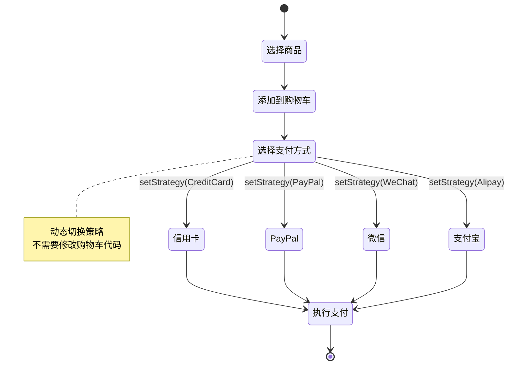
```mermaid
stateDiagram-v2
    [*] --> 选择商品
    选择商品 --> 添加到购物车
    添加到购物车 --> 选择支付方式
    
    选择支付方式 --> 信用卡: setStrategy(CreditCard)
    选择支付方式 --> PayPal: setStrategy(PayPal)
    选择支付方式 --> 微信: setStrategy(WeChat)
    选择支付方式 --> 支付宝: setStrategy(Alipay)
    
    信用卡 --> 执行支付
    PayPal --> 执行支付
    微信 --> 执行支付
    支付宝 --> 执行支付
    
    执行支付 --> [*]
    
    note right of 选择支付方式
        动态切换策略
        不需要修改购物车代码
    end note
```

### 示意代码

```java
// ========== 支付方式策略接口 ==========
interface PaymentStrategy {
    void pay(int amount);
}

// ========== 具体策略 ==========

// 信用卡支付
class CreditCardStrategy implements PaymentStrategy {
    private String cardNumber;
    private String cvv;
    private String expiryDate;
    
    public CreditCardStrategy(String cardNumber, String cvv, String expiryDate) {
        this.cardNumber = cardNumber;
        this.cvv = cvv;
        this.expiryDate = expiryDate;
    }
    
    @Override
    public void pay(int amount) {
        System.out.println("使用信用卡支付 $" + amount);
        System.out.println("  卡号: " + maskCardNumber(cardNumber));
    }
    
    private String maskCardNumber(String cardNumber) {
        return "****-****-****-" + cardNumber.substring(cardNumber.length() - 4);
    }
}

// PayPal 支付
class PayPalStrategy implements PaymentStrategy {
    private String email;
    private String password;
    
    public PayPalStrategy(String email, String password) {
        this.email = email;
        this.password = password;
    }
    
    @Override
    public void pay(int amount) {
        System.out.println("使用 PayPal 支付 $" + amount);
        System.out.println("  账户: " + email);
    }
}

// 微信支付
class WeChatPayStrategy implements PaymentStrategy {
    private String phoneNumber;
    
    public WeChatPayStrategy(String phoneNumber) {
        this.phoneNumber = phoneNumber;
    }
    
    @Override
    public void pay(int amount) {
        System.out.println("使用微信支付 ¥" + amount);
        System.out.println("  手机号: " + phoneNumber);
    }
}

// 支付宝支付
class AlipayStrategy implements PaymentStrategy {
    private String account;
    
    public AlipayStrategy(String account) {
        this.account = account;
    }
    
    @Override
    public void pay(int amount) {
        System.out.println("使用支付宝支付 ¥" + amount);
        System.out.println("  账户: " + account);
    }
}

// ========== 上下文（购物车） ==========
class ShoppingCart {
    private PaymentStrategy paymentStrategy;
    private int totalAmount;
    
    public void setPaymentStrategy(PaymentStrategy strategy) {
        this.paymentStrategy = strategy;
    }
    
    public void addItem(int price) {
        totalAmount += price;
    }
    
    public void checkout() {
        if (paymentStrategy == null) {
            System.out.println("请选择支付方式");
            return;
        }
        
        System.out.println("\n=== 结账 ===");
        System.out.println("总金额: $" + totalAmount);
        paymentStrategy.pay(totalAmount);
        System.out.println("支付完成！\n");
    }
}

// ========== 测试 ==========
public class PaymentStrategyDemo {
    public static void main(String[] args) {
        // 场景1：使用信用卡支付
        ShoppingCart cart = new ShoppingCart();
        cart.addItem(100);
        cart.addItem(50);
        
        System.out.println("--- 客户选择信用卡 ---");
        cart.setPaymentStrategy(new CreditCardStrategy(
            "1234567890123456", "123", "12/25"
        ));
        cart.checkout();
        
        // 场景2：使用 PayPal
        ShoppingCart cart2 = new ShoppingCart();
        cart2.addItem(200);
        
        System.out.println("--- 客户选择 PayPal ---");
        cart2.setPaymentStrategy(new PayPalStrategy(
            "user@example.com", "password123"
        ));
        cart2.checkout();
        
        // 场景3：使用微信支付
        ShoppingCart cart3 = new ShoppingCart();
        cart3.addItem(300);
        
        System.out.println("--- 客户选择微信支付 ---");
        cart3.setPaymentStrategy(new WeChatPayStrategy("13800138000"));
        cart3.checkout();
    }
}
```

---

## 7. Template Method 模板方法模式

### 模式简介

父类中定义<u>流程骨架</u>，某些步骤子类实现。模板方法使得子类可以不改变算法结构，重定义算法的某些特定步骤。  
**案例**：饮料制作 - 泡茶和冲咖啡的流程都是：烧水→冲泡→倒入杯中→添加调料，只有冲泡和调料不同。  
**何时使用**：多个类有相同的方法流程，复用代码，只有少数步骤不同时；增加新子类不用改父类；流程变化大时不适用

### 结构流程图

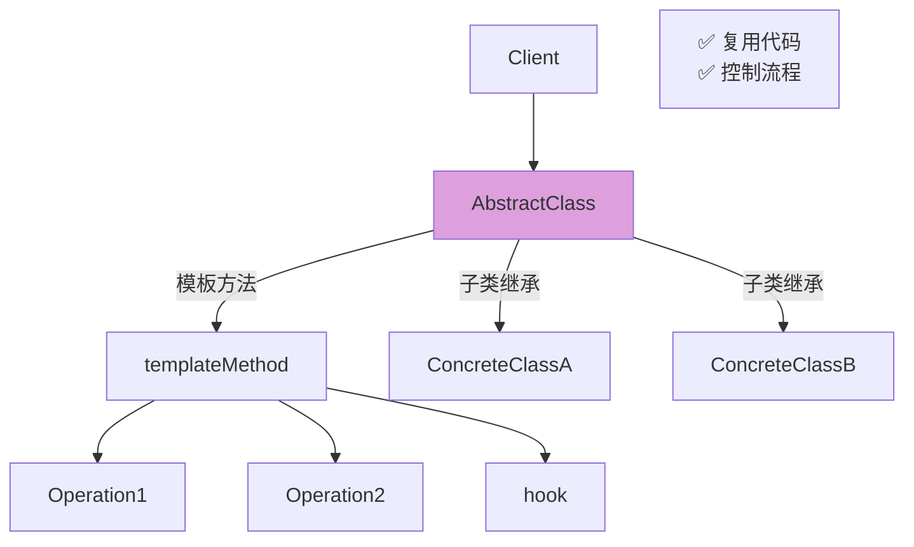
```mermaid
flowchart TD
    Client[Client] --> Abstract[AbstractClass]
    Abstract -->|模板方法| Template[templateMethod]
    Template --> Step1[Operation1]
    Template --> Step2[Operation2]
    Template --> Step3[hook]
    Abstract -->|子类继承| CA[ConcreteClassA]
    Abstract -->|子类继承| CB[ConcreteClassB]
    
    Note[✅ 复用代码<br/>✅ 控制流程]
   
style Abstract fill:#DDA0DD
```

```mermaid
classDiagram
    class AbstractClass {
        <<abstract>>
        +templateMethod()
        #primitiveOperation1()*
        #primitiveOperation2()*
        #hook()
    }
    
    class ConcreteClassA {
        #primitiveOperation1()
        #primitiveOperation2()
    }
    
    class ConcreteClassB {
        #primitiveOperation1()
        #primitiveOperation2()
        #hook()
    }
    
    class Client {
        +main()
    }
    
    AbstractClass <|-- ConcreteClassA
    AbstractClass <|-- ConcreteClassB
    Client ..> AbstractClass : uses
    
    style AbstractClass fill:#DDA0DD
    style ConcreteClassA fill:#FFE4B5
    style ConcreteClassB fill:#FFE4B5
    style Client fill:#E0FFFF
```

### 模板代码

```java
// ========== 抽象类 ==========
abstract class AbstractClass {
    // 模板方法（final防止子类重写）
    public final void templateMethod() {
        primitiveOperation1();
        primitiveOperation2();
        hook();
    }
    
    // 抽象方法，子类必须实现
    protected abstract void Operation1();
    protected abstract void Operation2();
    
    // 钩子方法，子类可选重写
    protected void hook() {
        // 默认实现为空
    }
}

// ========== 具体类A ==========
class ConcreteClassA extends AbstractClass {
    @Override
    protected void Operation1() {
        System.out.println("A类的操作1");
    }
    
    @Override
    protected void Operation2() {
        System.out.println("A类的操作2");
    }
}

// ========== 具体类B ==========
class ConcreteClassB extends AbstractClass {
    @Override
    protected void Operation1() {
        System.out.println("B类的操作1");
    }
    
    @Override
    protected void Operation2() {
        System.out.println("B类的操作2");
    }
    
    @Override
    protected void hook() {
        System.out.println("B类重写了钩子方法");
    }
}

// ========== 客户端 ==========
public class Client {
    public static void main(String[] args) {
        // 使用具体类A
        AbstractClass classA = new ConcreteClassA();
        classA.templateMethod();
        
        System.out.println();
        
        // 使用具体类B
        AbstractClass classB = new ConcreteClassB();
        classB.templateMethod();
    }
}
```

### 示意流程图

```mermaid
stateDiagram-v2
    [*] --> 烧水
    烧水 --> 冲泡
    
    冲泡 --> 泡茶叶: Tea
    冲泡 --> 冲咖啡粉: Coffee
    
    泡茶叶 --> 倒入杯中
    冲咖啡粉 --> 倒入杯中
    
    倒入杯中 --> 添加调料
    
    添加调料 --> 加柠檬: Tea
    添加调料 --> 加糖和奶: Coffee
    
    加柠檬 --> [*]
    加糖和奶 --> [*]
    
    note right of 冲泡
        模板方法定义流程
        子类实现不同步骤
    end note
```

### 示意代码

```java
// ========== 饮料抽象类 ==========
abstract class Beverage {
    // 模板方法：定义制作流程
    public final void prepareRecipe() {
        // 烧水，蒸，冲泡，加调料
        boilWater();
        brew();
        pourInCup();
        if (customerWantsCondiments()) {
            addCondiments();
        }
    }
    
    // 步骤1：烧水（所有饮料相同）
    private void boilWater() {
        System.out.println("烧开水");
    }
    
    // 步骤2：冲泡（不同饮料不同）
    protected abstract void brew();
    
    // 步骤3：倒入杯中（所有饮料相同）
    private void pourInCup() {
        System.out.println("倒入杯中");
    }
    
    // 步骤4：添加调料（不同饮料不同）
    protected abstract void addCondiments();
    
    // 钩子方法：是否需要调料（默认需要）
    protected boolean customerWantsCondiments() {
        return true;
    }
}

// ========== 茶 ==========
class Tea extends Beverage {
    @Override
    protected void brew() {
        System.out.println("用沸水浸泡茶叶");
    }
    
    @Override
    protected void addCondiments() {
        System.out.println("添加柠檬");
    }
}

// ========== 咖啡 ==========
class Coffee extends Beverage {
    @Override
    protected void brew() {
        System.out.println("用沸水冲泡咖啡");
    }
    
    @Override
    protected void addCondiments() {
        System.out.println("添加糖和牛奶");
    }
}

// ========== 不加调料的茶 ==========
class TeaWithoutCondiments extends Tea {
    @Override
    protected boolean customerWantsCondiments() {
        return false;
    }
}

// ========== 测试 ==========
public class BeverageDemo {
    public static void main(String[] args) {
        // 场景1：制作茶
        System.out.println("--- 制作茶 ---");
        Beverage tea = new Tea();
        tea.prepareRecipe();
        
        // 场景2：制作咖啡
        System.out.println("\n--- 制作咖啡 ---");
        Beverage coffee = new Coffee();
        coffee.prepareRecipe();
        
        // 场景3：制作不加调料的茶
        System.out.println("\n--- 制作不加调料的茶 ---");
        Beverage plainTea = new TeaWithoutCondiments();
        plainTea.prepareRecipe();
    }
}
```

---

## 8. State 状态模式

### 模式简介

对象<u>状态改变</u>时，行为改变，类似switch case。
**案例**：订单状态 - 订单有待支付、已支付、配送中、已完成等状态，每个状态下的行为不同。  
**何时使用**：本来都是if-else改变状态，现在有很多子类状态，而且添加新状态只要写子类；而且状态之间有相互关联，一个状态可以切换到下一个状态

### 结构流程图

```mermaid
flowchart TD
    Client[Client] --> Context[Context]
    Context --> State{State<br/>接口}
    State -->|实现| StateA[StateA]
    State -->|实现| StateB[StateB]
    State -->|实现| StateC[StateC]
    Context -.当前状态.-> State
    
    StateA -.转换.-> StateB
    StateB -.转换.-> StateC
    StateC -.转换.-> StateA
    
    Note[✅ 消除条件分支<br/>✅ 易于扩展<br/>✅ 封装状态转换]
   
style Context fill:#90EE90
```

```mermaid
classDiagram
    class State {
        <<interface>>
        +handle(context)
    }
    
    class StateA {
        +handle(context)
    }
    
    class StateB {
        +handle(context)
    }
    
    class StateC {
        +handle(context)
    }
    
    class Context {
        -state: State
        +setState(state)
        +request()
    }
    
    class Client {
        +main()
    }
    
    State <|.. StateA
    State <|.. StateB
    State <|.. StateC
    Context o-- State
    Client ..> Context : uses
    
    style State fill:#DDA0DD
    style StateA fill:#FFE4B5
    style StateB fill:#FFE4B5
    style StateC fill:#FFE4B5
    style Context fill:#90EE90
    style Client fill:#E0FFFF
```

### 模板代码

```java
// ========== 状态接口 ==========
interface State {
    void handle(Context context);
}

// ========== 具体状态A ==========
class StateA implements State {
    @Override
    public void handle(Context context) {
        System.out.println("当前状态: A");
        System.out.println("执行状态A的操作");
        // 可以转换到状态B
        context.setState(new StateB());
    }
}

// ========== 具体状态B ==========
class StateB implements State {
    @Override
    public void handle(Context context) {
        System.out.println("当前状态: B");
        System.out.println("执行状态B的操作");
        // 可以转换到状态C
        context.setState(new StateC());
    }
}

// ========== 具体状态C ==========
class StateC implements State {
    @Override
    public void handle(Context context) {
        System.out.println("当前状态: C");
        System.out.println("执行状态C的操作");
        // 可以转换到状态A
        context.setState(new StateA());
    }
}

// ========== 上下文 ==========
class Context {
    private State state;
    
    public Context(State state) {
        this.state = state;
    }
    
    public void setState(State state) {
        this.state = state;
    }
    
    public void request() {
        state.handle(this);
    }
}

// ========== 客户端 ==========
public class Client {
    public static void main(String[] args) {
        // 创建上下文，初始状态为A
        Context context = new Context(new StateA());
        
        // 执行请求，状态会自动转换
        context.request();
        System.out.println();
        
        context.request();
        System.out.println();
        
        context.request();
    }
}
```

### 示意流程图

```mermaid
stateDiagram-v2
    [*] --> 待支付
    待支付 --> 已支付: pay()
    待支付 --> 已取消: cancel()
    
    已支付 --> 配送中: ship()
    已支付 --> 已取消: cancel()
    
    配送中 --> 已完成: deliver()
    
    已完成 --> [*]
    已取消 --> [*]
    
    note right of 待支付
        每个状态下
        允许的操作不同
    end note
```

### 示意代码

```java
// ========== 订单状态接口 ==========
interface OrderState {
    void pay(Order order);
    void ship(Order order);
    void deliver(Order order);
    void cancel(Order order);
}

// ========== 待支付状态 ==========
class PendingPaymentState implements OrderState {
    @Override
    public void pay(Order order) {
        System.out.println("✅ 支付成功");
        order.setState(new PaidState());
    }
    
    @Override
    public void ship(Order order) {
        System.out.println("❌ 未支付，无法发货");
    }
    
    @Override
    public void deliver(Order order) {
        System.out.println("❌ 未支付，无法配送");
    }
    
    @Override
    public void cancel(Order order) {
        System.out.println("✅ 订单已取消");
        order.setState(new CancelledState());
    }
}

// ========== 已支付状态 ==========
class PaidState implements OrderState {
    @Override
    public void pay(Order order) {
        System.out.println("❌ 订单已支付");
    }
    
    @Override
    public void ship(Order order) {
        System.out.println("✅ 开始发货");
        order.setState(new ShippedState());
    }
    
    @Override
    public void deliver(Order order) {
        System.out.println("❌ 还未发货，无法配送");
    }
    
    @Override
    public void cancel(Order order) {
        System.out.println("✅ 订单已取消，退款中");
        order.setState(new CancelledState());
    }
}

// ========== 配送中状态 ==========
class ShippedState implements OrderState {
    @Override
    public void pay(Order order) {
        System.out.println("❌ 订单已支付");
    }
    
    @Override
    public void ship(Order order) {
        System.out.println("❌ 订单已在配送中");
    }
    
    @Override
    public void deliver(Order order) {
        System.out.println("✅ 订单已送达");
        order.setState(new DeliveredState());
    }
    
    @Override
    public void cancel(Order order) {
        System.out.println("❌ 配送中，无法取消");
    }
}

// ========== 已完成状态 ==========
class DeliveredState implements OrderState {
    @Override
    public void pay(Order order) {
        System.out.println("❌ 订单已完成");
    }
    
    @Override
    public void ship(Order order) {
        System.out.println("❌ 订单已完成");
    }
    
    @Override
    public void deliver(Order order) {
        System.out.println("❌ 订单已送达");
    }
    
    @Override
    public void cancel(Order order) {
        System.out.println("❌ 订单已完成，无法取消");
    }
}

// ========== 已取消状态 ==========
class CancelledState implements OrderState {
    @Override
    public void pay(Order order) {
        System.out.println("❌ 订单已取消");
    }
    
    @Override
    public void ship(Order order) {
        System.out.println("❌ 订单已取消");
    }
    
    @Override
    public void deliver(Order order) {
        System.out.println("❌ 订单已取消");
    }
    
    @Override
    public void cancel(Order order) {
        System.out.println("❌ 订单已取消");
    }
}

// ========== 订单上下文 ==========
class Order {
    private OrderState state;
    private String orderId;
    
    public Order(String orderId) {
        this.orderId = orderId;
        this.state = new PendingPaymentState(); // 初始状态
    }
    
    public void setState(OrderState state) {
        this.state = state;
    }
    
    public void pay() {
        System.out.println("\n订单 " + orderId + " - 支付操作");
        state.pay(this);
    }
    
    public void ship() {
        System.out.println("\n订单 " + orderId + " - 发货操作");
        state.ship(this);
    }
    
    public void deliver() {
        System.out.println("\n订单 " + orderId + " - 配送操作");
        state.deliver(this);
    }
    
    public void cancel() {
        System.out.println("\n订单 " + orderId + " - 取消操作");
        state.cancel(this);
    }
}

// ========== 测试 ==========
public class OrderStateDemo {
    public static void main(String[] args) {
        // 场景1：正常流程
        System.out.println("=== 场景1：正常流程 ===");
        Order order1 = new Order("ORD001");
        order1.pay();      // 待支付 → 已支付
        order1.ship();     // 已支付 → 配送中
        order1.deliver();  // 配送中 → 已完成
        
        // 场景2：中途取消
        System.out.println("\n=== 场景2：中途取消 ===");
        Order order2 = new Order("ORD002");
        order2.pay();      // 待支付 → 已支付
        order2.cancel();   // 已支付 → 已取消
        
        // 场景3：非法操作
        System.out.println("\n=== 场景3：非法操作 ===");
        Order order3 = new Order("ORD003");
        order3.ship();     // 未支付，无法发货
        order3.deliver();  // 未支付，无法配送
    }
}
```

---

## 9. Iterator 迭代器模式

### 模式简介

提供继承了迭代器的各种子迭代器，根据要求顺序访问不同的集合元素。  
**案例**：Java集合 - ArrayList、HashSet都能用for-each遍历，内部实现各不相同。  
**何时使用**：统一遍历不同聚合对象；具有多种遍历方式且不在乎性能

### 结构流程图

```mermaid
flowchart TD
    Client[Client] --> Aggregate{Aggregate<br/>接口}
    Aggregate -->|创建方法| Iterator{Iterator<br/>接口}
    Aggregate -->|实现| CA[ConcreteAggregate]
    Iterator -->|实现| CI[ConcreteIterator]
    CA -.创建.-> CI
    
    Note[✅ 统一访问接口<br/>✅ 隐藏内部结构<br/>✅ 支持多种遍历]
   
style CA fill:#90EE90
```

```mermaid
classDiagram
    class Iterator~T~ {
        <<interface>>
        +hasNext() boolean
        +next() T
    }
    
    class ConcreteIterator~T~ {
        -collection: ConcreteAggregate
        -index: int
        +hasNext() boolean
        +next() T
    }
    
    class Aggregate~T~ {
        <<interface>>
        +createIterator() Iterator~T~
    }
    
    class ConcreteAggregate~T~ {
        -items: T[]
        +createIterator() Iterator~T~
        +add(item)
        +get(index) T
    }
    
    class Client {
        +main()
    }
    
    Iterator <|.. ConcreteIterator
    Aggregate <|.. ConcreteAggregate
    ConcreteAggregate ..> ConcreteIterator : creates
    Client ..> Aggregate : uses
    Client ..> Iterator : uses
    
    style Iterator fill:#DDA0DD
    style ConcreteIterator fill:#FFE4B5
    style Aggregate fill:#DDA0DD
    style ConcreteAggregate fill:#90EE90
    style Client fill:#E0FFFF
```

### 模板代码

```java
// ========== 迭代器接口 ==========
interface Iterator<T> {
    boolean hasNext();
    T next();
}

// ========== 具体迭代器 ==========
class ConcreteIterator<T> implements Iterator<T> {
    private T[] items;
    private int position = 0;
    
    public ConcreteIterator(T[] items) {
        this.items = items;
    }
    
    @Override
    public boolean hasNext() {
        return position < items.length && items[position] != null;
    }
    
    @Override
    public T next() {
        T item = items[position];
        position++;
        return item;
    }
}

// ========== 聚合接口 ==========
interface Aggregate<T> {
    Iterator<T> createIterator();
}

// ========== 具体聚合 ==========
class ConcreteAggregate<T> implements Aggregate<T> {
    private T[] items;
    private int count = 0;
    
    public ConcreteAggregate(int size) {
        items = (T[]) new Object[size];
    }
    
    public void add(T item) {
        if (count < items.length) {
            items[count] = item;
            count++;
        }
    }
    
    @Override
    public Iterator<T> createIterator() {
        return new ConcreteIterator<>(items);
    }
}

// ========== 客户端 ==========
public class Client {
    public static void main(String[] args) {
        // 创建聚合对象
        ConcreteAggregate<String> aggregate = new ConcreteAggregate<>(5);
        aggregate.add("元素1");
        aggregate.add("元素2");
        aggregate.add("元素3");
        
        // 获取迭代器
        Iterator<String> iterator = aggregate.createIterator();
        
        // 遍历
        while (iterator.hasNext()) {
            String item = iterator.next();
            System.out.println(item);
        }
    }
}
```

### 示意流程图

```mermaid
stateDiagram-v2
    [*] --> 创建两种书架
    
    创建两种书架 --> 技术书架_数组: TechBookShelf
    创建两种书架 --> 小说书架_ArrayList: NovelBookShelf
    
    技术书架_数组 --> 添加技术书
    小说书架_ArrayList --> 添加小说
    
    添加技术书 --> 获取数组迭代器
    添加小说 --> 获取ArrayList迭代器
    
    获取数组迭代器 --> 统一遍历接口
    获取ArrayList迭代器 --> 统一遍历接口
    
    统一遍历接口 --> 检查hasNext
    检查hasNext --> 获取next: true
    检查hasNext --> 遍历结束: false
    
    获取next --> 打印书籍
    打印书籍 --> 检查hasNext
    
    遍历结束 --> [*]
    
    note right of 统一遍历接口
        迭代器模式的核心
        不同存储，统一接口
    end note
```

### 示意代码

```java
import java.util.ArrayList;

// ========== 迭代器接口 ==========
interface Iterator<T> {
    boolean hasNext();
    T next();
}

// ========== 聚合接口 ==========
interface Aggregate<T> {
    Iterator<T> createIterator();
}

// ========== 书籍类 ==========
class Book {
    private String title;
    private String author;
    
    public Book(String title, String author) {
        this.title = title;
        this.author = author;
    }
    
    public String getTitle() {
        return title;
    }
    
    public String getAuthor() {
        return author;
    }
    
    @Override
    public String toString() {
        return "《" + title + "》 - " + author;
    }
}

// ========== 数组书架迭代器 ==========
class ArrayBookShelfIterator implements Iterator<Book> {
    private Book[] books;
    private int position = 0;
    
    public ArrayBookShelfIterator(Book[] books) {
        this.books = books;
    }
    
    @Override
    public boolean hasNext() {
        return position < books.length && books[position] != null;
    }
    
    @Override
    public Book next() {
        Book book = books[position];
        position++;
        return book;
    }
}

// ========== ArrayList书架迭代器 ==========
class ListBookShelfIterator implements Iterator<Book> {
    private ArrayList<Book> books;
    private int position = 0;
    
    public ListBookShelfIterator(ArrayList<Book> books) {
        this.books = books;
    }
    
    @Override
    public boolean hasNext() {
        return position < books.size();
    }
    
    @Override
    public Book next() {
        Book book = books.get(position);
        position++;
        return book;
    }
}

// ========== 数组书架（技术书籍） ==========
class TechBookShelf implements Aggregate<Book> {
    private Book[] books;
    private int last = 0;
    
    public TechBookShelf(int capacity) {
        this.books = new Book[capacity];
    }
    
    public void addBook(Book book) {
        if (last < books.length) {
            books[last] = book;
            last++;
        }
    }
    
    @Override
    public Iterator<Book> createIterator() {
        return new ArrayBookShelfIterator(books);
    }
}

// ========== ArrayList书架（小说书籍） ==========
class NovelBookShelf implements Aggregate<Book> {
    private ArrayList<Book> books;
    
    public NovelBookShelf() {
        this.books = new ArrayList<>();
    }
    
    public void addBook(Book book) {
        books.add(book);
    }
    
    @Override
    public Iterator<Book> createIterator() {
        return new ListBookShelfIterator(books);
    }
}

// ========== 测试 ==========
public class BookShelfDemo {
    public static void main(String[] args) {
        // 场景1：技术书架（用数组存储）
        System.out.println("=== 技术书架（数组实现） ===");
        TechBookShelf techShelf = new TechBookShelf(5);
        techShelf.addBook(new Book("设计模式", "GoF"));
        techShelf.addBook(new Book("Java编程思想", "Bruce Eckel"));
        techShelf.addBook(new Book("重构", "Martin Fowler"));
        techShelf.addBook(new Book("代码整洁之道", "Robert Martin"));
        
        Iterator<Book> techIterator = techShelf.createIterator();
        while (techIterator.hasNext()) {
            Book book = techIterator.next();
            System.out.println(book);
        }
        
        // 场景2：小说书架（用ArrayList存储）
        System.out.println("\n=== 小说书架（ArrayList实现） ===");
        NovelBookShelf novelShelf = new NovelBookShelf();
        novelShelf.addBook(new Book("三体", "刘慈欣"));
        novelShelf.addBook(new Book("百年孤独", "马尔克斯"));
        novelShelf.addBook(new Book("1984", "乔治·奥威尔"));
        novelShelf.addBook(new Book("活着", "余华"));
        
        Iterator<Book> novelIterator = novelShelf.createIterator();
        while (novelIterator.hasNext()) {
            Book book = novelIterator.next();
            System.out.println(book);
        }
        
        System.out.println("\n✅ 不同的存储方式，统一的遍历接口！");
    }
}
```

---

## 总结

这份设计模式速查手册涵盖了9个常用设计模式，每个模式都包含：

✅ **模式简介** - 核心概念与适用场景  
✅ **结构流程图** - 清晰的UML类图和流程图  
✅ **模板代码** - 标准化的实现框架  
✅ **示意代码** - 实际应用案例  

**学习建议**：

1. **创建型模式** - 先掌握Singleton和Factory，理解对象创建的封装
2. **结构型模式** - 重点学习Decorator和Facade，理解对象组合
3. **行为型模式** - 按Strategy → Template Method → State → Observer → Iterator顺序学习

**记忆口诀**：

- **Singleton** - 一个实例全局用
- **Factory** - 工厂创建多类型
- **Decorator** - 动态包装加功能
- **Facade** - 外观简化子系统
- **Observer** - 一对多通知机制
- **Strategy** - 算法封装可切换
- **Template Method** - 流程固定步骤变
- **State** - 状态改变行为变
- **Iterator** - 统一遍历不暴露

祝学习顺利！🎉
