# Java 测试完整教程（考试版）

## 📚 目录

1. [白盒测试与黑盒测试](#2-白盒测试与黑盒测试)
2. [JUnit4 框架详解](#3-junit4-框架详解)
3. [测试用例设计方法](#4-测试用例设计方法)

### 1.4 FIRST 原则

**好的测试应该遵循 FIRST 原则**：

| 原则 | 含义 | 示例 |
|------|------|------|
| **F**ast | 快速 | 单元测试应该毫秒级完成 |
| **I**ndependent | 独立 | 测试之间不相互依赖 |
| **R**epeatable | 可重复 | 任何环境都能重复执行 |
| **S**elf-validating | 自验证 | 测试结果明确（通过/失败）|
| **T**imely | 及时 | 写完代码立即写测试 |

---

## 2. 白盒测试与黑盒测试

### 2.1 核心区别

**对比表**：

| 特征 | 白盒测试 | 黑盒测试 |
|------|---------|---------|
| **测试依据** | 源代码 | 需求文档、接口 |
| **关注点** | 代码覆盖率、执行路径 | 功能正确性、边界条件 |
| **测试者** | 开发者视角 | 用户视角 |
| **优势** | 发现逻辑错误、死代码 | 验证功能完整性 |
| **劣势** | 可能遗漏需求错误 | 无法保证代码覆盖 |
| **考试重点** | ✓✓✓ 代码覆盖率计算 | ✓✓ 等价类、边界值 |

### 2.2 白盒测试：看代码测试

**核心思想**：知道代码内部如何实现，设计测试用例覆盖所有路径。

#### 示例 1：简单 if-else

```java
public String checkAge(int age) {
    if (age >= 18) {           // 分支点
        return "成年人";
    } else {
        return "未成年人";
    }
}
```

**代码执行流程（age = 20）**：

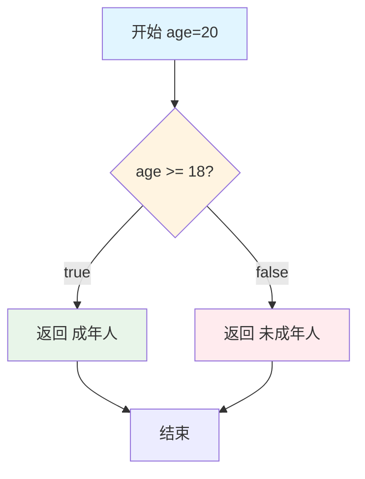

**代码执行流程（age = 15）**：

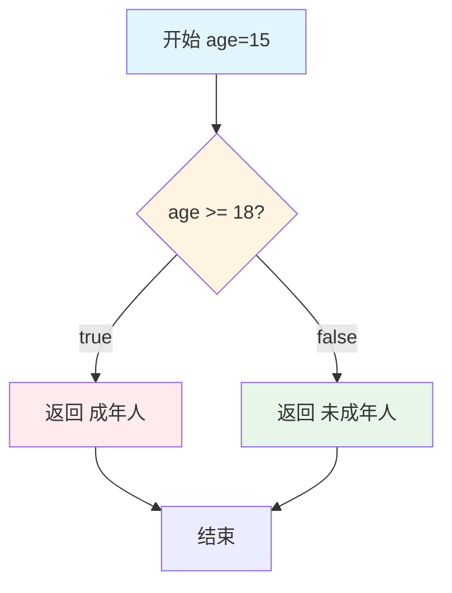

**白盒测试思路**：
1. 看代码：有 1 个 if 判断
2. 分析分支：
   - 分支 1：`age >= 18` 为 true
   - 分支 2：`age >= 18` 为 false
3. 设计测试用例：

```java
@Test
public void testCheckAge_Adult() {
    // 测试分支1：age >= 18
    assertEquals("成年人", checkAge(20));
}

@Test
public void testCheckAge_Minor() {
    // 测试分支2：age < 18
    assertEquals("未成年人", checkAge(15));
}

// 白盒测试覆盖率 = 2/2 = 100%
```

#### 示例 2：多重 if-else

```java
public String gradeScore(int score) {
    if (score >= 90) {         // 判断1
        return "A";
    } else if (score >= 80) {  // 判断2
        return "B";
    } else if (score >= 70) {  // 判断3
        return "C";
    } else if (score >= 60) {  // 判断4
        return "D";
    } else {
        return "F";
    }
}
```

**代码执行流程（score = 85）**：

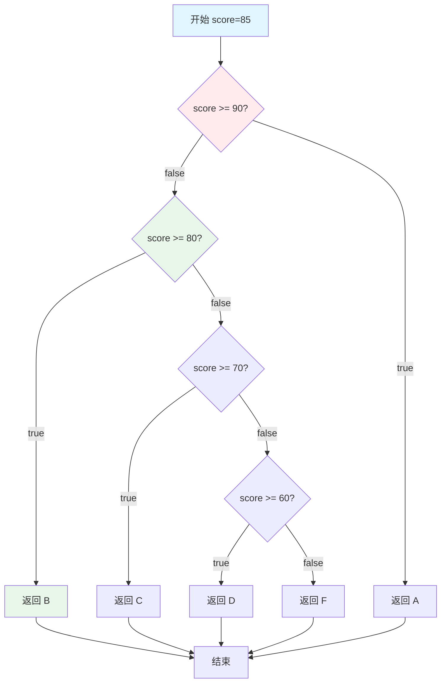

**代码执行流程（score = 55）**：

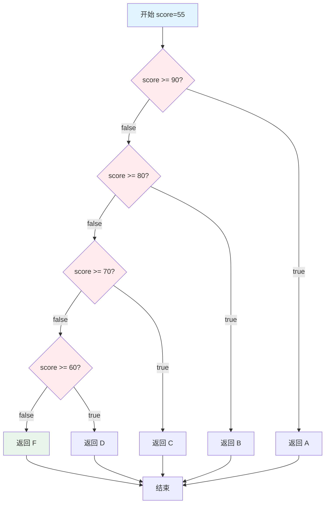

**白盒测试思路**：
1. 看代码：有 4 个 if 判断，5 个返回路径
2. 分析路径：
   - 路径 1：score >= 90 → "A"
   - 路径 2：score < 90 且 score >= 80 → "B"
   - 路径 3：score < 80 且 score >= 70 → "C"
   - 路径 4：score < 70 且 score >= 60 → "D"
   - 路径 5：score < 60 → "F"
3. 设计测试用例：

```java
@Test
public void testGradeScore_AllPaths() {
    // 覆盖所有5条路径
    assertEquals("A", gradeScore(95));  // 路径1
    assertEquals("B", gradeScore(85));  // 路径2
    assertEquals("C", gradeScore(75));  // 路径3
    assertEquals("D", gradeScore(65));  // 路径4
    assertEquals("F", gradeScore(55));  // 路径5
}

// 白盒测试覆盖率 = 5/5 = 100%
```

#### 示例 3：多个独立判断

```java
public double calculateDiscount(boolean isMember, boolean hasPromo, double amount) {
    double discount = 0;
    
    if (isMember) {        // 判断1
        discount += 0.1;   // 会员折扣 10%
    }
    
    if (hasPromo) {        // 判断2
        discount += 0.05;  // 促销折扣 5%
    }
    
    if (amount > 100) {    // 判断3
        discount += 0.02;  // 大额折扣 2%
    }
    
    return discount;
}
```

**代码执行流程（true, true, true, 150）**：

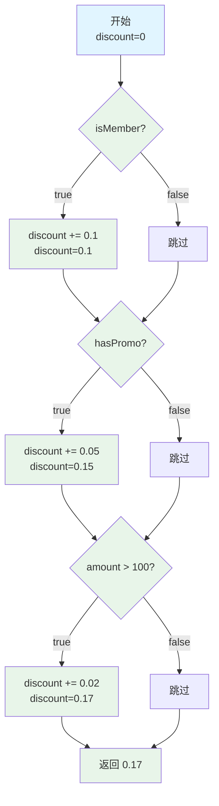

**代码执行流程（false, false, false, 50）**：

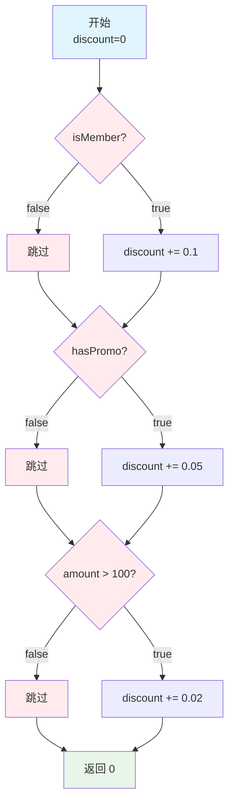

**白盒测试思路**：
1. 看代码：3 个独立的 if 判断
2. 分析路径：每个 if 有 2 种可能（true/false），共 2³ = 8 条路径
   - 路径 1：(F, F, F) → 0%
   - 路径 2：(T, F, F) → 10%
   - 路径 3：(F, T, F) → 5%
   - 路径 4：(F, F, T) → 2%
   - 路径 5：(T, T, F) → 15%
   - 路径 6：(T, F, T) → 12%
   - 路径 7：(F, T, T) → 7%
   - 路径 8：(T, T, T) → 17%
3. 设计测试用例：

```java
@Test
public void testCalculateDiscount_AllPaths() {
    // 测试所有 8 条路径
    assertEquals(0.0, calculateDiscount(false, false, 50), 0.001);   // 路径1
    assertEquals(0.1, calculateDiscount(true, false, 50), 0.001);    // 路径2
    assertEquals(0.05, calculateDiscount(false, true, 50), 0.001);   // 路径3
    assertEquals(0.02, calculateDiscount(false, false, 150), 0.001); // 路径4
    assertEquals(0.15, calculateDiscount(true, true, 50), 0.001);    // 路径5
    assertEquals(0.12, calculateDiscount(true, false, 150), 0.001);  // 路径6
    assertEquals(0.07, calculateDiscount(false, true, 150), 0.001);  // 路径7
    assertEquals(0.17, calculateDiscount(true, true, 150), 0.001);   // 路径8
}

// 路径覆盖率 = 8/8 = 100%
```

### 2.3 黑盒测试：不看代码测试

**核心思想**：不知道代码如何实现，只根据需求文档设计测试用例。

#### 方法 1：等价类划分

**思路**：把输入划分成几个等价类，每个类选一个代表测试。

**示例：年龄分类系统**

需求：
- 0-12 岁：儿童
- 13-19 岁：青少年
- 20-59 岁：成年人
- 60+ 岁：老年人
- 负数：抛出异常

```java
public String categorizeAge(int age) {
    if (age < 0) {
        throw new IllegalArgumentException("年龄不能为负");
    } else if (age <= 12) {
        return "儿童";
    } else if (age <= 19) {
        return "青少年";
    } else if (age <= 59) {
        return "成年人";
    } else {
        return "老年人";
    }
}
```

**测试执行流程（age = 8）**：

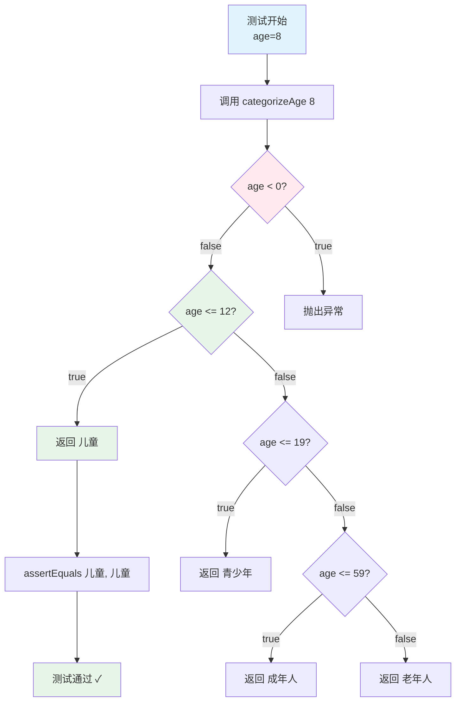

**测试执行流程（age = -5）**：

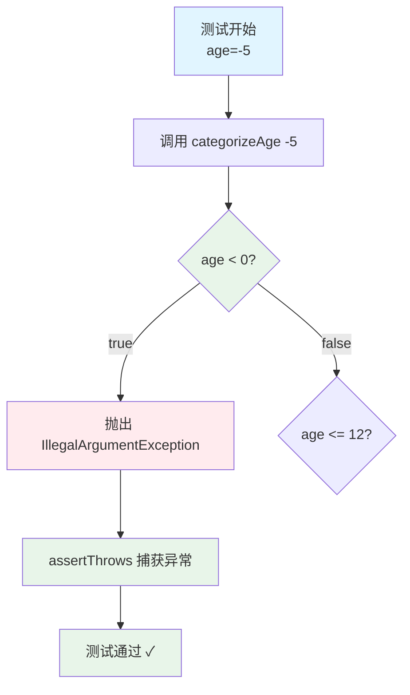

**黑盒测试思路**（不看代码）：
1. 根据需求划分等价类：
   - 有效类 1：[0, 12] → 儿童
   - 有效类 2：[13, 19] → 青少年
   - 有效类 3：[20, 59] → 成年人
   - 有效类 4：[60, ∞) → 老年人
   - 无效类：负数 → 异常
2. 每个等价类选一个代表值：

```java
@Test
public void testCategorizeAge_EquivalenceClasses() {
    // 有效等价类测试
    assertEquals("儿童", categorizeAge(8));      // 有效类1代表：8
    assertEquals("青少年", categorizeAge(16));    // 有效类2代表：16
    assertEquals("成年人", categorizeAge(35));    // 有效类3代表：35
    assertEquals("老年人", categorizeAge(75));    // 有效类4代表：75
    
    // 无效等价类测试
    assertThrows(IllegalArgumentException.class, () -> {
        categorizeAge(-5);                       // 无效类代表：-5
    });
}
```

#### 方法 2：边界值分析

**思路**：测试边界值及其附近的值，因为边界最容易出错。

**边界值选择规则**：
- 边界值本身
- 边界值 - 1
- 边界值 + 1

**示例：年龄分类系统的边界值**

边界值：0, 12, 13, 19, 20, 59, 60

```java
@Test
public void testCategorizeAge_BoundaryValues() {
    // 边界值测试
    
    // 边界：0（最小有效值）
    assertEquals("儿童", categorizeAge(0));      // 边界值
    
    // 边界：12, 13
    assertEquals("儿童", categorizeAge(12));     // 上边界
    assertEquals("青少年", categorizeAge(13));    // 下一个区间下边界
    
    // 边界：19, 20
    assertEquals("青少年", categorizeAge(19));    // 上边界
    assertEquals("成年人", categorizeAge(20));    // 下一个区间下边界
    
    // 边界：59, 60
    assertEquals("成年人", categorizeAge(59));    // 上边界
    assertEquals("老年人", categorizeAge(60));    // 下一个区间下边界
    
    // 边界外的无效值
    assertThrows(IllegalArgumentException.class, () -> {
        categorizeAge(-1);                       // 0的下边界外
    });
}
```

**边界值测试执行流程（age = 12）**：

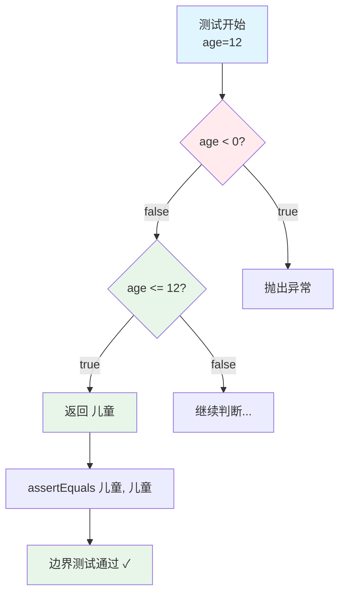

**边界值测试执行流程（age = 13）**：

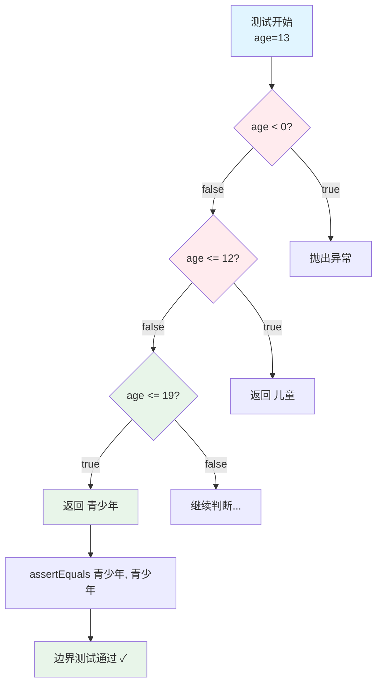

**边界值图示**：

```
无效 | 儿童  | 青少年 | 成年人 | 老年人
-----|-------|--------|--------|-------
 -1  |   0   |   13   |   20   |   60
     |  12   |   19   |   59   |
     ↑       ↑        ↑        ↑
   测试点   测试点    测试点    测试点
```

#### 方法 3：决策表法

**思路**：用表格列出所有条件组合和对应结果。

**示例：贷款申请系统**

需求：
- 年龄：18-65 岁
- 收入：>= 30000
- 信用分数：>= 700 或 有抵押物

```java
public String approveLoan(int age, int income, 
                          boolean hasCollateral, int creditScore) {
    if (age < 18 || age > 65) {
        return "拒绝：年龄不符";
    }
    
    if (income < 30000) {
        return "拒绝：收入不足";
    }
    
    if (!hasCollateral && creditScore < 700) {
        return "拒绝：需要抵押物或更高信用分数";
    }
    
    return "批准";
}
```

**决策表**：

| 条件 | 规则1 | 规则2 | 规则3 | 规则4 | 规则5 | 规则6 |
|------|-------|-------|-------|-------|-------|-------|
| 年龄合适 | ✓ | ✓ | ✓ | ✓ | ✗ | ✓ |
| 收入足够 | ✓ | ✓ | ✓ | ✓ | ✓ | ✗ |
| 有抵押物 | ✓ | ✗ | ✓ | ✗ | - | - |
| 信用分数>=700 | ✓ | ✓ | ✗ | ✗ | - | - |
| **结果** | **批准** | **批准** | **批准** | **拒绝** | **拒绝** | **拒绝** |

**黑盒测试用例**：

```java
@Test
public void testLoanApproval_DecisionTable() {
    // 规则1：全部满足
    assertEquals("批准", approveLoan(30, 50000, true, 750));
    
    // 规则2：无抵押物但信用分数高
    assertEquals("批准", approveLoan(30, 50000, false, 750));
    
    // 规则3：有抵押物但信用分数低
    assertEquals("批准", approveLoan(30, 50000, true, 650));
    
    // 规则4：无抵押物且信用分数低
    assertEquals("拒绝：需要抵押物或更高信用分数", 
                 approveLoan(30, 50000, false, 650));
    
    // 规则5：年龄不符
    assertEquals("拒绝：年龄不符", 
                 approveLoan(70, 50000, true, 750));
    
    // 规则6：收入不足
    assertEquals("拒绝：收入不足", 
                 approveLoan(30, 20000, true, 750));
}
```

**决策表测试执行流程（规则1：全部满足）**：

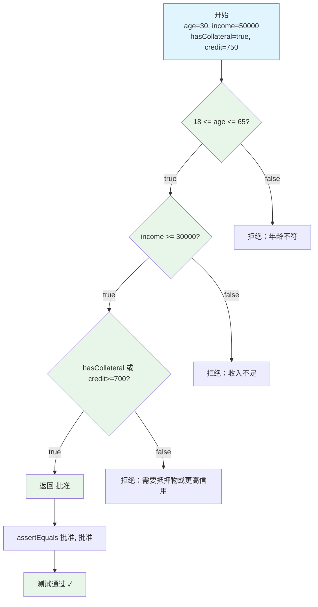

**决策表测试执行流程（规则4：无抵押物且信用低）**：

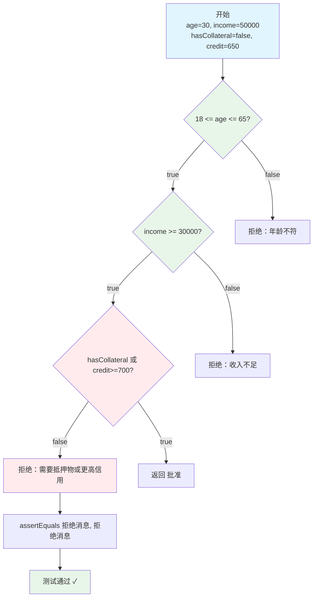

### 2.4 白盒 vs 黑盒：如何选择？

**实际应用**：
- **单元测试** → 主要用白盒测试（开发者写，看得到代码）
- **系统测试** → 主要用黑盒测试（测试人员写，不一定看代码）
- **最佳实践** → 结合使用，互相补充

**边界值测试执行流程（测试 categorizeAge）**：

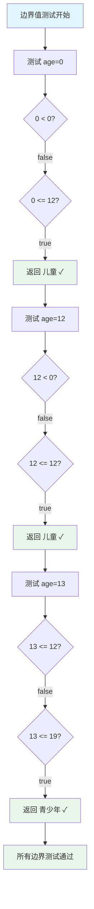

---

## 3. JUnit4 框架详解

### 3.1 基本使用三步曲

#### 第一步：添加依赖

**Maven 项目（pom.xml）**：
```xml
<dependency>
    <groupId>junit</groupId>
    <artifactId>junit</artifactId>
    <version>4.13.2</version>
    <scope>test</scope>
</dependency>
```

#### 第二步：创建测试类

```java
import org.junit.*;
import static org.junit.Assert.*;

public class CalculatorTest {
    
    @Test
    public void testAdd() {
        Calculator calc = new Calculator();
        int result = calc.add(2, 3);
        assertEquals(5, result);
    }
}
```

#### 第三步：运行测试

```bash
# Maven
mvn test

# IDE（Eclipse/IntelliJ）
右键测试类 → Run As → JUnit Test
```

### 3.2 核心注解详解

```java
import org.junit.*;
import static org.junit.Assert.*;

public class JUnit4AnnotationsDemo {
    
    private static Database database;
    private Calculator calculator;
    
    /**
     * @BeforeClass：整个测试类开始前执行一次
     * - 必须是 static 方法
     * - 用于昂贵的初始化（数据库连接、读取配置文件）
     */
    @BeforeClass
    public static void setUpClass() {
        System.out.println("=== 测试类开始 ===");
        database = new Database();
        database.connect();
    }
    
    /**
     * @AfterClass：整个测试类结束后执行一次
     * - 必须是 static 方法
     * - 用于清理全局资源
     */
    @AfterClass
    public static void tearDownClass() {
        System.out.println("=== 测试类结束 ===");
        if (database != null) {
            database.disconnect();
        }
    }
    
    /**
     * @Before：每个测试方法执行前运行
     * - 用于准备测试数据
     * - 确保测试隔离
     */
    @Before
    public void setUp() {
        System.out.println("准备测试...");
        calculator = new Calculator();
    }
    
    /**
     * @After：每个测试方法执行后运行
     * - 用于清理测试数据
     */
    @After
    public void tearDown() {
        System.out.println("清理测试...");
        calculator = null;
    }
    
    /**
     * @Test：标记测试方法
     * - 必须是 public void 方法
     * - 不能有参数
     */
    @Test
    public void testAdd() {
        assertEquals(5, calculator.add(2, 3));
    }
    
    /**
     * @Test(expected = ...)：测试是否抛出指定异常
     */
    @Test(expected = ArithmeticException.class)
    public void testDivideByZero() {
        calculator.divide(10, 0); // 应该抛出 ArithmeticException
    }
    
    /**
     * @Test(timeout = ...)：测试是否在指定时间内完成（毫秒）
     */
    @Test(timeout = 1000)
    public void testPerformance() {
        // 必须在 1 秒内完成
        for (int i = 0; i < 10000; i++) {
            calculator.add(i, i);
        }
    }
    
    /**
     * @Ignore：暂时跳过这个测试
     * - 用于标记尚未实现的功能
     * - 或已知的问题
     */
    @Ignore("功能尚未实现")
    @Test
    public void testFutureFeature() {
        calculator.complexCalculation(); // 这个方法还没写
    }
}
```

**执行顺序示例**：

假设有以下测试类：

```java
public class ExampleTest {
    @BeforeClass
    public static void setUpClass() {
        System.out.println("1. BeforeClass");
    }
    
    @Before
    public void setUp() {
        System.out.println("2. Before");
    }
    
    @Test
    public void testMethod1() {
        System.out.println("3. Test Method 1");
    }
    
    @Test
    public void testMethod2() {
        System.out.println("3. Test Method 2");
    }
    
    @After
    public void tearDown() {
        System.out.println("4. After");
    }
    
    @AfterClass
    public static void tearDownClass() {
        System.out.println("5. AfterClass");
    }
}
```

**实际执行流程图**：

```mermaid
graph TD
    A[测试类开始] --> B[@BeforeClass<br/>setUpClass]
    B --> C[@Before<br/>setUp]
    C --> D[@Test<br/>testMethod1]
    D --> E[@After<br/>tearDown]
    E --> F[@Before<br/>setUp]
    F --> G[@Test<br/>testMethod2]
    G --> H[@After<br/>tearDown]
    H --> I[@AfterClass<br/>tearDownClass]
    I --> J[测试类结束]
    
    style A fill:#e1f5ff
    style B fill:#fff4e1
    style C fill:#ffe1f5
    style D fill:#e8f5e9
    style E fill:#ffe1f5
    style F fill:#ffe1f5
    style G fill:#e8f5e9
    style H fill:#ffe1f5
    style I fill:#fff4e1
    style J fill:#e1f5ff
```

**控制台输出**：

```
=== 测试类开始 ===
准备测试...
testAdd 运行
清理测试...
准备测试...
testSubtract 运行
清理测试...
准备测试...
testMultiply 运行
清理测试...
=== 测试类结束 ===
```

### 3.3 断言方法大全

```java
import static org.junit.Assert.*;

public class AssertionExamples {
    
    @Test
    public void testBasicAssertions() {
        // 1. 布尔断言
        assertTrue("条件应该为真", 5 > 3);
        assertFalse("条件应该为假", 5 < 3);
        
        // 2. 相等断言
        assertEquals("整数相等", 5, 2 + 3);
        assertEquals("字符串相等", "Hello", "Hello");
        
        // 3. 不相等断言
        assertNotEquals("应该不相等", 5, 3);
        
        // 4. null 断言
        Object nullObj = null;
        assertNull("应该为 null", nullObj);
        
        Object nonNullObj = new Object();
        assertNotNull("不应该为 null", nonNullObj);
        
        // 5. 数组断言
        int[] expected = {1, 2, 3};
        int[] actual = {1, 2, 3};
        assertArrayEquals("数组应该相等", expected, actual);
        
        // 6. 浮点数断言（必须指定精度）
        double pi = 3.14159;
        assertEquals("浮点数相等", 3.14, pi, 0.01); // 精度 0.01
        
        // 7. 引用相等断言
        String s1 = "hello";
        String s2 = "hello";
        assertSame("应该是同一个对象", s1, s2); // 字符串常量池
        
        String s3 = new String("hello");
        assertNotSame("不应该是同一个对象", s1, s3);
        
        // 8. 强制失败
        // fail("测试失败，显示这个消息");
    }
    
    @Test
    public void testExceptionAssertion() {
        Calculator calc = new Calculator();
        
        // 方法1：使用 try-catch
        try {
            calc.divide(10, 0);
            fail("应该抛出 ArithmeticException");
        } catch (ArithmeticException e) {
            // 成功捕获异常
            assertEquals("异常消息正确", "/ by zero", e.getMessage());
        }
    }
```

**异常测试执行流程**：

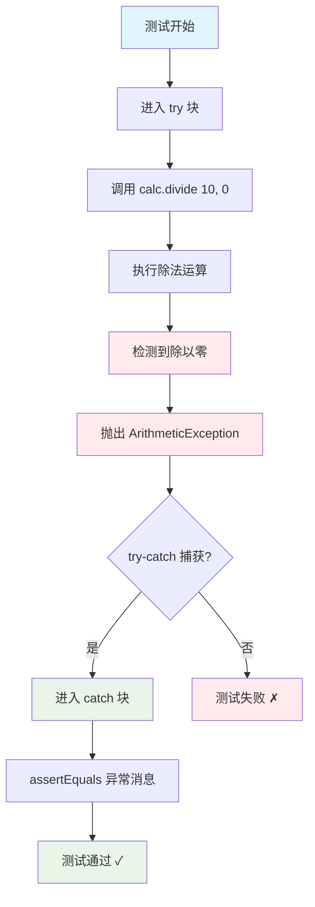

```java
    @Test(expected = IllegalArgumentException.class)
    public void testExceptionAnnotation() {
        // 方法2：使用 @Test(expected = ...)
        Calculator calc = new Calculator();
        calc.sqrt(-1); // 应该抛出 IllegalArgumentException
    }
}
```

**断言方法速查表**：

| 断言方法 | 作用 | 示例 |
|---------|------|------|
| `assertTrue(condition)` | 验证条件为真 | `assertTrue(x > 0)` |
| `assertFalse(condition)` | 验证条件为假 | `assertFalse(list.isEmpty())` |
| `assertEquals(expected, actual)` | 验证相等 | `assertEquals(5, result)` |
| `assertNotEquals(unexpected, actual)` | 验证不相等 | `assertNotEquals(0, result)` |
| `assertNull(object)` | 验证为 null | `assertNull(user)` |
| `assertNotNull(object)` | 验证不为 null | `assertNotNull(user)` |
| `assertArrayEquals(expected, actual)` | 验证数组相等 | `assertArrayEquals(arr1, arr2)` |
| `assertSame(expected, actual)` | 验证是同一对象 | `assertSame(obj1, obj2)` |
| `assertNotSame(unexpected, actual)` | 验证不是同一对象 | `assertNotSame(obj1, obj2)` |
| `fail(message)` | 强制测试失败 | `fail("不应该到这里")` |

### 3.4 参数化测试

**作用**：用一组数据测试同一个方法，避免重复代码。

```java
import org.junit.Test;
import org.junit.runner.RunWith;
import org.junit.runners.Parameterized;
import org.junit.runners.Parameterized.Parameters;
import java.util.Arrays;
import java.util.Collection;
import static org.junit.Assert.*;

@RunWith(Parameterized.class)
public class FactorialTest {
    
    // 测试参数
    private int input;
    private int expected;
    
    // 构造函数接收参数
    public FactorialTest(int input, int expected) {
        this.input = input;
        this.expected = expected;
    }
    
    // 提供测试数据
    @Parameters(name = "factorial({0}) = {1}")
    public static Collection<Object[]> data() {
        return Arrays.asList(new Object[][] {
            {0, 1},      // 0! = 1
            {1, 1},      // 1! = 1
            {2, 2},      // 2! = 2
            {3, 6},      // 3! = 6
            {4, 24},     // 4! = 24
            {5, 120},    // 5! = 120
            {6, 720}     // 6! = 720
        });
    }
    
    @Test
    public void testFactorial() {
        MathUtils math = new MathUtils();
        assertEquals(expected, math.factorial(input));
    }
}
```

**运行结果**：
```
factorial(0) = 1 ✓
factorial(1) = 1 ✓
factorial(2) = 2 ✓
factorial(3) = 6 ✓
factorial(4) = 24 ✓
factorial(5) = 120 ✓
factorial(6) = 720 ✓
```

**参数化测试执行流程**：

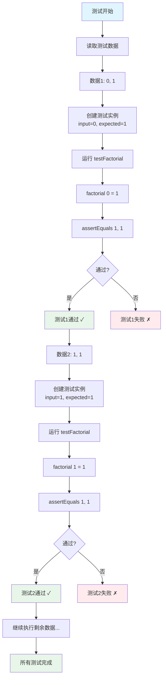

**参数化测试的优势**：

```java
// ✗ 没有参数化：重复代码
@Test
public void testFactorial0() {
    assertEquals(1, math.factorial(0));
}
@Test
public void testFactorial1() {
    assertEquals(1, math.factorial(1));
}
@Test
public void testFactorial2() {
    assertEquals(2, math.factorial(2));
}
// ... 重复很多次

// ✓ 参数化测试：简洁优雅
@RunWith(Parameterized.class)
public class FactorialTest {
    // 一个测试方法 + 多组数据 = 多个测试用例
}
```

### 3.5 测试套件

**作用**：组织多个测试类一起运行。

```java
import org.junit.runner.RunWith;
import org.junit.runners.Suite;
import org.junit.runners.Suite.SuiteClasses;

@RunWith(Suite.class)
@SuiteClasses({
    CalculatorTest.class,
    StringUtilsTest.class,
    UserServiceTest.class,
    OrderProcessorTest.class
})
public class AllTests {
    // 这个类不需要任何代码
    // 只是用来组织测试类
}
```

**运行测试套件**：
```java
// 运行 AllTests，会依次运行所有包含的测试类
```

---

## 4. 测试用例设计方法

### 4.1 等价类划分法

**核心思想**：把输入数据划分成若干等价类，每个类选一个代表值测试。

**步骤**：
1. 识别输入条件
2. 划分有效等价类和无效等价类
3. 为每个等价类设计测试用例

#### 示例 1：成绩等级划分

**需求**：
- 输入：0-100 的整数
- 输出：
  - 90-100: "优秀"
  - 80-89: "良好"
  - 70-79: "中等"
  - 60-69: "及格"
  - 0-59: "不及格"
  - 其他: 抛出异常

```java
public String gradeScore(int score) {
    if (score < 0 || score > 100) {
        throw new IllegalArgumentException("分数必须在 0-100 之间");
    }
    if (score >= 90) return "优秀";
    if (score >= 80) return "良好";
    if (score >= 70) return "中等";
    if (score >= 60) return "及格";
    return "不及格";
}
```

**等价类划分**：

| 类型 | 等价类 | 代表值 | 期望输出 |
|------|--------|--------|----------|
| 有效类1 | [90, 100] | 95 | "优秀" |
| 有效类2 | [80, 89] | 85 | "良好" |
| 有效类3 | [70, 79] | 75 | "中等" |
| 有效类4 | [60, 69] | 65 | "及格" |
| 有效类5 | [0, 59] | 30 | "不及格" |
| 无效类1 | < 0 | -5 | 异常 |
| 无效类2 | > 100 | 105 | 异常 |

**测试用例**：

```java
@Test
public void testGradeScore_EquivalenceClasses() {
    // 有效等价类
    assertEquals("优秀", gradeScore(95));     // 有效类1
    assertEquals("良好", gradeScore(85));     // 有效类2
    assertEquals("中等", gradeScore(75));     // 有效类3
    assertEquals("及格", gradeScore(65));     // 有效类4
    assertEquals("不及格", gradeScore(30));   // 有效类5
    
    // 无效等价类
    assertThrows(IllegalArgumentException.class, () -> gradeScore(-5));   // 无效类1
    assertThrows(IllegalArgumentException.class, () -> gradeScore(105));  // 无效类2
}
```

**等价类测试执行流程（score = 95）**：

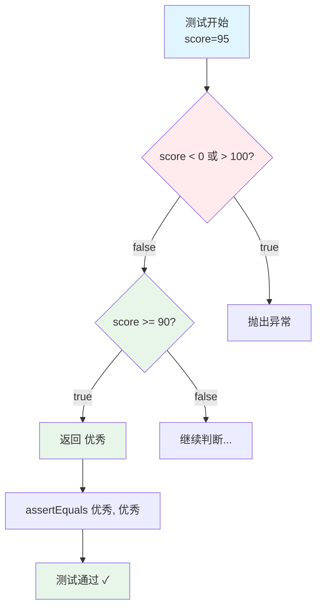

**等价类测试执行流程（score = -5）**：

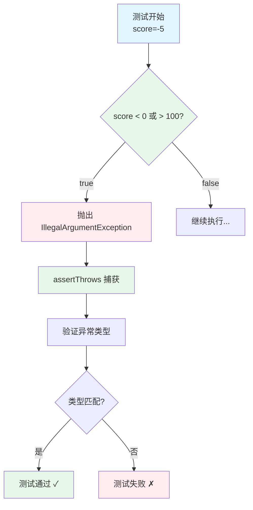

#### 示例 2：用户名验证

**需求**：
- 长度：6-20 个字符
- 字符：只能包含字母、数字、下划线
- 开头：必须是字母

```java
public boolean validateUsername(String username) {
    if (username == null || username.isEmpty()) {
        return false;
    }
    if (username.length() < 6 || username.length() > 20) {
        return false;
    }
    if (!Character.isLetter(username.charAt(0))) {
        return false;
    }
    for (char c : username.toCharArray()) {
        if (!Character.isLetterOrDigit(c) && c != '_') {
            return false;
        }
    }
    return true;
}
```

**等价类划分**：

| 类型 | 等价类 | 代表值 | 期望结果 |
|------|--------|--------|----------|
| 有效类 | 符合所有规则 | "user123" | true |
| 无效类1 | null | null | false |
| 无效类2 | 空字符串 | "" | false |
| 无效类3 | 长度 < 6 | "user" | false |
| 无效类4 | 长度 > 20 | "verylongusername12345" | false |
| 无效类5 | 数字开头 | "123user" | false |
| 无效类6 | 特殊字符开头 | "_user" | false |
| 无效类7 | 包含非法字符 | "user@123" | false |
| 无效类8 | 包含空格 | "user 123" | false |

**测试用例**：

```java
@Test
public void testValidateUsername_EquivalenceClasses() {
    // 有效等价类
    assertTrue(validateUsername("user123"));
    assertTrue(validateUsername("Admin_01"));
    
    // 无效等价类
    assertFalse(validateUsername(null));              // 无效类1
    assertFalse(validateUsername(""));                // 无效类2
    assertFalse(validateUsername("user"));            // 无效类3
    assertFalse(validateUsername("verylongusername12345")); // 无效类4
    assertFalse(validateUsername("123user"));         // 无效类5
    assertFalse(validateUsername("_user"));           // 无效类6
    assertFalse(validateUsername("user@123"));        // 无效类7
    assertFalse(validateUsername("user 123"));        // 无效类8
}
```

### 4.2 边界值分析法

**核心思想**：测试边界值及其附近的值，因为边界最容易出错。

**边界值选择**：
- 边界值本身
- 边界值 - 1（刚好不满足）
- 边界值 + 1（刚好满足）

#### 示例 1：分数等级（边界值版）

```java
@Test
public void testGradeScore_BoundaryValues() {
    // 边界：0
    assertEquals("不及格", gradeScore(0));    // 最小边界
    
    // 边界：59, 60
    assertEquals("不及格", gradeScore(59));   // 59（边界-1）
    assertEquals("及格", gradeScore(60));     // 60（边界）
    
    // 边界：69, 70
    assertEquals("及格", gradeScore(69));     // 69（边界-1）
    assertEquals("中等", gradeScore(70));     // 70（边界）
    
    // 边界：79, 80
    assertEquals("中等", gradeScore(79));     // 79（边界-1）
    assertEquals("良好", gradeScore(80));     // 80（边界）
    
    // 边界：89, 90
    assertEquals("良好", gradeScore(89));     // 89（边界-1）
    assertEquals("优秀", gradeScore(90));     // 90（边界）
    
    // 边界：100
    assertEquals("优秀", gradeScore(100));    // 最大边界
    
    // 边界外的无效值
    assertThrows(IllegalArgumentException.class, () -> gradeScore(-1));  // -1（边界-1）
    assertThrows(IllegalArgumentException.class, () -> gradeScore(101)); // 101（边界+1）
}
```

**边界值图示**：

```
无效  | 不及格  | 及格  | 中等  | 良好  | 优秀  | 无效
-----|---------|-------|-------|-------|-------|-----
 -1  |    0    |  60   |  70   |  80   |  90   | 101
     |   59    |  69   |  79   |  89   | 100   |
     ↑         ↑       ↑       ↑       ↑       ↑
   测试点    测试点   测试点   测试点   测试点   测试点
```

#### 示例 2：数组索引

**需求**：获取数组元素，索引范围 0 到 length-1

```java
public int getElement(int[] array, int index) {
    if (index < 0 || index >= array.length) {
        throw new IndexOutOfBoundsException("索引越界");
    }
    return array[index];
}
```

**边界值测试**：

```java
@Test
public void testGetElement_BoundaryValues() {
    int[] array = {10, 20, 30, 40, 50}; // length = 5
    
    // 下边界：0
    assertEquals(10, getElement(array, 0));    // 最小有效索引
    
    // 上边界：4 (length - 1)
    assertEquals(50, getElement(array, 4));    // 最大有效索引
    
    // 边界外的无效值
    assertThrows(IndexOutOfBoundsException.class, 
                 () -> getElement(array, -1));  // 下边界-1
    assertThrows(IndexOutOfBoundsException.class, 
                 () -> getElement(array, 5));   // 上边界+1
}
```

### 4.3 决策表法

**核心思想**：用表格列出所有条件组合和对应的动作。

**适用场景**：多个条件的复杂判断逻辑。

#### 示例：保险费用计算

**需求**：
- 条件1：年龄 >= 25
- 条件2：有驾驶经验 > 5 年
- 条件3：无事故记录

费用规则：
- 全部满足：基础费用 × 0.8（20% 折扣）
- 满足2个：基础费用 × 0.9（10% 折扣）
- 满足1个：基础费用 × 1.0（无折扣）
- 都不满足：基础费用 × 1.2（20% 加价）

```java
public double calculateInsurance(int age, int experience, 
                                 boolean noAccident, double baseFee) {
    int count = 0;
    if (age >= 25) count++;
    if (experience > 5) count++;
    if (noAccident) count++;
    
    switch (count) {
        case 3: return baseFee * 0.8;
        case 2: return baseFee * 0.9;
        case 1: return baseFee * 1.0;
        default: return baseFee * 1.2;
    }
}
```

**决策表**：

| 规则 | 1 | 2 | 3 | 4 | 5 | 6 | 7 | 8 |
|------|---|---|---|---|---|---|---|---|
| 年龄>=25 | T | T | T | T | F | F | F | F |
| 经验>5年 | T | T | F | F | T | T | F | F |
| 无事故 | T | F | T | F | T | F | T | F |
| **满足条件数** | 3 | 2 | 2 | 1 | 2 | 1 | 1 | 0 |
| **结果** | ×0.8 | ×0.9 | ×0.9 | ×1.0 | ×0.9 | ×1.0 | ×1.0 | ×1.2 |

**测试用例**：

```java
@Test
public void testCalculateInsurance_DecisionTable() {
    double baseFee = 1000.0;
    
    // 规则1：全部满足 (T,T,T) → ×0.8
    assertEquals(800.0, calculateInsurance(30, 10, true, baseFee), 0.01);
    
    // 规则2：满足2个 (T,T,F) → ×0.9
    assertEquals(900.0, calculateInsurance(30, 10, false, baseFee), 0.01);
    
    // 规则3：满足2个 (T,F,T) → ×0.9
    assertEquals(900.0, calculateInsurance(30, 3, true, baseFee), 0.01);
    
    // 规则4：满足1个 (T,F,F) → ×1.0
    assertEquals(1000.0, calculateInsurance(30, 3, false, baseFee), 0.01);
    
    // 规则5：满足2个 (F,T,T) → ×0.9
    assertEquals(900.0, calculateInsurance(20, 10, true, baseFee), 0.01);
    
    // 规则6：满足1个 (F,T,F) → ×1.0
    assertEquals(1000.0, calculateInsurance(20, 10, false, baseFee), 0.01);
    
    // 规则7：满足1个 (F,F,T) → ×1.0
    assertEquals(1000.0, calculateInsurance(20, 3, true, baseFee), 0.01);
    
    // 规则8：都不满足 (F,F,F) → ×1.2
    assertEquals(1200.0, calculateInsurance(20, 3, false, baseFee), 0.01);
}
```

### 4.4 三种方法对比

| 方法 | 适用场景 | 优势 | 劣势 | 考试重点 |
|------|---------|------|------|----------|
| **等价类划分** | 输入范围明确 | 减少测试用例数量 | 可能遗漏边界 | ✓✓ |
| **边界值分析** | 有明确边界值 | 发现边界错误 | 用例数量多 | ✓✓✓ |
| **决策表法** | 多条件组合 | 覆盖所有组合 | 组合数爆炸 | ✓✓ |

**组合使用示例**：

```java
// 综合使用三种方法测试年龄分类
@Test
public void testCategorizeAge_Comprehensive() {
    // 1. 等价类划分
    assertEquals("儿童", categorizeAge(8));      // 代表值
    assertEquals("青少年", categorizeAge(16));    // 代表值
    
    // 2. 边界值分析
    assertEquals("儿童", categorizeAge(0));      // 下边界
    assertEquals("儿童", categorizeAge(12));     // 上边界
    assertEquals("青少年", categorizeAge(13));    // 下一个区间下边界
    
    // 3. 无效类测试
    assertThrows(IllegalArgumentException.class, 
                 () -> categorizeAge(-1));
}
```

---

## 5. 分支覆盖率与代码覆盖

### 5.1 代码覆盖率的类型

**覆盖率强度对比**：

| 类型 | 强度 | 实用性 | 考试重点 |
|------|------|--------|----------|
| 语句覆盖 | ⭐ | 低 | ✓ |
| 分支覆盖 | ⭐⭐⭐ | 高 | ✓✓✓ |
| 条件覆盖 | ⭐⭐⭐⭐ | 中 | ✓✓ |
| 路径覆盖 | ⭐⭐⭐⭐⭐ | 低 | ✓ |

### 5.2 语句覆盖率（Statement Coverage）

**定义**：测试用例执行的代码行数 / 总代码行数

```java
public String checkAge(int age) {
    String result;              // 语句1
    if (age >= 18) {           // 语句2
        result = "成年人";      // 语句3
    } else {                   // 语句4
        result = "未成年人";    // 语句5
    }
    return result;             // 语句6
}
```

**测试执行流程（只测 age=20）**：

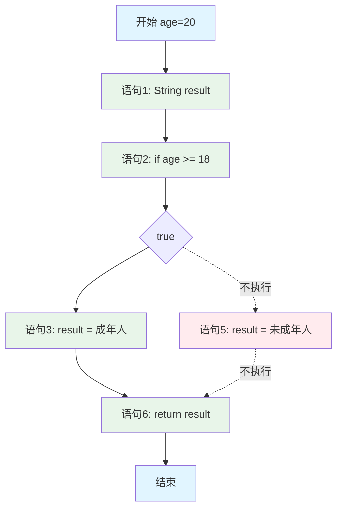

**覆盖情况**：
- 执行的语句：1, 2, 3, 6（4个）
- 未执行的语句：5（1个）
- 语句覆盖率 = 4/6 = 66.7%（注意：语句4的else不算单独的语句）

实际上：
- 执行的语句：1, 2, 3, 6
- 未执行的语句：5
- 语句覆盖率 = 4/5 = 80%

**测试用例 1**：只测试成年人

```java
@Test
public void test1() {
    assertEquals("成年人", checkAge(20)); // 执行语句：1,2,3,6
}
// 语句覆盖率 = 4/6 = 66.7%
```

**测试用例 2**：完整测试

```java
@Test
public void test2() {
    assertEquals("成年人", checkAge(20));   // 执行语句：1,2,3,6
    assertEquals("未成年人", checkAge(15)); // 执行语句：1,2,5,6
}
// 语句覆盖率 = 6/6 = 100%
```

### 5.3 分支覆盖率（Branch Coverage）⭐

**定义**：测试用例执行的分支数 / 总分支数

**每个 if 有 2 个分支：true 分支和 false 分支**

#### 示例 1：单个 if

```java
public String gradeScore(int score) {
    if (score >= 60) {         // 分支1: true/false
        return "及格";
    } else {
        return "不及格";
    }
}

// 总分支数 = 2（true 和 false）
```

**分支测试执行流程（score = 80, true 分支）**：

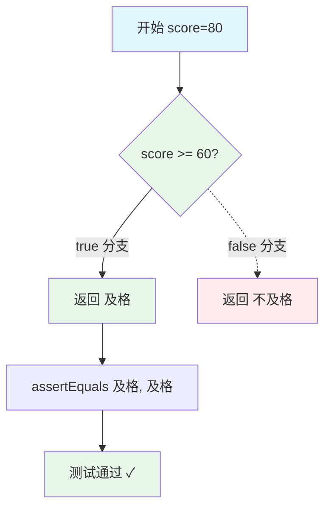

**分支测试执行流程（score = 50, false 分支）**：

```mermaid
graph TD
    A[开始 score=50] --> B{score >= 60?}
    B -.true 分支.-> C[返回 及格]
    B -->|false 分支| D[返回 不及格]
    D --> E[assertEquals 不及格, 不及格]
    E --> F[测试通过 ✓]
    
    style A fill:#e1f5ff
    style B fill:#ffebee
    style C fill:#ffebee
    style D fill:#e8f5e9
    style F fill:#e8f5e9
```

**测试用例分析**：

```java
// 测试1：只测试 true 分支
@Test
public void test1() {
    assertEquals("及格", gradeScore(80));
}
// 分支覆盖率 = 1/2 = 50%

// 测试2：完整测试
@Test
public void test2() {
    assertEquals("及格", gradeScore(80));     // true 分支
    assertEquals("不及格", gradeScore(50));   // false 分支
}
// 分支覆盖率 = 2/2 = 100%
```

#### 示例 2：多重 if-else

```java
public String gradeScore(int score) {
    if (score >= 90) {         // 分支1: true/false
        return "A";
    } else if (score >= 80) {  // 分支2: true/false
        return "B";
    } else if (score >= 70) {  // 分支3: true/false
        return "C";
    } else {
        return "F";
    }
}

// 总分支数 = 6（3个if，每个2个分支）
```

**分支分析表**：

| if 语句 | true 分支 | false 分支 |
|---------|----------|-----------|
| `score >= 90` | 返回 "A" | 继续检查 |
| `score >= 80` | 返回 "B" | 继续检查 |
| `score >= 70` | 返回 "C" | 返回 "F" |

**测试用例**：

```java
@Test
public void testGradeScore_AllBranches() {
    // 覆盖所有分支
    assertEquals("A", gradeScore(95));  // 分支1-true
    assertEquals("B", gradeScore(85));  // 分支1-false, 分支2-true
    assertEquals("C", gradeScore(75));  // 分支1-false, 分支2-false, 分支3-true
    assertEquals("F", gradeScore(65));  // 分支1-false, 分支2-false, 分支3-false
}
// 分支覆盖率 = 6/6 = 100%
```

**分支测试执行流程（score = 85）**：

```mermaid
graph TD
    A[开始 score=85] --> B{score >= 90?}
    B -->|false| C{score >= 80?}
    B -.true.-> Z1[返回 A]
    C -->|true| D[返回 B]
    C -.false.-> E{score >= 70?}
    E -.true.-> Z2[返回 C]
    E -.false.-> F[返回 F]
    
    D --> G[assertEquals B, B]
    G --> H[测试通过 ✓]
    
    style A fill:#e1f5ff
    style B fill:#ffebee
    style C fill:#e8f5e9
    style D fill:#e8f5e9
    style H fill:#e8f5e9
    style Z1 fill:#ffebee
    style Z2 fill:#ffebee
    style F fill:#ffebee
```

**分支测试执行流程（score = 65）**：

```mermaid
graph TD
    A[开始 score=65] --> B{score >= 90?}
    B -->|false| C{score >= 80?}
    B -.true.-> Z1[返回 A]
    C -->|false| E{score >= 70?}
    C -.true.-> Z2[返回 B]
    E -->|false| F[返回 F]
    E -.true.-> Z3[返回 C]
    
    F --> G[assertEquals F, F]
    G --> H[测试通过 ✓]
    
    style A fill:#e1f5ff
    style B fill:#ffebee
    style C fill:#ffebee
    style E fill:#ffebee
    style F fill:#e8f5e9
    style H fill:#e8f5e9
```

#### 示例 3：独立的多个 if

```java
public int calculateBonus(boolean highPerformance, 
                          boolean longService, 
                          boolean teamLead) {
    int bonus = 0;
    
    if (highPerformance) {     // 分支1: true/false
        bonus += 1000;
    }
    
    if (longService) {         // 分支2: true/false
        bonus += 500;
    }
    
    if (teamLead) {            // 分支3: true/false
        bonus += 300;
    }
    
    return bonus;
}

// 总分支数 = 6（3个if，每个2个分支）
```

**最少测试用例**（覆盖所有分支）：

```java
@Test
public void testCalculateBonus_MinimalBranchCoverage() {
    // 测试用例1：全部 true
    assertEquals(1800, calculateBonus(true, true, true));
    // 覆盖分支：1-true, 2-true, 3-true
    
    // 测试用例2：全部 false
    assertEquals(0, calculateBonus(false, false, false));
    // 覆盖分支：1-false, 2-false, 3-false
}
// 分支覆盖率 = 6/6 = 100%（只用2个测试用例）
```

**最少测试执行流程（true, true, true）**：

```mermaid
graph TD
    A[开始 bonus=0] --> B{highPerformance?}
    B -->|true| C[bonus += 1000<br/>bonus=1000]
    B -.false.-> D1[跳过]
    C --> E{longService?}
    E -->|true| F[bonus += 500<br/>bonus=1500]
    E -.false.-> D2[跳过]
    F --> G{teamLead?}
    G -->|true| H[bonus += 300<br/>bonus=1800]
    G -.false.-> D3[跳过]
    H --> I[返回 1800]
    I --> J[assertEquals 1800, 1800]
    J --> K[测试通过 ✓]
    
    style A fill:#e1f5ff
    style B fill:#e8f5e9
    style C fill:#e8f5e9
    style E fill:#e8f5e9
    style F fill:#e8f5e9
    style G fill:#e8f5e9
    style H fill:#e8f5e9
    style K fill:#e8f5e9
```

**最少测试执行流程（false, false, false）**：

```mermaid
graph TD
    A[开始 bonus=0] --> B{highPerformance?}
    B -.true.-> C1[bonus += 1000]
    B -->|false| D[跳过]
    D --> E{longService?}
    E -.true.-> C2[bonus += 500]
    E -->|false| F[跳过]
    F --> G{teamLead?}
    G -.true.-> C3[bonus += 300]
    G -->|false| H[跳过]
    H --> I[返回 0]
    I --> J[assertEquals 0, 0]
    J --> K[测试通过 ✓]
    
    style A fill:#e1f5ff
    style B fill:#ffebee
    style D fill:#ffebee
    style E fill:#ffebee
    style F fill:#ffebee
    style G fill:#ffebee
    style H fill:#ffebee
    style K fill:#e8f5e9
```

### 5.4 路径覆盖率（Path Coverage）

**定义**：测试用例执行的路径数 / 总路径数

**路径 = 从开始到结束的完整执行序列**

#### 示例：独立的多个 if（路径覆盖）

```java
public int calculateBonus(boolean highPerformance, 
                          boolean longService, 
                          boolean teamLead) {
    int bonus = 0;
    
    if (highPerformance) { bonus += 1000; }  // if1
    if (longService) { bonus += 500; }       // if2
    if (teamLead) { bonus += 300; }          // if3
    
    return bonus;
}

// 总路径数 = 2^3 = 8（每个if有2种选择）
```

**所有可能的路径**：

| 路径 | highPerformance | longService | teamLead | bonus |
|------|-----------------|-------------|----------|-------|
| 1 | F | F | F | 0 |
| 2 | T | F | F | 1000 |
| 3 | F | T | F | 500 |
| 4 | F | F | T | 300 |
| 5 | T | T | F | 1500 |
| 6 | T | F | T | 1300 |
| 7 | F | T | T | 800 |
| 8 | T | T | T | 1800 |

**完整路径覆盖测试**：

```java
@Test
public void testCalculateBonus_AllPaths() {
    // 8条路径，需要8个测试用例
    assertEquals(0, calculateBonus(false, false, false));      // 路径1
    assertEquals(1000, calculateBonus(true, false, false));    // 路径2
    assertEquals(500, calculateBonus(false, true, false));     // 路径3
    assertEquals(300, calculateBonus(false, false, true));     // 路径4
    assertEquals(1500, calculateBonus(true, true, false));     // 路径5
    assertEquals(1300, calculateBonus(true, false, true));     // 路径6
    assertEquals(800, calculateBonus(false, true, true));      // 路径7
    assertEquals(1800, calculateBonus(true, true, true));      // 路径8
}
// 路径覆盖率 = 8/8 = 100%
```

**路径覆盖执行示意（3个独立if的所有组合）**：

```mermaid
graph TD
    A[开始] --> B1[路径1: F,F,F → 0]
    A --> B2[路径2: T,F,F → 1000]
    A --> B3[路径3: F,T,F → 500]
    A --> B4[路径4: F,F,T → 300]
    A --> B5[路径5: T,T,F → 1500]
    A --> B6[路径6: T,F,T → 1300]
    A --> B7[路径7: F,T,T → 800]
    A --> B8[路径8: T,T,T → 1800]
    
    B1 --> C[所有路径]
    B2 --> C
    B3 --> C
    B4 --> C
    B5 --> C
    B6 --> C
    B7 --> C
    B8 --> C
    
    C --> D[8个测试用例全部通过 ✓]
    
    style A fill:#e1f5ff
    style D fill:#e8f5e9
```

**路径8详细执行流程（true, true, true）**：

```mermaid
graph TD
    A[开始 bonus=0] --> B{if1: high?}
    B -->|T| C[bonus=1000]
    C --> D{if2: long?}
    D -->|T| E[bonus=1500]
    E --> F{if3: lead?}
    F -->|T| G[bonus=1800]
    G --> H[返回 1800]
    
    style A fill:#e1f5ff
    style B fill:#e8f5e9
    style C fill:#e8f5e9
    style D fill:#e8f5e9
    style E fill:#e8f5e9
    style F fill:#e8f5e9
    style G fill:#e8f5e9
```

### 5.5 条件覆盖率（Condition Coverage）

**定义**：每个条件的 true 和 false 都至少执行一次

#### 示例：复合条件

```java
public String checkEligibility(int age, int income) {
    if (age >= 18 && income >= 30000) {  // 复合条件
        return "合格";
    } else {
        return "不合格";
    }
}
```

**条件分析**：
- 条件1：`age >= 18`
- 条件2：`income >= 30000`

**条件覆盖测试**：

```java
@Test
public void testCheckEligibility_ConditionCoverage() {
    // 测试用例1：条件1-true, 条件2-true
    assertEquals("合格", checkEligibility(25, 40000));
    
    // 测试用例2：条件1-false, 条件2-false
    assertEquals("不合格", checkEligibility(15, 20000));
    
    // 可选：条件1-true, 条件2-false
    assertEquals("不合格", checkEligibility(25, 20000));
    
    // 可选：条件1-false, 条件2-true
    assertEquals("不合格", checkEligibility(15, 40000));
}
// 条件覆盖率 = 100%（每个条件的 true 和 false 都测试了）
```

**条件测试执行流程（age=25, income=40000）**：

```mermaid
graph TD
    A[开始<br/>age=25, income=40000] --> B[条件1: age >= 18]
    B --> C{true}
    C --> D[条件2: income >= 30000]
    D --> E{true}
    E --> F[整体条件: true AND true]
    F --> G{结果 true?}
    G -->|是| H[返回 合格]
    G -->|否| Z[返回 不合格]
    H --> I[assertEquals 合格, 合格]
    I --> J[测试通过 ✓]
    
    style A fill:#e1f5ff
    style B fill:#e8f5e9
    style C fill:#e8f5e9
    style D fill:#e8f5e9
    style E fill:#e8f5e9
    style F fill:#e8f5e9
    style H fill:#e8f5e9
    style J fill:#e8f5e9
```

**条件测试执行流程（age=25, income=20000）**：

```mermaid
graph TD
    A[开始<br/>age=25, income=20000] --> B[条件1: age >= 18]
    B --> C{true}
    C --> D[条件2: income >= 30000]
    D --> E{false}
    E --> F[整体条件: true AND false]
    F --> G{结果 false?}
    G -->|是| H[返回 不合格]
    G -->|否| Z[返回 合格]
    H --> I[assertEquals 不合格, 不合格]
    I --> J[测试通过 ✓]
    
    style A fill:#e1f5ff
    style B fill:#e8f5e9
    style C fill:#e8f5e9
    style D fill:#ffebee
    style E fill:#ffebee
    style F fill:#ffebee
    style H fill:#e8f5e9
    style J fill:#e8f5e9
```

### 5.6 覆盖率对比与选择

**对比表**：

| 覆盖率类型 | 强度 | 用例数量 | 实用性 | 考试重点 |
|-----------|------|----------|--------|----------|
| **语句覆盖** | ⭐ | 少 | 低 | ✓ |
| **分支覆盖** | ⭐⭐⭐ | 中 | 高 | ✓✓✓ |
| **条件覆盖** | ⭐⭐⭐⭐ | 多 | 中 | ✓✓ |
| **路径覆盖** | ⭐⭐⭐⭐⭐ | 很多 | 低（太多）| ✓ |

**实际应用建议**：
- **目标**：分支覆盖率 > 80%
- **核心代码**：分支覆盖率 > 95%
- **路径覆盖**：仅用于关键、简单的方法

### 5.7 使用 JaCoCo 测量覆盖率

**JaCoCo** = Java Code Coverage，测量代码覆盖率的工具

#### 配置 Maven

```xml
<build>
    <plugins>
        <plugin>
            <groupId>org.jacoco</groupId>
            <artifactId>jacoco-maven-plugin</artifactId>
            <version>0.8.8</version>
            <executions>
                <execution>
                    <goals>
                        <goal>prepare-agent</goal>
                    </goals>
                </execution>
                <execution>
                    <id>report</id>
                    <phase>test</phase>
                    <goals>
                        <goal>report</goal>
                    </goals>
                </execution>
            </executions>
        </plugin>
    </plugins>
</build>
```

#### 运行测试并生成报告

```bash
mvn clean test
```

**报告位置**：`target/site/jacoco/index.html`

#### 查看覆盖率报告

打开 HTML 报告，可以看到：
- **绿色**：已覆盖的代码
- **红色**：未覆盖的代码
- **黄色**：部分覆盖的分支

**示例报告**：

```
Calculator.java
├─ add()           100% (2/2 branches)  ✓
├─ subtract()      100% (2/2 branches)  ✓
├─ multiply()      50%  (1/2 branches)  ⚠️
└─ divide()        0%   (0/2 branches)  ✗
```

### 5.8 覆盖率计算练习

#### 练习 1：计算分支覆盖率

```java
public int max(int a, int b, int c) {
    int max = a;
    if (b > max) {         // 分支1
        max = b;
    }
    if (c > max) {         // 分支2
        max = c;
    }
    return max;
}

// 问题：总共有多少个分支？
// 答案：4个分支（每个if有2个分支）

@Test
public void testMax() {
    assertEquals(5, max(3, 5, 2));
}
```

**测试执行流程图（a=3, b=5, c=2）**：

```mermaid
graph TD
    A[开始<br/>max=a=3] --> B{b > max?<br/>5 > 3?}
    B -->|true 分支1-T| C[max = b = 5]
    B -.false 分支1-F.-> D1[跳过]
    C --> E{c > max?<br/>2 > 5?}
    D1 --> E
    E -.true 分支2-T.-> F[max = c]
    E -->|false 分支2-F| G[跳过]
    F --> H[return max]
    G --> H
    H --> I[返回 5]
    
    style A fill:#e1f5ff
    style B fill:#e8f5e9
    style C fill:#e8f5e9
    style E fill:#ffebee
    style G fill:#ffebee
    style I fill:#e8f5e9
```

**覆盖情况分析**：
- 分支1-true：✓ 覆盖（5 > 3）
- 分支1-false：✗ 未覆盖
- 分支2-true：✗ 未覆盖
- 分支2-false：✓ 覆盖（2 > 5）
- **分支覆盖率 = 2/4 = 50%**

#### 练习 2：设计达到 100% 分支覆盖的测试

```java
public String checkNumber(int num) {
    if (num > 0) {         // 分支1: true/false
        if (num % 2 == 0) { // 分支2: true/false
            return "正偶数";
        } else {
            return "正奇数";
        }
    } else if (num < 0) {  // 分支3: true/false
        return "负数";
    } else {
        return "零";
    }
}
```

**分支覆盖测试执行流程**：

```mermaid
graph TD
    A[需要覆盖的分支] --> B[分支1-true: num > 0]
    A --> C[分支1-false: num <= 0]
    A --> D[分支2-true: num % 2 == 0]
    A --> E[分支2-false: num % 2 != 0]
    A --> F[分支3-true: num < 0]
    A --> G[分支3-false: num == 0]
    
    B --> H[测试: num=4]
    C --> F
    D --> H
    E --> I[测试: num=3]
    F --> J[测试: num=-1]
    G --> K[测试: num=0]
    
    H --> L[4个测试用例]
    I --> L
    J --> L
    K --> L
    L --> M[100% 分支覆盖 ✓]
    
    style A fill:#e1f5ff
    style M fill:#e8f5e9
```

**测试用例执行流程（num=4，正偶数）**：

```mermaid
graph TD
    A[开始 num=4] --> B{num > 0?}
    B -->|true| C{num % 2 == 0?}
    B -.false.-> Z1
    C -->|true| D[返回 正偶数]
    C -.false.-> Z2[返回 正奇数]
    D --> E[测试通过 ✓]
    
    style A fill:#e1f5ff
    style B fill:#e8f5e9
    style C fill:#e8f5e9
    style D fill:#e8f5e9
    style E fill:#e8f5e9
```

**测试用例执行流程（num=-1，负数）**：

```mermaid
graph TD
    A[开始 num=-1] --> B{num > 0?}
    B -.true.-> Z1[进入内层if]
    B -->|false| C{num < 0?}
    C -->|true| D[返回 负数]
    C -.false.-> E[返回 零]
    D --> F[测试通过 ✓]
    
    style A fill:#e1f5ff
    style B fill:#ffebee
    style C fill:#e8f5e9
    style D fill:#e8f5e9
    style F fill:#e8f5e9
```

**完整测试代码**：

```java
// 问题：设计测试用例达到 100% 分支覆盖
@Test
public void testCheckNumber_FullBranchCoverage() {
    // 你的答案：
    assertEquals("正偶数", checkNumber(4));   // 分支1-true, 分支2-true
    assertEquals("正奇数", checkNumber(3));   // 分支1-true, 分支2-false
    assertEquals("负数", checkNumber(-1));    // 分支1-false, 分支3-true
    assertEquals("零", checkNumber(0));       // 分支1-false, 分支3-false
}
// 分支覆盖率 = 6/6 = 100%
```

---

## 6. 考试重点总结

### 6.1 必须掌握的概念

**核心知识点清单**：

### 6.2 快速记忆卡片

#### 卡片 1：测试金字塔

```
        端到端测试 (5%)
        ↑ 慢、贵、脆弱
    集成测试 (15%)
    ↑ 中速、中成本
单元测试 (80%)
↑ 快、便宜、稳定
```

#### 卡片 2：FIRST 原则

```
F - Fast          快速
I - Independent   独立
R - Repeatable    可重复
S - Self-validating  自验证
T - Timely        及时
```

#### 卡片 3：白盒 vs 黑盒

```
白盒测试：
✓ 看代码
✓ 测试内部逻辑
✓ 关注覆盖率

黑盒测试：
✓ 不看代码
✓ 测试输入输出
✓ 关注功能
```

#### 卡片 4：JUnit4 注解

```
@BeforeClass  → 类开始前执行一次
@AfterClass   → 类结束后执行一次
@Before       → 每个测试前执行
@After        → 每个测试后执行
@Test         → 测试方法
@Ignore       → 跳过测试
```

#### 卡片 5：常用断言

```java
assertEquals(expected, actual)    // 相等
assertNotEquals(unexpected, actual) // 不相等
assertTrue(condition)             // 为真
assertFalse(condition)            // 为假
assertNull(object)                // 为null
assertNotNull(object)             // 不为null
```

#### 卡片 6：测试用例设计方法

```
1. 等价类划分
   → 把输入分成几类
   → 每类选一个代表

2. 边界值分析
   → 测试边界值
   → 边界±1

3. 决策表法
   → 列出所有条件组合
   → 对应的动作
```

#### 卡片 7：代码覆盖率

```
语句覆盖率 = 执行的语句数 / 总语句数
分支覆盖率 = 执行的分支数 / 总分支数
路径覆盖率 = 执行的路径数 / 总路径数

目标：分支覆盖率 > 80%
```

#### 卡片 8：分支数计算

```
单个 if      → 2 个分支 (true, false)
if-else      → 2 个分支
if-elseif    → 4 个分支 (每个if 2个)
if-elseif-elseif → 6 个分支

n 个独立的 if → 2^n 条路径
```

### 6.3 常见考试题型

#### 题型 1：计算覆盖率

**题目**：给定代码和测试用例，计算分支覆盖率

```java
// 代码
public String check(int x) {
    if (x > 0) {
        return "正数";
    } else {
        return "非正数";
    }
}

// 测试
@Test
public void test() {
    assertEquals("正数", check(5));
}

// 问题：分支覆盖率是多少？
// 答案：50%（只覆盖了 true 分支，未覆盖 false 分支）
```

#### 题型 2：设计测试用例

**题目**：为给定代码设计测试用例，达到 100% 分支覆盖

```java
// 代码
public int abs(int x) {
    if (x < 0) {
        return -x;
    }
    return x;
}

// 问题：设计测试用例达到 100% 分支覆盖
// 答案：
@Test
public void testAbs() {
    assertEquals(5, abs(-5));  // 覆盖 x < 0 (true)
    assertEquals(5, abs(5));   // 覆盖 x < 0 (false)
}
```

#### 题型 3：等价类划分

**题目**：根据需求划分等价类

```
需求：密码长度 8-16 位

问题：划分有效和无效等价类
答案：
有效类：[8, 16]
无效类1：< 8
无效类2：> 16
无效类3：null/空
```

#### 题型 4：JUnit4 注解

**题目**：说明注解的执行顺序

```
问题：以下注解的执行顺序是什么？
@BeforeClass
@Before
@Test
@After
@AfterClass

答案：
@BeforeClass (一次)
  @Before
  @Test (方法1)
  @After
  @Before
  @Test (方法2)
  @After
@AfterClass (一次)
```

### 6.4 考前检查清单

**理论知识**：
- [ ] 能说出测试金字塔三层
- [ ] 能解释 FIRST 原则
- [ ] 能区分白盒测试和黑盒测试
- [ ] 能说出至少 5 个常用断言方法

**JUnit4**：
- [ ] 会写基本的测试方法
- [ ] 知道 @Before/@After/@BeforeClass/@AfterClass 的区别
- [ ] 会测试异常（@Test(expected = ...)）
- [ ] 会写参数化测试

**测试用例设计**：
- [ ] 会用等价类划分法设计测试
- [ ] 会用边界值分析法设计测试
- [ ] 会用决策表法处理多条件问题

**代码覆盖**：
- [ ] 能计算语句覆盖率
- [ ] 能计算分支覆盖率（重点）
- [ ] 能计算路径数（n 个独立 if → 2^n 路径）
- [ ] 能设计测试用例达到 100% 分支覆盖

---

## 7. 练习题

### 练习 1：基础测试

写一个计算器类的测试，测试加减乘除四个方法。

```java
public class Calculator {
    public int add(int a, int b) { return a + b; }
    public int subtract(int a, int b) { return a - b; }
    public int multiply(int a, int b) { return a * b; }
    public int divide(int a, int b) { return a / b; }
}

// 你的测试代码：
```

### 练习 2：异常测试

测试除以零是否抛出正确的异常。

```java
// 你的测试代码：
```

### 练习 3：分支覆盖率计算

```java
public String classify(int score) {
    if (score >= 60) {
        if (score >= 90) {
            return "优秀";
        }
        return "及格";
    }
    return "不及格";
}

// 问题1：这段代码有多少个分支？
// 问题2：设计测试用例达到 100% 分支覆盖
```

### 练习 4：等价类划分

```
需求：ATM 取款，金额限制
- 最小：100 元
- 最大：5000 元
- 必须是 100 的倍数

问题：划分等价类并设计测试用例
```

### 练习 5：边界值测试

```java
public boolean isValidAge(int age) {
    return age >= 0 && age <= 150;
}

// 问题：设计边界值测试用例
```

---

## 附录：快速参考

### JUnit4 常用断言

```java
// 相等性断言
assertEquals(expected, actual)
assertNotEquals(unexpected, actual)
assertArrayEquals(expectedArray, actualArray)

// 布尔断言
assertTrue(condition)
assertFalse(condition)

// null 断言
assertNull(object)
assertNotNull(object)

// 引用断言
assertSame(expected, actual)
assertNotSame(unexpected, actual)

// 失败
fail(message)
```

### 覆盖率计算公式

```
语句覆盖率 = (已执行语句数 / 总语句数) × 100%

分支覆盖率 = (已执行分支数 / 总分支数) × 100%

路径覆盖率 = (已执行路径数 / 总路径数) × 100%
```

### 分支数计算规则

```
单个 if              → 2 个分支
if-else              → 2 个分支
if-elseif            → 4 个分支
if-elseif-else       → 4 个分支
if-elseif-elseif     → 6 个分支

n 个独立的 if        → 2^n 条路径
```

---

**学习建议**：
1. 先掌握 JUnit4 基本用法（最重要）
2. 理解分支覆盖率计算（考试重点）
3. 练习三种测试用例设计方法
4. 多做练习题，熟能生巧

**祝你考试顺利！** 🎯
